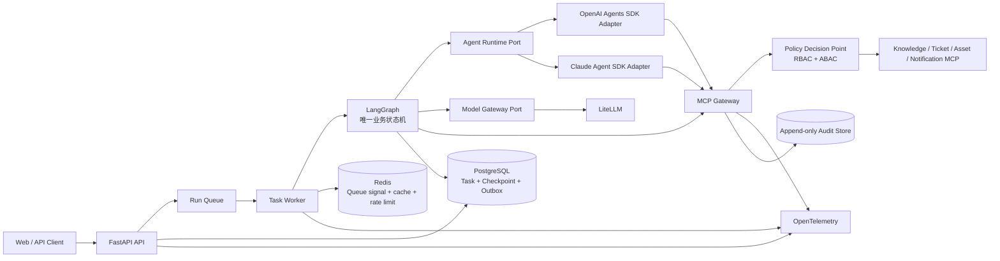

# 流程领航（FlowPilot）

> 面向企业 IT 服务台的可恢复、可审计智能工单 Agent 平台。

## 仓库状态

当前主分支已经完成 **M0～M6 工程候选**：公共契约与 Python Workspace、安全 MCP 平台、LangGraph Studio、持久化恢复、VPN 只读与安全写入、Context/Handoff、新员工复合申请、Fixture Web，以及 120 条功能任务和 36 条安全/故障任务的版本化语料与 Hash 冻结均已进入仓库。

这里的“完成”指代码、测试和候选证据已经合入，不等于产品发布。当前仍缺少真实模型 Provider、Web/API/Worker/数据平面的完整装配、真实企业 Connector 和 156 条任务的产品执行器；因此 `RELEASED=false`、整体 `FROZEN=false`。`make acceptance` 已经存在，但在没有注册产品执行器时会按设计失败，不能据此报告任务成功率。

下一阶段采用 M7～M10 路线，先把现有模块接成可以实际使用和观察的本地产品，再完成两条业务闭环和正式评测。首个真实模型入口确定为 **LiteLLM + DeepSeek V4 Flash**；具体 LiteLLM 模型标识和供应端配置将在 M7 实现时锁定并验证。完整状态和证据入口见 [项目交接总览](./docs/roadmap/PROJECT_HANDOFF.md)。

| 能力 | 当前状态 | 可宣称范围 | 
|---|---|---|
| 架构、契约与安全边界 | M0 基线及后续兼容性门禁已合入 | 可描述企业级架构和可执行契约；整体契约尚未发布为最终版本 |
| 14 包 Python Workspace | 锁文件、构建、类型检查和公共测试入口已合入 | 可描述工程基线，不代表所有模块已完成产品装配 |
| LangGraph Runtime 与 Studio | 同源图、Interrupt/Resume、Handoff、重试、Checkpoint 和安全投影已验证 | 可体验非黑箱流程；默认仍是合成状态和 Fake 工具 |
| PostgreSQL、Redis 与恢复 | RLS、Inbox/Outbox、Lease/Fencing、Checkpoint CAS 和 Redis 丢失恢复已验证 | 可描述可靠性候选；生产备份、扩容和灾备未验证 |
| MCP Gateway 与安全写入 | 默认拒绝、策略、审批绑定、执行账本、幂等和回读测试已合入 | 可描述安全写入候选；尚未接入真实企业工单系统 |
| VPN 业务场景 | 只读知识闭环和安全工单写入代码已合入 | 当前依赖合成知识与 Ticket Store，不是企业生产闭环 |
| Context 与受限 Handoff | 分层上下文、硬预算、字段过滤和安全投影已合入 | 可描述机制，不得宣称 24% Token 降幅 |
| Provider Adapter | 零凭据、零网络的 Sandbox Adapter 已合入 | 真实 Provider 未接入，不可宣称 OpenAI/Claude/DeepSeek 已可用 |
| Web 产品面 | 任务、时间线、补全、审批、恢复和 SSE 交互外壳已合入 | 当前使用 Fixture，尚未接通真实 API 与 Agent Runtime |
| 新员工复合申请 | 澄清、并行读取、双动作审批、部分失败和汇总测试已合入 | 属于合成端到端候选，尚未形成可操作的真实产品链路 |
| 120+36 评测语料 | 三个数据集共 120 功能 + 36 安全/故障 Case，内容 Hash 已冻结 | 产品执行器未注册，正式成功率与 Judge 结论尚不存在 |
| `make acceptance` | 编排器、失败保留、证据 Manifest 和报告生成已实现 | 当前 156 条产品执行会失败关闭，不能标记发布通过 |
| 本地 Compose | PostgreSQL、Redis、迁移、RLS 与恢复组合验证通过 | 应用服务尚未形成一键可用的完整产品拓扑 |
| 800 条路由样本及 LoRA | 未构建 | 不可报告 Macro-F1 |
| Token 降幅、任务成功率提升 | 未测量 | 仅作为待验证假设 |

原方案中的“输入 Token 降低 24%”“任务成功率由 82.5% 提升至 90.0%”“Macro-F1 由 0.86 提升至 0.91”均为目标方向的参考值，不是本仓库已经取得的结果。只有生成可复现的测试报告后，才允许将真实数值写入 README、简历或演示材料。

## 项目目标

FlowPilot 将知识问答、信息补全、工单创建、人工审批和业务工具执行整合成一个任务闭环：

1. 识别用户意图并补全必要信息。
2. 并行检索企业知识和授权范围内的业务数据。
3. 生成带证据的回答或结构化执行计划。
4. 对有副作用的动作执行实时策略判定。
5. 在需要时中断任务并等待人工审批。
6. 使用幂等键执行工具，回读验证结果。
7. 在重启、超时或审批等待后安全续跑。
8. 记录可关联但相互隔离的 Trace、Audit Log 和 Security Event。

首个可交付范围只覆盖 IT 服务台：

- VPN 故障自助排障，失败后创建工单。
- 新员工设备与系统权限申请，包含并行查询、人工审批和多个关联工单。

采购、HR、客服、多模态附件和 LoRA 均为后续增量，不进入首个核心闭环的完成定义。

## 架构结论

FlowPilot 采用“**一个持久化业务状态机、两个执行适配层、一个安全工具入口**”：



- **LangGraph** 是跨业务节点的唯一流程控制器，负责状态、条件路由、并行分支、Interrupt、Checkpoint、恢复与补偿。
- **Agents SDK** 只在有边界的节点内执行专业 Agent 循环、结构化输出、Guardrail 和受限 Handoff，不成为第二套业务状态机。
- **LiteLLM** 位于通用模型调用端口后，用于分类、摘要、评审等模型调用的路由、预算和计量；是否代理某个 Agents SDK 的 Provider 流量由具体适配器决定，不能破坏统一审计。
- **MCP Gateway** 是所有业务工具的唯一入口，执行 Schema 固定、工具白名单、RBAC + ABAC、审批绑定、凭据交换、幂等、回读校验和审计。
- **PostgreSQL** 保存业务任务、LangGraph Checkpoint、审批、工具执行账本和事务型 Outbox；Redis 不是任务事实源。

OpenAI 官方将 Agents SDK 定位为有明确工具和重复编排模式的有界 Agent 工作流，并提供 Agent loop、Handoff、Session、可恢复审批和 Trace。FlowPilot 仍在平台层负责跨业务状态、租户授权和合规审计，详见 [OpenAI Agents SDK](https://developers.openai.com/api/docs/guides/agents)。

## 不可破坏的架构约束

1. Agent 不得直接连接数据库、企业业务网络、密钥服务或上游 MCP Server。
2. 模型只能提出动作，不能决定自身权限、审批结果或最终授权。
3. 每次有副作用的工具调用都必须绑定 `tenant_id`、`task_id`、`action_digest`、`policy_decision_id` 和 `idempotency_key`。
4. 审批只对确定的 `action_digest` 有效；参数、主体、工具、资源或策略版本变化后必须重新审批。
5. LangGraph Interrupt 恢复会重新进入节点，因此 Interrupt 之前的副作用必须为零或天然幂等。
6. Checkpoint 只保存恢复所需最小状态与安全上下文引用，不保存长期凭据或完整敏感资料。
7. Handoff 后重新计算上下文和工具集合，不继承上游 Agent 的全部消息、凭据或权限。
8. Trace 可以采样，Audit Log 与 Security Event 不可采样；三者都不得记录隐藏思维链或明文密钥。
9. LLM-as-Judge 只评估语义质量，不能替代权限、安全、状态和工具结果的确定性断言。
10. 跨租户成功读取和写入必须为 0。
11. 所有量化结论必须关联代码版本、数据集版本、配置版本、原始结果和可复现命令。

## 文档导航

| 文档 | 作用 |
|---|---|
| [项目交接总览](./docs/roadmap/PROJECT_HANDOFF.md) | 当前能力、证据、运行入口、限制、目录责任与下一阶段计划的唯一状态入口 |
| [STRUCTURE.md](./STRUCTURE.md) | 目标仓库结构、部署单元、依赖方向和目录验收 |
| [架构总览](./docs/architecture/ARCHITECTURE.md) | 容器边界、状态所有权、事务、恢复、安全与可观测设计 |
| [企业级 Agent 学习与演进手册](./docs/architecture/ENGINEERING_PLAYBOOK.md) | 记录检索、恢复、循环、Context、副作用、安全与评测难题及其结构化解法 |
| [Agent Runtime Port](./docs/architecture/AGENT_RUNTIME.md) | OpenAI/Claude Adapter 的统一请求、结果、错误和 Conformance 边界 |
| [LangGraph Studio 非黑箱设计](./docs/architecture/LANGGRAPH_STUDIO.md) | 图拓扑、Interrupt、Handoff、Checkpoint 和安全状态投影的本地可视化边界 |
| [Context Engineering](./docs/architecture/CONTEXT_ENGINEERING.md) | 分层上下文、记忆、裁剪、Handoff 过滤与 Token 评测 |
| [版本化契约](./contracts/README.md) | Task/Command/Event、动作、审批、策略、工具、Context、审计和评测 JSON Schema |
| [七 Codex 会话协作](./docs/team/CODEX_SESSIONS.md) | 七个会话的角色、目录所有权、工程约定、Worktree 与交接 |
| [预授权链路执行约定](./docs/team/CHAIN_EXECUTION_PROTOCOL.md) | 有序工作链、消费者门禁、异常上报与最终 S7/S1 验收 |
| [Codex 会话自动唤醒协议](./docs/team/THREAD_WAKE_PROTOCOL.md) | 会话间自动交接、去重、循环保护与最终用户门禁 |
| [Agent 注册与最小调度协议](./docs/team/AGENT_REGISTRY_PROTOCOL.md) | 按能力、范围、风险和可用性选择最少执行者，减少固定七会话通信成本 |
| [增量上下文启动协议](./docs/team/CONTEXT_BOOTSTRAP_PROTOCOL.md) | 用 Git Base→Target 差异替代新 Attempt 的无条件全量重读 |
| [P2 持久化恢复工作包](./docs/team/work-packages/WP-P2-durable-runtime.md) | Flow Lite `g1` 的批准范围、恢复不变量、测试和注册制执行边界 |
| [集成门禁分级](./docs/team/INTEGRATION_GATES.md) | FAST/STANDARD/RELEASE 的触发条件、证据复用和耗时预算 |
| [七会话执行契约](./docs/team/session-contracts/README.md) | 每个会话的决策权、输入输出、门禁、当前任务与激活条件 |
| [任务控制面](./WORKFLOW.md) | 工作项状态、派发、并发、恢复、证据和安全边界 |
| [工作包索引](./docs/team/work-packages/README.md) | WP-000/010/011/012/020/021/030/040 的责任、当前 Attempt、依赖与集成顺序 |
| [AGENTS.md](./AGENTS.md) | 所有 Codex 会话必须遵守的仓库级工程规则 |
| [功能验收标准](./docs/acceptance/ACCEPTANCE.md) | 可运行的功能、安全、恢复与评测完成定义 |
| [机器追踪清单](./docs/acceptance/traceability.v1.json) | 功能 ID 到测试、证据的唯一机器事实源 |
| [公共评测 Registry](./contracts/registries/evaluation-dataset-manifest.v1.json) | 仍为空的 `candidate` 契约清单，尚未提升为发布 Registry |
| [M6 Hash 冻结记录](./evals/runners/m6-hash-freeze.v1.json) | 三个数据集 120+36 Case 的内容哈希；不代表产品执行通过 |
| [评测 Fixture 清单](./contracts/registries/evaluation-fixture-manifest.v1.json) | 合成租户/主体 Fixture 的版本与哈希 |
| [需求追踪矩阵](./docs/acceptance/TRACEABILITY.md) | 机器追踪清单的人类可读投影视图 |
| [实施路线](./docs/roadmap/IMPLEMENTATION_PLAN.md) | M0～M12 垂直切片、当前阶段和退出条件；当前执行窗口为 M7～M10 |
| [M3～M6 加速交付规划](./docs/roadmap/ACCELERATED_DELIVERY_PLAN.md) | 已完成阶段的并行建设记录，保留用于复核数据集、Web 与 Connector 的来源 |
| [架构评审报告](./docs/review/ARCHITECTURE_REVIEW.md) | 对原始总稿的保留项、问题与改造决策 |
| [WP-000 rc1 裁决](./docs/review/WP-000-RC1-DISPOSITION.md) | 三方 REJECT、逐项处理和 rc2 冻结门禁 |
| [ADR-0001](./docs/decisions/ADR-0001-orchestration-boundary.md) | LangGraph、Agents SDK 与 LiteLLM 的边界 |
| [ADR-0002](./docs/decisions/ADR-0002-safe-side-effects.md) | 审批、幂等、Outbox 与回读验证 |
| [ADR-0003](./docs/decisions/ADR-0003-task-command-event-protocol.md) | Task 投影、Command 并发与 Event 至少一次协议 |
| [ADR-0004](./docs/decisions/ADR-0004-reproducible-acceptance-and-freeze.md) | 稳定内容摘要、评测分母、Feature 证据与 Audit 哈希链 |
| [原始方案总稿](./企业智能工单与流程协同平台项目方案（企业级优化版）.md) | 历史设计输入，不再作为实施唯一事实源 |

## 验收优先，而不是数字优先

核心版本首先通过可观察的技术行为验收：

- 进程重启后从持久化 Checkpoint 恢复。
- 同一写动作重放十次只产生一次业务写入。
- 审批后篡改任一参数会使审批失效。
- 跨租户、越权 Agent、恶意 MCP 输出和 Prompt Injection 用例被阻断并产生安全事件。
- 并行只读分支可在 Trace 中证明并发执行并正确汇总。
- 每个知识结论包含可回查的文档、章节和版本。
- 所有写操作都有策略决策、审批/确认、执行账本、回读结果和审计事件。
- Handoff 后上下文与工具权限满足最小化策略。

质量数字作为第二层证据：

- 固定 120 条功能任务和 36 条安全/故障任务。
- 单 Agent 基线与多 Agent 方案使用相同数据、模型预算和判定规则。
- Context 裁剪对比记录每条样本的输入 Token，而不是只报告平均百分比。
- LLM-as-Judge 结果必须与规则断言分开，并报告人工校准一致率。
- LoRA 仅在 800 条路由样本具备来源、脱敏、分割与版本清单后启动。

详细门槛与证据格式见 [功能验收标准](./docs/acceptance/ACCEPTANCE.md)。

## 目标技术栈

| 层 | 选型 |
|---|---|
| API 与 Worker | Python、FastAPI、Pydantic |
| 业务编排 | LangGraph、PostgreSQL Checkpointer |
| Agent Runtime | OpenAI Agents SDK / Claude Agent SDK，经统一端口适配 |
| 模型网关 | LiteLLM |
| 工具协议 | MCP，统一经过自建 MCP Gateway |
| 数据 | PostgreSQL + RLS、pgvector、Redis、S3/MinIO |
| 身份与策略 | OIDC、Keycloak（本地）、OPA/Rego 或 Cedar |
| 可观测性 | OpenTelemetry、Prometheus、Grafana、结构化日志 |
| 评测 | Pytest、规则评测、LLM-as-Judge、版本化 JSONL 数据集 |
| 本地交付 | Docker Compose |

当前 Python Workspace 依赖由 `uv.lock` 固定。M7 将在 Model Gateway 后接入 LiteLLM，并以 DeepSeek V4 Flash 作为首个真实模型；README 不提前填写未经供应端和 LiteLLM 兼容性测试确认的模型字符串、版本或价格。

## M7～M10 开发路线

M0～M6 解决了模块边界、可靠性、安全机制、两条场景代码和评测语料，但这些能力还没有组成一个可供用户连续操作的真实产品。后续四个里程碑按“先接通，再写入，再扩场景，最后评测”推进。

### M7：真实模型与本地产品闭环

- 在统一 Model Gateway 后接入 LiteLLM，首个模型使用 DeepSeek V4 Flash。
- 补齐 `.env.example`、密钥缺失提示、模型路由、超时、重试、预算和调用计量。
- 将 Web、FastAPI、Worker、LangGraph、PostgreSQL/Redis 与只读 MCP 路径装配到同一本地拓扑。
- 在 Web 和 LangGraph Studio 中展示节点、模型调用、Interrupt、恢复、引用与稳定错误，不记录隐藏思维链。

退出条件：从 Web 提交中文 VPN 请求后，真实模型参与受限节点，任务可以完成信息补全和引用回答；缺少密钥、模型超时或 Provider 不可用时必须失败关闭并可追踪。

### M8：VPN 安全写入闭环

- 把工单创建接入 Web 审批卡、策略判定、MCP Gateway、执行账本与回读结果。
- 先提供 Vendor-neutral Connector 与受控 Sandbox/Preview，对真实企业系统只预留配置和契约，不在这一阶段写满所有适配器。
- 验证参数篡改、审批过期、重复提交、超时后实际成功、`UNKNOWN` 对账和进程恢复。

退出条件：VPN 排障失败后能够创建且只创建一张可回读工单；任一授权、租户、摘要或审批绑定异常都在上游写入前被拒绝。

### M9：新员工复合申请闭环

- 将设备标准、库存和权限模板的并行读取接到真实 API 与 Web 时间线。
- 完成设备与权限两个动作的独立审批、执行、部分失败、恢复和结果汇总。
- 保持 PostgreSQL 事实源、最小 Handoff、跨租户零成功读取和 Audit/Security 分流。

退出条件：第二业务场景可以从 Web 连续走完澄清、并行查询、审批、双动作执行和恢复，且失败动作不会导致已成功动作重复执行。

### M10：产品执行评测与发布候选

- 为 120+36 Case 注册真实产品执行器，保存实际输入、观察结果、证据引用和版本绑定。
- 完成 Judge 双轮人工校准、规则评分、单 Agent/Multi-Agent 公平对比和三次可复现运行。
- 验证 Compose 空卷启动、两个五分钟业务演示、三分钟安全演示和完整证据包。

退出条件：156 条任务全部进入固定分母，不允许用 skipped 或 quarantined 缩小分母；P0 安全断言全部通过后，才评估是否把整体状态提升为 `frozen` 或发布候选。安全多模态和路由 LoRA 顺延到 M11、M12，不阻塞 M10。

## 本地体验入口（当前能力）

在 Windows PowerShell 中执行：

```powershell
uv sync --all-packages --all-groups --locked
$env:PYTHONUTF8 = "1"
$env:LANGSMITH_TRACING = "false"
uv run --all-packages --all-groups --locked langgraph dev --config langgraph.json --host 127.0.0.1 --port 2024 --no-browser
```

命令启动后会输出本地 API、API Docs 与 LangGraph Studio URL。打开 Studio，选择
`flowpilot_it_service`，输入 `{"scenario":"full_demo"}`，可以观察稳定图拓扑、
clarification/approval 两次 Interrupt 与 Resume、并行只读分支、Handoff、一次重试、
Checkpoint 序号和失败关闭状态。该入口固定使用 `studio-safe`：只运行合成状态和
Fake 只读工具，不连接生产凭据、外部模型、企业系统或公网 Tunnel。

可单独体验 FastAPI 外壳：

```powershell
uv run --all-packages --all-groups --locked python -m uvicorn flowpilot_api.main:app --host 127.0.0.1 --port 8000
```

打开 `http://127.0.0.1:8000/docs`。当前模块级 App 的 `/health` 与 OpenAPI 可用，
但会返回 `configured=false`；业务命令和查询在 Security/Application/Persistence
端口未完成组合装配时按设计失败关闭，不能把它当成完整工单后端。

本地依赖平面可以从示例配置启动：

```powershell
Copy-Item .env.example .env
docker compose --env-file .env -f infra/compose/compose.yaml up -d --wait
docker compose --env-file .env -f infra/compose/compose.yaml ps
```

体验结束后运行：

```powershell
docker compose --env-file .env -f infra/compose/compose.yaml down
```

当前可体验与不可体验边界以本节为准；测试证据不等于用户可操作产品。Web 外壳、
第二业务场景和 120+36 Case 已有代码或语料，但真实 Provider、完整 API 组合、企业
Connector、156 条产品执行报告和经人工双轮校准的 Judge 仍不可体验。

仓库还提供一个与真实后端隔离的 Fixture Web 演示外壳：

```powershell
uv run --frozen python web/server.py --port 8765
```

打开 `http://127.0.0.1:8765/`，可体验任务列表、时间线、信息补全、审批卡、
错误与恢复界面以及 SSE 重连。它使用内存和合成 Fixture，适合查看交互外壳，
不代表 Web 已经接通上述 FastAPI、数据库或真实 Agent 流程。

## 目标开发命令

当前已经提供：

```bash
make bootstrap
make studio
make studio-smoke
make test
make test-contract
make test-security
make acceptance
```

`make studio` 只启动默认失败关闭的 `studio-safe` 本地 Agent Server，不启用生产凭据或公网 Tunnel。`make test` 运行仓库 Python 测试；`make acceptance` 生成机器 Manifest 和人类报告，并在产品执行器缺失时返回失败。以下全仓接口仍未实现：

```bash
make dev
make eval
```

`make acceptance` 必须生成机器可读的证据清单和人类可读报告；命令不存在或报告不可复现时，项目不能标记为已完成。

底层契约门禁也可独立运行：

```bash
python contracts/conformance/validate.py
```

它与 `make test-contract` 使用同一 Conformance 入口；前者便于架构期或外部解释器直接复核。

## 完成定义

核心版本只有同时满足以下条件才能从“架构设计”升级为“已实现”：

- 两个 IT 服务台闭环均有端到端测试。
- 审批中断、服务重启恢复、失败补偿和幂等重放可自动验证。
- 工具调用不存在绕过 MCP Gateway 的路径。
- 至少两个租户的行级隔离和检索隔离通过测试。
- 120 条功能任务与 36 条安全/故障任务具有固定版本和运行报告。
- Docker Compose 可以从空环境启动演示。
- `README` 中所有“实现”和所有数字都能在追踪矩阵中找到证据。
