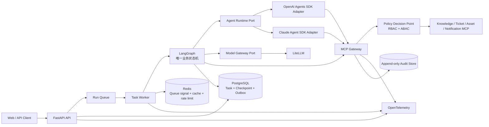

# 流程领航（FlowPilot）

> 面向企业 IT 服务台，把信息补全、知识查询、审批和工具执行放进一条可恢复、可审计的任务流程。

## 项目目标

FlowPilot 面向企业 IT 服务台，正式产品覆盖智能工单、知识库问答、新员工入职、
权限变更和审批辅助。系统负责补齐信息、查询知识、等待审批并调用受控工具；任务
在用户暂离或 Worker 重启后仍可继续。

新员工入职候选已经具备并行查询设备标准、库存和权限模板的流程，设备申请与权限
申请分别审批、分别执行。现有 VPN 数据只保留为早期知识检索和恢复能力的回归样例，
不再作为产品定位或后续里程碑的目标场景。

M20 再加入截图、日志和附件的安全多模态处理。项目不做采购、HR 或客服领域扩展，
也不在本阶段接入真实企业系统和生产基础设施。

## 当前状态

`master` 已包含 M0～M10 工程候选和 M9T 工程控制面，M11 短期记忆已进入开发链，
但还不是可以部署给真实用户的完整产品。目前可以直接体验：

- 在 LangGraph Studio 查看图结构、并行分支、两次 Interrupt、恢复、Handoff 和重试。
- 启动 Web Fixture，查看任务列表、时间线、补全表单、审批卡和 SSE 重连；Web 同时具备真实 API/SSE 适配模式。
- 启动 FastAPI 外壳，查看健康检查和 OpenAPI。
- 用 Docker Compose 启动 PostgreSQL、Redis 等本地依赖，并运行恢复与隔离测试。

M7 已加入 LiteLLM、OpenAI/Claude Agents SDK Adapter、本地产品组合根、可恢复知识问答 Graph、真实 API/SSE Web 适配和集中凭据扫描。首批 24 条知识问答 Case 可以沿 API → Worker → LangGraph 产品边界执行。仓库仍缺少一条可直接启动完整产品的 `make dev` 入口；DeepSeek V4 Flash 在线调用没有执行，企业工单和资产系统也仍是中立接口与 Sandbox。固定 120+36 评测中还有 132 条 Case 没有产品执行器，因此 M7 只能作为开发候选合入，不能标记为发布版本。

M8 已接通本地 Keycloak、OIDC Code+PKCE、Cookie-only 会话、可信
SecurityContext、工作负载身份、租户传播与 PostgreSQL RLS。真实 Keycloak/JWKS、
同秒刷新、并发刷新、注销撤销、Worker 恢复和跨租户拒绝均已通过本地组合验证。
这仍是本地工程候选，不等于生产身份系统或企业级部署已经完成。

M9T 工程控制面已经合入，后续工作默认使用仓库地图、Delta Context Capsule、测试
选择和 Evidence Cache。M9 已完成版本化策略、短时 Capability、Gateway 与 Runtime
DLP、追加式审计、可查询治理页面和 9 条治理安全执行器的本地组合验证。

M10 已把合成知识读取升级为 PostgreSQL/pgvector 本地知识平台：文档版本、ACL、
生命周期、混合检索、稳定引用、无证据回答、Knowledge MCP、Runtime、管理 API 和
Web 诊断入口已完成本地组合验证。固定 156 条 Case 当前为 40 条完成、116 条因没有
对应产品执行器而明确失败；项目仍不是发布版本。

M11 正在实现任务内短期记忆：最近轮次、claimed/verified/inferred 分层摘要、未决字段、
硬 Token 预算、Handoff 重建、Checkpoint 恢复、TTL/用户清理和安全可观察投影。短期记忆
是可重建派生状态，不保存权限、审批、凭据或跨任务偏好，也不提前实现 M12 长期记忆。

## M0～M10 做了什么

| 阶段 | 已进入主分支的内容 | 当前限制 |
|---|---|---|
| M0 工程底座 | 当前 16 成员 Python Workspace、公共 JSON Schema、领域与应用端口、API/Runtime/Persistence 骨架 | 模块可以独立测试，还没有连成产品 |
| M1 知识只读候选 | 信息补全、知识检索、租户与 ACL 过滤、引用回答；VPN 仅为历史 Fixture | 使用合成知识源，没有真实模型 |
| M2 持久化运行 | PostgreSQL Checkpoint、Lease/Fencing、Inbox/Outbox、Redis 丢失恢复 | 已验证恢复行为，生产备份和扩容未覆盖 |
| M3 安全写入 | MCP Gateway、策略判定、审批绑定、执行账本、幂等、回读和 SSE | 使用 Sandbox Ticket Store，没有企业 Connector |
| M4 Agent 与上下文 | Sandbox Provider、分层 Context、硬预算、受限 Handoff、多 Agent 节点 | 没有真实 Token 和效果对比数据 |
| M5 产品外壳与第二场景 | Fixture Web、新员工设备与权限复合申请、部分失败处理 | Web 尚未接通真实 API 和运行时 |
| M6 评测工具链 | 120 条功能 Case、36 条安全/故障 Case、Hash 冻结、Judge 工具和 `make acceptance` | 产品执行器与人工 Judge 校准尚未完成 |
| M7 本地产品候选 | LiteLLM 与 Agents SDK Adapter、API/Worker/Graph/Data 组合、Web API/SSE 模式、Studio 安全恢复、集中凭据扫描、24 条知识问答执行器 | 在线 Provider Smoke 未运行；132 条 Case 未注册；没有一键产品启动入口 |
| M8 本地身份与租户 | Keycloak 双租户、OIDC/JWKS、Cookie-only 会话、双主体身份、可信 SecurityContext、RLS 与恢复重验、6 条租户隔离执行器 | 使用本地 Realm；126 条后续 Case 尚无执行器；不包含生产 IdP/HA |
| M9 本地治理 | 版本化 Rego/OPA 策略、Capability、Secret Provider、Gateway/Runtime DLP、追加式审计与治理页面、9 条治理安全执行器 | 使用本地 OPA/Secret 配置；117 条后续 Case 尚无执行器；不包含生产 Vault/KMS/SIEM/HA |
| M10 本地知识平台 | PostgreSQL/pgvector 文档事实、ACL/RLS、生命周期、混合检索、稳定引用、Knowledge MCP、Runtime、管理 API、Web 诊断和 1 条知识安全执行器 | 116 条后续 Case 尚无执行器；在线 Provider 与真实企业知识源未接入 |

当前仓库状态为 `RELEASED=false`、整体 `FROZEN=false`。原方案中的 Token 降低 24%、任务成功率 82.5%→90.0%、Macro-F1 0.86→0.91 都是参考目标，不是已有结果。项目在产生可复现报告前不会使用这些数字。

## 系统怎么工作

一次任务从 Web 或 API 进入队列，由 Worker 交给 LangGraph。LangGraph 保存流程状态并决定下一步；模型负责理解文本和生成候选内容，权限、审批和最终状态由确定性代码处理。所有知识查询和业务写入都经过 MCP Gateway。



- **LangGraph** 管理跨节点流程，包括条件路由、并行任务、暂停审批、Checkpoint、恢复和补偿。
- **Agents SDK Adapter** 只在单个节点内运行受限 Agent，不另外保存一套业务状态。
- **LiteLLM** 统一模型路由、预算和用量记录。模型调用仍要经过项目自己的端口和审计。
- **MCP Gateway** 检查工具 Schema、调用者身份、租户、策略、审批和幂等键，再决定是否访问上游工具。
- **PostgreSQL** 保存任务、Checkpoint、审批、执行账本和 Outbox。Redis 只负责可重建的队列信号、缓存和限流。

## 工程底线

1. Agent 不能直连业务数据库、企业网络、密钥服务或上游 MCP Server。
2. 模型可以建议动作，不能给自己授权，也不能决定审批结果和任务终态。
3. 写操作必须带上租户、任务、动作摘要、策略决策和幂等键。
4. 审批只对当时展示的动作有效。参数、执行人、工具或策略发生变化后要重新审批。
5. Interrupt 恢复会再次进入节点，因此暂停前不能留下不可重复的副作用。
6. Checkpoint 只保存恢复所需的数据，不保存长期凭据和完整敏感内容。
7. Agent Handoff 时重新计算上下文和工具权限，不直接继承上一个 Agent 的全部消息与凭据。
8. Trace 可以采样，Audit Log 和 Security Event 不能采样；三者都不能保存隐藏思维链或明文密钥。
9. LLM-as-Judge 只评文本质量。权限是否正确、工具是否成功、数据是否落库都由代码和证据判断。
10. 跨租户成功读取或写入必须为 0。

## 文档导航

| 文档 | 作用 |
|---|---|
| [项目交接总览](./docs/roadmap/PROJECT_HANDOFF.md) | 当前能力、证据、运行入口、限制、目录责任与下一阶段计划的唯一状态入口 |
| [STRUCTURE.md](./STRUCTURE.md) | 目标仓库结构、部署单元、依赖方向和目录验收 |
| [架构总览](./docs/architecture/ARCHITECTURE.md) | 容器边界、状态所有权、事务、恢复、安全与可观测设计 |
| [企业级 Agent 学习与演进手册](./docs/architecture/ENGINEERING_PLAYBOOK.md) | 记录检索、恢复、循环、Context、副作用、安全与评测难题及其结构化解法 |
| [Agent Runtime Port](./docs/architecture/AGENT_RUNTIME.md) | OpenAI/Claude Adapter 的统一请求、结果、错误和 Conformance 边界 |
| [短期记忆架构](./docs/architecture/SHORT_TERM_MEMORY.md) | M11 任务内 Turn、Snapshot、Manifest、预算、恢复、清理和状态权威 |
| [LangGraph Studio 非黑箱设计](./docs/architecture/LANGGRAPH_STUDIO.md) | 图拓扑、Interrupt、Handoff、Checkpoint 和安全状态投影的本地可视化边界 |
| [Context Engineering](./docs/architecture/CONTEXT_ENGINEERING.md) | 分层上下文、记忆、裁剪、Handoff 过滤与 Token 评测 |
| [版本化契约](./contracts/README.md) | Task/Command/Event、动作、审批、策略、工具、Context、审计和评测 JSON Schema |
| [七 Codex 会话协作](./docs/team/CODEX_SESSIONS.md) | 七个会话的角色、目录所有权、工程约定、Worktree 与交接 |
| [预授权链路执行约定](./docs/team/CHAIN_EXECUTION_PROTOCOL.md) | 有序工作链、消费者门禁、异常上报与最终 S7/S1 验收 |
| [Codex 会话自动唤醒协议](./docs/team/THREAD_WAKE_PROTOCOL.md) | 会话间自动交接、去重、循环保护与最终用户门禁 |
| [Agent 注册与最小调度协议](./docs/team/AGENT_REGISTRY_PROTOCOL.md) | 按能力、范围、风险和可用性选择最少执行者，减少固定七会话通信成本 |
| [增量上下文启动协议](./docs/team/CONTEXT_BOOTSTRAP_PROTOCOL.md) | 用 Git Base→Target 差异替代新 Attempt 的无条件全量重读 |
| [主 Agent 与子 Agent 协议](./docs/team/PRINCIPAL_SUBAGENT_PROTOCOL.md) | 领域主 Agent 的自主分派、Context Capsule、单写者、复用优先和责任回收规则 |
| [工程控制面](./docs/architecture/ENGINEERING_CONTROL_PLANE.md) | M9T 仓库地图、Delta Context Capsule、测试选择、Evidence Cache 与效率报告边界 |
| [本地治理控制面](./docs/architecture/LOCAL_GOVERNANCE_CONTROL_PLANE.md) | M9 版本化策略、Capability、Secret、DLP、Audit 与 Security Event 边界 |
| [本地知识平台](./docs/architecture/LOCAL_KNOWLEDGE_PLATFORM.md) | M10 文档版本、ACL、pgvector 混合检索、稳定引用与生命周期边界 |
| [P2 持久化恢复工作包](./docs/team/work-packages/WP-P2-durable-runtime.md) | Flow Lite `g1` 的批准范围、恢复不变量、测试和注册制执行边界 |
| [集成门禁分级](./docs/team/INTEGRATION_GATES.md) | FAST/STANDARD/RELEASE 的触发条件、证据复用和耗时预算 |
| [七会话执行契约](./docs/team/session-contracts/README.md) | 每个会话的决策权、输入输出、门禁、当前任务与激活条件 |
| [任务控制面](./WORKFLOW.md) | 工作项状态、派发、并发、恢复、证据和安全边界 |
| [工作包索引](./docs/team/work-packages/README.md) | 基础工作包、M7～M11 状态、依赖和集成顺序 |
| [AGENTS.md](./AGENTS.md) | 所有 Codex 会话必须遵守的仓库级工程规则 |
| [功能验收标准](./docs/acceptance/ACCEPTANCE.md) | 可运行的功能、安全、恢复与评测完成定义 |
| [机器追踪清单](./docs/acceptance/traceability.v1.json) | 功能 ID 到测试、证据的唯一机器事实源 |
| [公共评测 Registry](./contracts/registries/evaluation-dataset-manifest.v1.json) | 仍为空的 `candidate` 契约清单，尚未提升为发布 Registry |
| [M6 Hash 冻结记录](./evals/runners/m6-hash-freeze.v1.json) | 三个数据集 120+36 Case 的内容哈希；不代表产品执行通过 |
| [评测 Fixture 清单](./contracts/registries/evaluation-fixture-manifest.v1.json) | 合成租户/主体 Fixture 的版本与哈希 |
| [需求追踪矩阵](./docs/acceptance/TRACEABILITY.md) | 机器追踪清单的人类可读投影视图 |
| [实施路线](./docs/roadmap/IMPLEMENTATION_PLAN.md) | M0～M20 状态、范围、依赖、拆包方式和退出条件；当前里程碑为 M11（已启动） |
| [架构评审报告](./docs/review/ARCHITECTURE_REVIEW.md) | 对原始总稿的保留项、问题与改造决策 |
| [WP-000 rc1 裁决](./docs/review/WP-000-RC1-DISPOSITION.md) | 三方 REJECT、逐项处理和 rc2 冻结门禁 |
| [ADR-0001](./docs/decisions/ADR-0001-orchestration-boundary.md) | LangGraph、Agents SDK 与 LiteLLM 的边界 |
| [ADR-0002](./docs/decisions/ADR-0002-safe-side-effects.md) | 审批、幂等、Outbox 与回读验证 |
| [ADR-0003](./docs/decisions/ADR-0003-task-command-event-protocol.md) | Task 投影、Command 并发与 Event 至少一次协议 |
| [ADR-0004](./docs/decisions/ADR-0004-reproducible-acceptance-and-freeze.md) | 稳定内容摘要、评测分母、Feature 证据与 Audit 哈希链 |
| [ADR-0005](./docs/decisions/ADR-0005-local-identity-and-tenant-boundary.md) | 本地身份、双主体、SecurityContext 与租户信任边界 |
| [ADR-0006](./docs/decisions/ADR-0006-short-term-memory-authority.md) | 短期记忆作为任务内可重建派生状态的权威边界 |
| [原始方案总稿](./企业智能工单与流程协同平台项目方案（企业级优化版）.md) | 历史设计输入，不再作为实施唯一事实源 |

## 怎么判断功能真的完成

FlowPilot 不用“模型看起来回答得不错”作为完成标准。下面这些行为必须能由测试或运行证据复现：

- 进程重启后从持久化 Checkpoint 恢复。
- 同一写动作重放十次只产生一次业务写入。
- 审批后篡改任一参数会使审批失效。
- 跨租户、越权 Agent、恶意 MCP 输出和 Prompt Injection 用例被阻断并产生安全事件。
- Trace 能看出只读分支是否并行，以及结果如何汇总。
- 知识回答能回查到文档、章节和版本。
- 写操作能找到对应的策略决策、审批、执行账本、回读结果和审计事件。
- Handoff 后只保留下一个 Agent 真正需要的上下文和工具。

质量指标等产品链路接通后再计算：

- 固定 120 条功能任务和 36 条安全/故障任务。
- 单 Agent 基线与多 Agent 方案使用相同数据、模型预算和判定规则。
- Context 对比保留每条样本的输入 Token，不能只给一个平均降幅。
- LLM-as-Judge 与规则断言分开统计，并报告人工校准结果。
- 当前路线不做 LoRA；需要验证路由质量时，先使用固定数据集和可解释的模型路由。

详细门槛与证据格式见 [功能验收标准](./docs/acceptance/ACCEPTANCE.md)。

## 目标技术栈

| 层 | 选型 |
|---|---|
| API 与 Worker | Python、FastAPI、Pydantic |
| 业务编排 | LangGraph、PostgreSQL Checkpointer |
| Agent Runtime | OpenAI Agents SDK / Claude Agent SDK，经统一端口适配 |
| 模型网关 | LiteLLM |
| 工具协议 | MCP，统一经过自建 MCP Gateway |
| 数据 | PostgreSQL + RLS、pgvector、Redis、S3/MinIO |
| 身份与策略 | OIDC、Keycloak（本地）、OPA/Rego 或 Cedar |
| 可观测性 | OpenTelemetry、Prometheus、Grafana、结构化日志 |
| 评测 | Pytest、规则评测、LLM-as-Judge、版本化 JSONL 数据集 |
| 本地交付 | Docker Compose |

当前 Python Workspace 依赖由 `uv.lock` 固定。OpenAI/Claude Agents SDK 已作为
正式 Runtime Adapter 技术栈进入 M7 候选，只在单个 LangGraph 节点内承载受限
Agent；LangGraph 仍是唯一跨业务流程状态机。Model Gateway 已有 LiteLLM Provider，
DeepSeek V4 Flash 是首个在线目标，但尚未完成真实供应端调用，因此 README 不填写
未经兼容性测试确认的模型字符串、版本、价格或效果数据。

## M7～M20 开发路线

后续目标不是继续堆技术骨架，而是把现有模块收口为一套可在本机连续操作、
可以解释安全边界的企业级演示产品。

| 阶段 | 主要结果 |
|---|---|
| M7（候选已合入） | LiteLLM 与 OpenAI/Claude Agents SDK Adapter；API、Worker、LangGraph、数据、只读 MCP 与 Web/SSE 组合；24 条知识问答执行器 |
| M8（候选已验收） | 本地 Keycloak 登录、可信 SecurityContext、租户隔离与 RLS；真实本地组合门禁通过 |
| M9T（已合入） | Codex 工程控制面：仓库地图、增量 Context、测试选择、证据缓存与可量化效率报告 |
| M9（候选已验收） | 本地 OPA 策略、Capability、DLP、Audit 与 Security Event；固定分母累计 39 条完成 |
| M10（候选已验收） | PostgreSQL/pgvector 本地知识平台、权限过滤、混合检索、稳定引用、管理与诊断页面；固定分母累计 40 条完成 |
| M11（开发中） | 面向当前任务的短期记忆、摘要、Token 预算、Checkpoint 恢复、Handoff 过滤与安全可观察投影 |
| M12 | 用户可管理、可纠正、可删除的长期记忆 |
| M13 | 带来源和新鲜度的用户画像；只做预填和个性化，不参与授权 |
| M14 | 企业知识库问答：权限过滤、稳定引用、知识反馈与工单衔接 |
| M15 | 通用智能工单：动态补全、优先级/处理组建议、确认后创建 |
| M16 | 新员工入职：设备与权限双动作、独立审批和部分失败恢复 |
| M17 | 权限添加、变更、续期和撤销 |
| M18 | 审批辅助：摘要、差异、证据和风险建议，最终决定仍由人作出 |
| M19 | 五链产品汇合、120+36 产品执行、Judge 校准和本地演示 |
| M20 | 截图、日志和附件经隔离、扫描、脱敏后进入只读多模态 Agent |

主依赖为 M7→M13。之后 M14→M15 与 M16→M17 可以并行，再汇合到
M18→M19→M20。每个阶段都同步建设页面、Trace、执行器和负向测试，避免最终
一次性补齐。

本阶段只交付本地企业级演示：使用本地身份、策略、知识、数据和 Sandbox MCP。
真实企业 Connector、生产 Vault/KMS/SIEM、生产高可用、跨地域部署、采购领域包
和 LoRA 均不在 M7～M20 范围内。完整交付项、退出条件和工作包拆分见
[实施路线](./docs/roadmap/IMPLEMENTATION_PLAN.md)。

## 本地体验入口（当前能力）

在 Windows PowerShell 中执行：

```powershell
uv sync --all-packages --all-groups --locked
$env:PYTHONUTF8 = "1"
$env:LANGSMITH_TRACING = "false"
uv run --all-packages --all-groups --locked langgraph dev --config langgraph.json --host 127.0.0.1 --port 2024 --no-browser
```

命令启动后会输出本地 API、API Docs 与 LangGraph Studio URL。打开 Studio，选择
`flowpilot_it_service`，输入 `{"scenario":"full_demo"}`，可以观察稳定图拓扑、
clarification/approval 两次 Interrupt 与 Resume、并行只读分支、Handoff、一次重试、
Checkpoint 序号和失败关闭状态。该入口固定使用 `studio-safe`：只运行合成状态和
Fake 只读工具，不连接生产凭据、外部模型、企业系统或公网 Tunnel。

可单独体验 FastAPI 外壳：

```powershell
uv run --all-packages --all-groups --locked python -m uvicorn flowpilot_api.main:app --host 127.0.0.1 --port 8000
```

打开 `http://127.0.0.1:8000/docs`。当前模块级 App 的 `/health` 与 OpenAPI 可用，
但会返回 `configured=false`；业务命令和查询在 Security/Application/Persistence
端口未完成组合装配时按设计失败关闭，不能把它当成完整工单后端。

本地依赖平面可以从示例配置启动：

```powershell
Copy-Item .env.example .env
docker compose --env-file .env -f infra/compose/compose.yaml up -d --wait
docker compose --env-file .env -f infra/compose/compose.yaml ps
```

体验结束后运行：

```powershell
docker compose --env-file .env -f infra/compose/compose.yaml down
```

当前可体验与不可体验边界以本节为准；测试证据不等于用户可操作产品。M7 已完成
真实 API/SSE Web 适配和完整产品组合端口，但仓库还没有把这些依赖封装成一条可直接
运行的本地产品进程。在线 Provider、企业 Connector、全部 156 条产品执行和经人工
双轮校准的 Judge 仍不可体验。

仓库还提供一个与真实后端隔离的 Fixture Web 演示外壳：

```powershell
uv run --frozen python web/server.py --port 8765
```

打开 `http://127.0.0.1:8765/`，可体验任务列表、时间线、信息补全、审批卡、
错误与恢复界面以及 SSE 重连。默认模式使用内存和合成 Fixture。`web/README.md`
记录了真实 API/SSE 模式的环境变量；该模式需要调用方先装配受信身份、持久化、
Worker、Gateway 和 Agent Runtime，当前没有独立的一键启动命令。

## 目标开发命令

当前已经提供：

```bash
make bootstrap
make studio
make studio-smoke
make lint
make test
make test-all
make test-contract
make test-security
make test-coverage
make audit
make ci
make acceptance
```

`make studio` 只启动默认失败关闭的 `studio-safe` 本地 Agent Server，不启用
生产凭据或公网 Tunnel。`make test` 和 `make test-all` 均包含全仓 Python 与集成
测试，后者还执行 Contract Conformance；`make ci` 汇合静态检查、覆盖率、契约、
安全与依赖审计。`make acceptance` 生成机器 Manifest 和人类报告，并在产品执行器
缺失时返回失败。以下产品运行接口仍未实现：

```bash
make dev
make eval
```

`make acceptance` 必须生成机器可读的证据清单和人类可读报告；命令不存在或报告不可复现时，项目不能标记为已完成。

Windows 没有 GNU Make 时，使用同一锁内命令的 PowerShell 入口：

```powershell
.\scripts\quality.ps1 bootstrap
.\scripts\quality.ps1 lint
.\scripts\quality.ps1 test-all
.\scripts\quality.ps1 test-security
.\scripts\quality.ps1 test-coverage
.\scripts\quality.ps1 audit
# 完整本地 CI 等价门禁
.\scripts\quality.ps1 ci
```

该脚本不读取 `.env` 或 Provider 密钥，只执行工程质量命令；目标与 Makefile
一一对应，任一步非零退出都会停止。

底层契约门禁也可独立运行：

```bash
python contracts/conformance/validate.py
```

它与 `make test-contract` 使用同一 Conformance 入口；前者便于架构期或外部解释器直接复核。

## 完成定义

本地核心产品只有同时满足以下条件才能从“工程候选”升级为“已验证”：

- 五条 IT 服务链均有端到端测试和 Web 可操作入口。
- 审批中断、服务重启恢复、失败补偿和幂等重放可自动验证。
- 工具调用不存在绕过 MCP Gateway 的路径。
- 至少两个租户的行级隔离和检索隔离通过测试。
- 120 条功能任务与 36 条安全/故障任务具有固定版本和运行报告。
- Docker Compose 可以从空环境启动演示。
- 截图、日志和附件只能经过隔离、扫描、脱敏与注入检测后进入模型。
- `README` 中所有“实现”和所有数字都能在追踪矩阵中找到证据。
