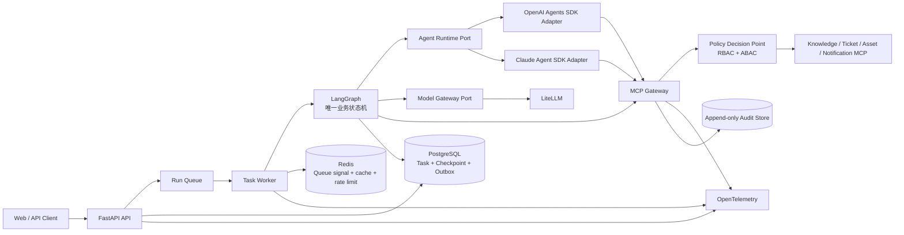

# 流程领航（FlowPilot）

> 把 IT 服务台的知识查询、信息补全、审批和工单执行放进一条可恢复、可审计的流程。

## 项目目标

FlowPilot 先解决企业 IT 服务台里最常见的一类问题：员工提交的信息不完整，服务台需要反复追问、查知识库、确认权限、走审批，再到不同系统里创建工单。

以 VPN 故障为例，员工只需要描述现象。系统会补问网络位置、设备和报错信息，查询企业知识库并给出带来源的处理建议。问题仍未解决时，系统生成工单计划，展示将要写入的内容，取得确认后再调用工单工具。任务在等待回复、等待审批或 Worker 重启后仍能继续。

第二个场景是新员工入职。设备标准、库存和权限模板可以并行查询，设备申请与权限申请分别审批、分别执行。一个动作失败时，已经成功的动作不会被重复提交。

项目当前只做这两条 IT 服务流程。采购、HR、客服、多模态附件和 LoRA 放在核心版本之后。

## 当前状态

`master` 已包含 M0～M6 的代码和测试，但还不是可以部署给真实用户的完整产品。目前可以直接体验：

- 在 LangGraph Studio 查看图结构、并行分支、两次 Interrupt、恢复、Handoff 和重试。
- 启动 Fixture Web，查看任务列表、时间线、补全表单、审批卡和 SSE 重连。
- 启动 FastAPI 外壳，查看健康检查和 OpenAPI。
- 用 Docker Compose 启动 PostgreSQL、Redis 等本地依赖，并运行恢复与隔离测试。

尚未接通的部分也很明确：Web 仍使用 Fixture，真实模型尚未接入，企业工单和资产系统只有中立接口与 Sandbox，120+36 评测也缺少产品执行器。下一阶段 M7 会先把 Web、API、Worker、LangGraph、数据库和真实模型接成一条本地链路；首个模型入口采用 **LiteLLM + DeepSeek V4 Flash**。

## M0～M6 做了什么

| 阶段 | 已进入主分支的内容 | 当前限制 |
|---|---|---|
| M0 工程底座 | 14 包 Python Workspace、公共 JSON Schema、领域与应用端口、API/Runtime/Persistence 骨架 | 模块可以独立测试，还没有连成产品 |
| M1 VPN 只读 | 信息补全、知识检索、租户与 ACL 过滤、引用回答 | 使用合成知识源，没有真实模型 |
| M2 持久化运行 | PostgreSQL Checkpoint、Lease/Fencing、Inbox/Outbox、Redis 丢失恢复 | 已验证恢复行为，生产备份和扩容未覆盖 |
| M3 安全写入 | MCP Gateway、策略判定、审批绑定、执行账本、幂等、回读和 SSE | 使用 Sandbox Ticket Store，没有企业 Connector |
| M4 Agent 与上下文 | Sandbox Provider、分层 Context、硬预算、受限 Handoff、多 Agent 节点 | 没有真实 Token 和效果对比数据 |
| M5 产品外壳与第二场景 | Fixture Web、新员工设备与权限复合申请、部分失败处理 | Web 尚未接通真实 API 和运行时 |
| M6 评测工具链 | 120 条功能 Case、36 条安全/故障 Case、Hash 冻结、Judge 工具和 `make acceptance` | 产品执行器与人工 Judge 校准尚未完成 |

当前仓库状态为 `RELEASED=false`、整体 `FROZEN=false`。原方案中的 Token 降低 24%、任务成功率 82.5%→90.0%、Macro-F1 0.86→0.91 都是参考目标，不是已有结果。项目在产生可复现报告前不会使用这些数字。

## 系统怎么工作

一次任务从 Web 或 API 进入队列，由 Worker 交给 LangGraph。LangGraph 保存流程状态并决定下一步；模型负责理解文本和生成候选内容，权限、审批和最终状态由确定性代码处理。所有知识查询和业务写入都经过 MCP Gateway。



- **LangGraph** 管理跨节点流程，包括条件路由、并行任务、暂停审批、Checkpoint、恢复和补偿。
- **Agents SDK Adapter** 只在单个节点内运行受限 Agent，不另外保存一套业务状态。
- **LiteLLM** 统一模型路由、预算和用量记录。模型调用仍要经过项目自己的端口和审计。
- **MCP Gateway** 检查工具 Schema、调用者身份、租户、策略、审批和幂等键，再决定是否访问上游工具。
- **PostgreSQL** 保存任务、Checkpoint、审批、执行账本和 Outbox。Redis 只负责可重建的队列信号、缓存和限流。

## 工程底线

1. Agent 不能直连业务数据库、企业网络、密钥服务或上游 MCP Server。
2. 模型可以建议动作，不能给自己授权，也不能决定审批结果和任务终态。
3. 写操作必须带上租户、任务、动作摘要、策略决策和幂等键。
4. 审批只对当时展示的动作有效。参数、执行人、工具或策略发生变化后要重新审批。
5. Interrupt 恢复会再次进入节点，因此暂停前不能留下不可重复的副作用。
6. Checkpoint 只保存恢复所需的数据，不保存长期凭据和完整敏感内容。
7. Agent Handoff 时重新计算上下文和工具权限，不直接继承上一个 Agent 的全部消息与凭据。
8. Trace 可以采样，Audit Log 和 Security Event 不能采样；三者都不能保存隐藏思维链或明文密钥。
9. LLM-as-Judge 只评文本质量。权限是否正确、工具是否成功、数据是否落库都由代码和证据判断。
10. 跨租户成功读取或写入必须为 0。

## 文档导航

| 文档 | 作用 |
|---|---|
| [项目交接总览](./docs/roadmap/PROJECT_HANDOFF.md) | 当前能力、证据、运行入口、限制、目录责任与下一阶段计划的唯一状态入口 |
| [STRUCTURE.md](./STRUCTURE.md) | 目标仓库结构、部署单元、依赖方向和目录验收 |
| [架构总览](./docs/architecture/ARCHITECTURE.md) | 容器边界、状态所有权、事务、恢复、安全与可观测设计 |
| [企业级 Agent 学习与演进手册](./docs/architecture/ENGINEERING_PLAYBOOK.md) | 记录检索、恢复、循环、Context、副作用、安全与评测难题及其结构化解法 |
| [Agent Runtime Port](./docs/architecture/AGENT_RUNTIME.md) | OpenAI/Claude Adapter 的统一请求、结果、错误和 Conformance 边界 |
| [LangGraph Studio 非黑箱设计](./docs/architecture/LANGGRAPH_STUDIO.md) | 图拓扑、Interrupt、Handoff、Checkpoint 和安全状态投影的本地可视化边界 |
| [Context Engineering](./docs/architecture/CONTEXT_ENGINEERING.md) | 分层上下文、记忆、裁剪、Handoff 过滤与 Token 评测 |
| [版本化契约](./contracts/README.md) | Task/Command/Event、动作、审批、策略、工具、Context、审计和评测 JSON Schema |
| [七 Codex 会话协作](./docs/team/CODEX_SESSIONS.md) | 七个会话的角色、目录所有权、工程约定、Worktree 与交接 |
| [预授权链路执行约定](./docs/team/CHAIN_EXECUTION_PROTOCOL.md) | 有序工作链、消费者门禁、异常上报与最终 S7/S1 验收 |
| [Codex 会话自动唤醒协议](./docs/team/THREAD_WAKE_PROTOCOL.md) | 会话间自动交接、去重、循环保护与最终用户门禁 |
| [Agent 注册与最小调度协议](./docs/team/AGENT_REGISTRY_PROTOCOL.md) | 按能力、范围、风险和可用性选择最少执行者，减少固定七会话通信成本 |
| [增量上下文启动协议](./docs/team/CONTEXT_BOOTSTRAP_PROTOCOL.md) | 用 Git Base→Target 差异替代新 Attempt 的无条件全量重读 |
| [P2 持久化恢复工作包](./docs/team/work-packages/WP-P2-durable-runtime.md) | Flow Lite `g1` 的批准范围、恢复不变量、测试和注册制执行边界 |
| [集成门禁分级](./docs/team/INTEGRATION_GATES.md) | FAST/STANDARD/RELEASE 的触发条件、证据复用和耗时预算 |
| [七会话执行契约](./docs/team/session-contracts/README.md) | 每个会话的决策权、输入输出、门禁、当前任务与激活条件 |
| [任务控制面](./WORKFLOW.md) | 工作项状态、派发、并发、恢复、证据和安全边界 |
| [工作包索引](./docs/team/work-packages/README.md) | WP-000/010/011/012/020/021/030/040 的责任、当前 Attempt、依赖与集成顺序 |
| [AGENTS.md](./AGENTS.md) | 所有 Codex 会话必须遵守的仓库级工程规则 |
| [功能验收标准](./docs/acceptance/ACCEPTANCE.md) | 可运行的功能、安全、恢复与评测完成定义 |
| [机器追踪清单](./docs/acceptance/traceability.v1.json) | 功能 ID 到测试、证据的唯一机器事实源 |
| [公共评测 Registry](./contracts/registries/evaluation-dataset-manifest.v1.json) | 仍为空的 `candidate` 契约清单，尚未提升为发布 Registry |
| [M6 Hash 冻结记录](./evals/runners/m6-hash-freeze.v1.json) | 三个数据集 120+36 Case 的内容哈希；不代表产品执行通过 |
| [评测 Fixture 清单](./contracts/registries/evaluation-fixture-manifest.v1.json) | 合成租户/主体 Fixture 的版本与哈希 |
| [需求追踪矩阵](./docs/acceptance/TRACEABILITY.md) | 机器追踪清单的人类可读投影视图 |
| [实施路线](./docs/roadmap/IMPLEMENTATION_PLAN.md) | M0～M12 垂直切片、当前阶段和退出条件；当前执行窗口为 M7～M10 |
| [M3～M6 加速交付规划](./docs/roadmap/ACCELERATED_DELIVERY_PLAN.md) | 已完成阶段的并行建设记录，保留用于复核数据集、Web 与 Connector 的来源 |
| [架构评审报告](./docs/review/ARCHITECTURE_REVIEW.md) | 对原始总稿的保留项、问题与改造决策 |
| [WP-000 rc1 裁决](./docs/review/WP-000-RC1-DISPOSITION.md) | 三方 REJECT、逐项处理和 rc2 冻结门禁 |
| [ADR-0001](./docs/decisions/ADR-0001-orchestration-boundary.md) | LangGraph、Agents SDK 与 LiteLLM 的边界 |
| [ADR-0002](./docs/decisions/ADR-0002-safe-side-effects.md) | 审批、幂等、Outbox 与回读验证 |
| [ADR-0003](./docs/decisions/ADR-0003-task-command-event-protocol.md) | Task 投影、Command 并发与 Event 至少一次协议 |
| [ADR-0004](./docs/decisions/ADR-0004-reproducible-acceptance-and-freeze.md) | 稳定内容摘要、评测分母、Feature 证据与 Audit 哈希链 |
| [原始方案总稿](./企业智能工单与流程协同平台项目方案（企业级优化版）.md) | 历史设计输入，不再作为实施唯一事实源 |

## 怎么判断功能真的完成

FlowPilot 不用“模型看起来回答得不错”作为完成标准。下面这些行为必须能由测试或运行证据复现：

- 进程重启后从持久化 Checkpoint 恢复。
- 同一写动作重放十次只产生一次业务写入。
- 审批后篡改任一参数会使审批失效。
- 跨租户、越权 Agent、恶意 MCP 输出和 Prompt Injection 用例被阻断并产生安全事件。
- Trace 能看出只读分支是否并行，以及结果如何汇总。
- 知识回答能回查到文档、章节和版本。
- 写操作能找到对应的策略决策、审批、执行账本、回读结果和审计事件。
- Handoff 后只保留下一个 Agent 真正需要的上下文和工具。

质量指标等产品链路接通后再计算：

- 固定 120 条功能任务和 36 条安全/故障任务。
- 单 Agent 基线与多 Agent 方案使用相同数据、模型预算和判定规则。
- Context 对比保留每条样本的输入 Token，不能只给一个平均降幅。
- LLM-as-Judge 与规则断言分开统计，并报告人工校准结果。
- 800 条路由样本具备来源、脱敏、数据切分和版本清单后，才开始 LoRA。

详细门槛与证据格式见 [功能验收标准](./docs/acceptance/ACCEPTANCE.md)。

## 目标技术栈

| 层 | 选型 |
|---|---|
| API 与 Worker | Python、FastAPI、Pydantic |
| 业务编排 | LangGraph、PostgreSQL Checkpointer |
| Agent Runtime | OpenAI Agents SDK / Claude Agent SDK，经统一端口适配 |
| 模型网关 | LiteLLM |
| 工具协议 | MCP，统一经过自建 MCP Gateway |
| 数据 | PostgreSQL + RLS、pgvector、Redis、S3/MinIO |
| 身份与策略 | OIDC、Keycloak（本地）、OPA/Rego 或 Cedar |
| 可观测性 | OpenTelemetry、Prometheus、Grafana、结构化日志 |
| 评测 | Pytest、规则评测、LLM-as-Judge、版本化 JSONL 数据集 |
| 本地交付 | Docker Compose |

当前 Python Workspace 依赖由 `uv.lock` 固定。M7 将在 Model Gateway 后接入 LiteLLM，并以 DeepSeek V4 Flash 作为首个真实模型；README 不提前填写未经供应端和 LiteLLM 兼容性测试确认的模型字符串、版本或价格。

## M7～M10 开发路线

M0～M6 解决了模块边界、可靠性、安全机制、两条场景代码和评测语料，但这些能力还没有组成一个可供用户连续操作的真实产品。后续四个里程碑按“先接通，再写入，再扩场景，最后评测”推进。

### M7：真实模型与本地产品闭环

- 在统一 Model Gateway 后接入 LiteLLM，首个模型使用 DeepSeek V4 Flash。
- 补齐 `.env.example`、密钥缺失提示、模型路由、超时、重试、预算和调用计量。
- 将 Web、FastAPI、Worker、LangGraph、PostgreSQL/Redis 与只读 MCP 路径装配到同一本地拓扑。
- 在 Web 和 LangGraph Studio 中展示节点、模型调用、Interrupt、恢复、引用与稳定错误，不记录隐藏思维链。

退出条件：从 Web 提交中文 VPN 请求后，真实模型参与受限节点，任务可以完成信息补全和引用回答；缺少密钥、模型超时或 Provider 不可用时必须失败关闭并可追踪。

### M8：VPN 安全写入闭环

- 把工单创建接入 Web 审批卡、策略判定、MCP Gateway、执行账本与回读结果。
- 先提供 Vendor-neutral Connector 与受控 Sandbox/Preview，对真实企业系统只预留配置和契约，不在这一阶段写满所有适配器。
- 验证参数篡改、审批过期、重复提交、超时后实际成功、`UNKNOWN` 对账和进程恢复。

退出条件：VPN 排障失败后能够创建且只创建一张可回读工单；任一授权、租户、摘要或审批绑定异常都在上游写入前被拒绝。

### M9：新员工复合申请闭环

- 将设备标准、库存和权限模板的并行读取接到真实 API 与 Web 时间线。
- 完成设备与权限两个动作的独立审批、执行、部分失败、恢复和结果汇总。
- 保持 PostgreSQL 事实源、最小 Handoff、跨租户零成功读取和 Audit/Security 分流。

退出条件：第二业务场景可以从 Web 连续走完澄清、并行查询、审批、双动作执行和恢复，且失败动作不会导致已成功动作重复执行。

### M10：产品执行评测与发布候选

- 为 120+36 Case 注册真实产品执行器，保存实际输入、观察结果、证据引用和版本绑定。
- 完成 Judge 双轮人工校准、规则评分、单 Agent/Multi-Agent 公平对比和三次可复现运行。
- 验证 Compose 空卷启动、两个五分钟业务演示、三分钟安全演示和完整证据包。

退出条件：156 条任务全部进入固定分母，不允许用 skipped 或 quarantined 缩小分母；P0 安全断言全部通过后，才评估是否把整体状态提升为 `frozen` 或发布候选。安全多模态和路由 LoRA 顺延到 M11、M12，不阻塞 M10。

## 本地体验入口（当前能力）

在 Windows PowerShell 中执行：

```powershell
uv sync --all-packages --all-groups --locked
$env:PYTHONUTF8 = "1"
$env:LANGSMITH_TRACING = "false"
uv run --all-packages --all-groups --locked langgraph dev --config langgraph.json --host 127.0.0.1 --port 2024 --no-browser
```

命令启动后会输出本地 API、API Docs 与 LangGraph Studio URL。打开 Studio，选择
`flowpilot_it_service`，输入 `{"scenario":"full_demo"}`，可以观察稳定图拓扑、
clarification/approval 两次 Interrupt 与 Resume、并行只读分支、Handoff、一次重试、
Checkpoint 序号和失败关闭状态。该入口固定使用 `studio-safe`：只运行合成状态和
Fake 只读工具，不连接生产凭据、外部模型、企业系统或公网 Tunnel。

可单独体验 FastAPI 外壳：

```powershell
uv run --all-packages --all-groups --locked python -m uvicorn flowpilot_api.main:app --host 127.0.0.1 --port 8000
```

打开 `http://127.0.0.1:8000/docs`。当前模块级 App 的 `/health` 与 OpenAPI 可用，
但会返回 `configured=false`；业务命令和查询在 Security/Application/Persistence
端口未完成组合装配时按设计失败关闭，不能把它当成完整工单后端。

本地依赖平面可以从示例配置启动：

```powershell
Copy-Item .env.example .env
docker compose --env-file .env -f infra/compose/compose.yaml up -d --wait
docker compose --env-file .env -f infra/compose/compose.yaml ps
```

体验结束后运行：

```powershell
docker compose --env-file .env -f infra/compose/compose.yaml down
```

当前可体验与不可体验边界以本节为准；测试证据不等于用户可操作产品。Web 外壳、
第二业务场景和 120+36 Case 已有代码或语料，但真实 Provider、完整 API 组合、企业
Connector、156 条产品执行报告和经人工双轮校准的 Judge 仍不可体验。

仓库还提供一个与真实后端隔离的 Fixture Web 演示外壳：

```powershell
uv run --frozen python web/server.py --port 8765
```

打开 `http://127.0.0.1:8765/`，可体验任务列表、时间线、信息补全、审批卡、
错误与恢复界面以及 SSE 重连。它使用内存和合成 Fixture，适合查看交互外壳，
不代表 Web 已经接通上述 FastAPI、数据库或真实 Agent 流程。

## 目标开发命令

当前已经提供：

```bash
make bootstrap
make studio
make studio-smoke
make test
make test-contract
make test-security
make acceptance
```

`make studio` 只启动默认失败关闭的 `studio-safe` 本地 Agent Server，不启用生产凭据或公网 Tunnel。`make test` 运行仓库 Python 测试；`make acceptance` 生成机器 Manifest 和人类报告，并在产品执行器缺失时返回失败。以下全仓接口仍未实现：

```bash
make dev
make eval
```

`make acceptance` 必须生成机器可读的证据清单和人类可读报告；命令不存在或报告不可复现时，项目不能标记为已完成。

底层契约门禁也可独立运行：

```bash
python contracts/conformance/validate.py
```

它与 `make test-contract` 使用同一 Conformance 入口；前者便于架构期或外部解释器直接复核。

## 完成定义

核心版本只有同时满足以下条件才能从“架构设计”升级为“已实现”：

- 两个 IT 服务台闭环均有端到端测试。
- 审批中断、服务重启恢复、失败补偿和幂等重放可自动验证。
- 工具调用不存在绕过 MCP Gateway 的路径。
- 至少两个租户的行级隔离和检索隔离通过测试。
- 120 条功能任务与 36 条安全/故障任务具有固定版本和运行报告。
- Docker Compose 可以从空环境启动演示。
- `README` 中所有“实现”和所有数字都能在追踪矩阵中找到证据。
