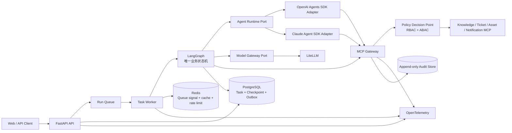

# 流程领航（FlowPilot）

> 面向企业 IT 服务台的可恢复、可审计智能工单 Agent 平台。

## 仓库状态

当前主分支处于 **Architecture Baseline v1.0 + M1 平台切片已集成 + M2 Studio 可观测切片已集成 + P1 VPN 只读闭环已集成**。P1 已通过 S7 RELEASE、S1 FAST final gate 和用户合并门禁；经 Flow Lite 计划且由用户批准的 `g1` 已转化为 P2 持久化恢复注册链，按 `data-recovery → durable-runtime → recovery-verifier` 最小集合执行。真实 Provider、工单写入、Web 与完整端到端工单闭环仍未完成。当前结果不是发布级 `frozen`，也没有可用于简历的性能或质量提升数据。

| 能力 | 当前状态 | 可宣称范围 | 
|---|---|---|
| 产品范围、目标架构、信任边界 | 已设计 | 可使用“设计” |
| README、目标目录与模块依赖 | 已基线化 | 可使用“规划” |
| 功能与安全验收标准 | 已定义 | 可使用“定义验收” |
| M0 公共 JSON Schema | rc1 已拒绝；rc2 五角色同摘要 ACCEPT，本提交激活实现基线 | 可使用“rc2 实现基线已激活”，不可使用“已冻结” |
| Python Workspace、Domain/Application/API 骨架 | M0 九包 Workspace/Lock 已组合验证 | 可描述领域与应用端口骨架，不代表完整 API 业务闭环 |
| 离线评测、证据与信号分流骨架 | 已编码、经 S1 复审并合入主分支 | 只能描述离线骨架，不代表 120/36 数据集或跨组件验收完成 |
| LangGraph/Runtime/Context/Worker 与 Studio 安全入口 | M2 同源图工厂、真实本地 Agent Server、Interrupt/Resume 和安全投影已组合验证 | 可描述可恢复 Runtime 骨架与非黑箱开发入口；真实 Provider 和完整生产业务节点未完成 |
| PostgreSQL/RLS/Checkpoint/Lease 骨架 | M0 Migration、TaskQuery、CAS/Fencing 与 Redis 丢失恢复已组合验证 | 可描述 M0 数据可靠性骨架；生产备份/扩容未验证 |
| MCP Gateway、Policy、Security 与只读模拟 MCP | M1 安全平台切片已集成 | 可描述默认拒绝、审批绑定、账本/回读与安全黑盒骨架；不代表真实企业工具闭环 |
| VPN 确定性只读知识闭环 | P1 已通过 S7 RELEASE、S1 FAST final gate 与用户门禁并进入主分支 | 可描述“确定性只读候选已集成”；不代表真实企业知识源、工单写入或发布完成 |
| 持久化恢复闭环 | P2 注册链已批准，等待 S6→S2→S7 形成精确候选 | 只能描述“进入实施”，通过 final gate 前不可宣称重启/Redis 丢失恢复已验证 |
| OpenAI/Claude Provider | 未实现 | 不可使用“多 Provider 已接入” |
| 本地 Compose 集成 | S7 对精确候选验证 5 服务健康、Migration/RLS/恢复 | `0002` 自动接入仍为 P2；不能宣称发布环境完成 |
| 120 条任务集、36 条安全/故障集 | 未构建 | 不可报告成功率 |
| 800 条路由样本及 LoRA | 未构建 | 不可报告 Macro-F1 |
| Token 降幅、任务成功率提升 | 未测量 | 仅作为待验证假设 |

原方案中的“输入 Token 降低 24%”“任务成功率由 82.5% 提升至 90.0%”“Macro-F1 由 0.86 提升至 0.91”均为目标方向的参考值，不是本仓库已经取得的结果。只有生成可复现的测试报告后，才允许将真实数值写入 README、简历或演示材料。

## 项目目标

FlowPilot 将知识问答、信息补全、工单创建、人工审批和业务工具执行整合成一个任务闭环：

1. 识别用户意图并补全必要信息。
2. 并行检索企业知识和授权范围内的业务数据。
3. 生成带证据的回答或结构化执行计划。
4. 对有副作用的动作执行实时策略判定。
5. 在需要时中断任务并等待人工审批。
6. 使用幂等键执行工具，回读验证结果。
7. 在重启、超时或审批等待后安全续跑。
8. 记录可关联但相互隔离的 Trace、Audit Log 和 Security Event。

首个可交付范围只覆盖 IT 服务台：

- VPN 故障自助排障，失败后创建工单。
- 新员工设备与系统权限申请，包含并行查询、人工审批和多个关联工单。

采购、HR、客服、多模态附件和 LoRA 均为后续增量，不进入首个核心闭环的完成定义。

## 架构结论

FlowPilot 采用“**一个持久化业务状态机、两个执行适配层、一个安全工具入口**”：



- **LangGraph** 是跨业务节点的唯一流程控制器，负责状态、条件路由、并行分支、Interrupt、Checkpoint、恢复与补偿。
- **Agents SDK** 只在有边界的节点内执行专业 Agent 循环、结构化输出、Guardrail 和受限 Handoff，不成为第二套业务状态机。
- **LiteLLM** 位于通用模型调用端口后，用于分类、摘要、评审等模型调用的路由、预算和计量；是否代理某个 Agents SDK 的 Provider 流量由具体适配器决定，不能破坏统一审计。
- **MCP Gateway** 是所有业务工具的唯一入口，执行 Schema 固定、工具白名单、RBAC + ABAC、审批绑定、凭据交换、幂等、回读校验和审计。
- **PostgreSQL** 保存业务任务、LangGraph Checkpoint、审批、工具执行账本和事务型 Outbox；Redis 不是任务事实源。

OpenAI 官方将 Agents SDK 定位为有明确工具和重复编排模式的有界 Agent 工作流，并提供 Agent loop、Handoff、Session、可恢复审批和 Trace。FlowPilot 仍在平台层负责跨业务状态、租户授权和合规审计，详见 [OpenAI Agents SDK](https://developers.openai.com/api/docs/guides/agents)。

## 不可破坏的架构约束

1. Agent 不得直接连接数据库、企业业务网络、密钥服务或上游 MCP Server。
2. 模型只能提出动作，不能决定自身权限、审批结果或最终授权。
3. 每次有副作用的工具调用都必须绑定 `tenant_id`、`task_id`、`action_digest`、`policy_decision_id` 和 `idempotency_key`。
4. 审批只对确定的 `action_digest` 有效；参数、主体、工具、资源或策略版本变化后必须重新审批。
5. LangGraph Interrupt 恢复会重新进入节点，因此 Interrupt 之前的副作用必须为零或天然幂等。
6. Checkpoint 只保存恢复所需最小状态与安全上下文引用，不保存长期凭据或完整敏感资料。
7. Handoff 后重新计算上下文和工具集合，不继承上游 Agent 的全部消息、凭据或权限。
8. Trace 可以采样，Audit Log 与 Security Event 不可采样；三者都不得记录隐藏思维链或明文密钥。
9. LLM-as-Judge 只评估语义质量，不能替代权限、安全、状态和工具结果的确定性断言。
10. 跨租户成功读取和写入必须为 0。
11. 所有量化结论必须关联代码版本、数据集版本、配置版本、原始结果和可复现命令。

## 文档导航

| 文档 | 作用 |
|---|---|
| [STRUCTURE.md](./STRUCTURE.md) | 目标仓库结构、部署单元、依赖方向和目录验收 |
| [架构总览](./docs/architecture/ARCHITECTURE.md) | 容器边界、状态所有权、事务、恢复、安全与可观测设计 |
| [企业级 Agent 学习与演进手册](./docs/architecture/ENGINEERING_PLAYBOOK.md) | 记录检索、恢复、循环、Context、副作用、安全与评测难题及其结构化解法 |
| [Agent Runtime Port](./docs/architecture/AGENT_RUNTIME.md) | OpenAI/Claude Adapter 的统一请求、结果、错误和 Conformance 边界 |
| [LangGraph Studio 非黑箱设计](./docs/architecture/LANGGRAPH_STUDIO.md) | 图拓扑、Interrupt、Handoff、Checkpoint 和安全状态投影的本地可视化边界 |
| [Context Engineering](./docs/architecture/CONTEXT_ENGINEERING.md) | 分层上下文、记忆、裁剪、Handoff 过滤与 Token 评测 |
| [版本化契约](./contracts/README.md) | Task/Command/Event、动作、审批、策略、工具、Context、审计和评测 JSON Schema |
| [七 Codex 会话协作](./docs/team/CODEX_SESSIONS.md) | 七个会话的角色、目录所有权、工程约定、Worktree 与交接 |
| [预授权链路执行约定](./docs/team/CHAIN_EXECUTION_PROTOCOL.md) | 有序工作链、消费者门禁、异常上报与最终 S7/S1 验收 |
| [Codex 会话自动唤醒协议](./docs/team/THREAD_WAKE_PROTOCOL.md) | 会话间自动交接、去重、循环保护与最终用户门禁 |
| [Agent 注册与最小调度协议](./docs/team/AGENT_REGISTRY_PROTOCOL.md) | 按能力、范围、风险和可用性选择最少执行者，减少固定七会话通信成本 |
| [增量上下文启动协议](./docs/team/CONTEXT_BOOTSTRAP_PROTOCOL.md) | 用 Git Base→Target 差异替代新 Attempt 的无条件全量重读 |
| [P2 持久化恢复工作包](./docs/team/work-packages/WP-P2-durable-runtime.md) | Flow Lite `g1` 的批准范围、恢复不变量、测试和注册制执行边界 |
| [集成门禁分级](./docs/team/INTEGRATION_GATES.md) | FAST/STANDARD/RELEASE 的触发条件、证据复用和耗时预算 |
| [七会话执行契约](./docs/team/session-contracts/README.md) | 每个会话的决策权、输入输出、门禁、当前任务与激活条件 |
| [任务控制面](./WORKFLOW.md) | 工作项状态、派发、并发、恢复、证据和安全边界 |
| [rc2 五会话复审指令](./docs/team/RC2_REVIEW_INSTRUCTIONS.md) | 绑定同一 content_digest 的 S2/S3/S4/S5/S6 可复制只读指令 |
| [工作包索引](./docs/team/work-packages/README.md) | WP-000/010/011/012/020/021/030/040 的责任、当前 Attempt、依赖与集成顺序 |
| [AGENTS.md](./AGENTS.md) | 所有 Codex 会话必须遵守的仓库级工程规则 |
| [功能验收标准](./docs/acceptance/ACCEPTANCE.md) | 可运行的功能、安全、恢复与评测完成定义 |
| [机器追踪清单](./docs/acceptance/traceability.v1.json) | 功能 ID 到测试、证据的唯一机器事实源 |
| [评测数据集清单](./contracts/registries/evaluation-dataset-manifest.v1.json) | Case 文件与哈希；`candidate` 空清单不代表 120/36 已实现 |
| [评测 Fixture 清单](./contracts/registries/evaluation-fixture-manifest.v1.json) | 合成租户/主体 Fixture 的版本与哈希 |
| [需求追踪矩阵](./docs/acceptance/TRACEABILITY.md) | 机器追踪清单的人类可读投影视图 |
| [实施路线](./docs/roadmap/IMPLEMENTATION_PLAN.md) | 按垂直切片推进的阶段计划与退出条件 |
| [架构评审报告](./docs/review/ARCHITECTURE_REVIEW.md) | 对原始总稿的保留项、问题与改造决策 |
| [WP-000 rc1 裁决](./docs/review/WP-000-RC1-DISPOSITION.md) | 三方 REJECT、逐项处理和 rc2 冻结门禁 |
| [ADR-0001](./docs/decisions/ADR-0001-orchestration-boundary.md) | LangGraph、Agents SDK 与 LiteLLM 的边界 |
| [ADR-0002](./docs/decisions/ADR-0002-safe-side-effects.md) | 审批、幂等、Outbox 与回读验证 |
| [ADR-0003](./docs/decisions/ADR-0003-task-command-event-protocol.md) | Task 投影、Command 并发与 Event 至少一次协议 |
| [ADR-0004](./docs/decisions/ADR-0004-reproducible-acceptance-and-freeze.md) | 稳定内容摘要、评测分母、Feature 证据与 Audit 哈希链 |
| [原始方案总稿](./企业智能工单与流程协同平台项目方案（企业级优化版）.md) | 历史设计输入，不再作为实施唯一事实源 |

## 验收优先，而不是数字优先

核心版本首先通过可观察的技术行为验收：

- 进程重启后从持久化 Checkpoint 恢复。
- 同一写动作重放十次只产生一次业务写入。
- 审批后篡改任一参数会使审批失效。
- 跨租户、越权 Agent、恶意 MCP 输出和 Prompt Injection 用例被阻断并产生安全事件。
- 并行只读分支可在 Trace 中证明并发执行并正确汇总。
- 每个知识结论包含可回查的文档、章节和版本。
- 所有写操作都有策略决策、审批/确认、执行账本、回读结果和审计事件。
- Handoff 后上下文与工具权限满足最小化策略。

质量数字作为第二层证据：

- 固定 120 条功能任务和 36 条安全/故障任务。
- 单 Agent 基线与多 Agent 方案使用相同数据、模型预算和判定规则。
- Context 裁剪对比记录每条样本的输入 Token，而不是只报告平均百分比。
- LLM-as-Judge 结果必须与规则断言分开，并报告人工校准一致率。
- LoRA 仅在 800 条路由样本具备来源、脱敏、分割与版本清单后启动。

详细门槛与证据格式见 [功能验收标准](./docs/acceptance/ACCEPTANCE.md)。

## 目标技术栈

| 层 | 选型 |
|---|---|
| API 与 Worker | Python、FastAPI、Pydantic |
| 业务编排 | LangGraph、PostgreSQL Checkpointer |
| Agent Runtime | OpenAI Agents SDK / Claude Agent SDK，经统一端口适配 |
| 模型网关 | LiteLLM |
| 工具协议 | MCP，统一经过自建 MCP Gateway |
| 数据 | PostgreSQL + RLS、pgvector、Redis、S3/MinIO |
| 身份与策略 | OIDC、Keycloak（本地）、OPA/Rego 或 Cedar |
| 可观测性 | OpenTelemetry、Prometheus、Grafana、结构化日志 |
| 评测 | Pytest、规则评测、LLM-as-Judge、版本化 JSONL 数据集 |
| 本地交付 | Docker Compose |

M0 Python Workspace 的依赖已经由 `uv.lock` 固定；其余技术栈仍在各工作包中逐步锁定。README 不提前承诺未经兼容性测试的具体版本。

## 目标开发命令

当前已经提供：

```bash
make bootstrap
make studio
make studio-smoke
make test
make test-contract
make test-security
```

`make studio` 只启动默认失败关闭的 `studio-safe` 本地 Agent Server，不启用远程 Trace、生产凭据或公网 Tunnel。`make test` 当前运行 Core、Runtime、Data 与 Platform 测试；S4 离线质量测试使用 `python -m pytest tests/acceptance`。以下全仓接口仍未实现：

```bash
make dev
make eval
make acceptance
```

`make acceptance` 必须生成机器可读的证据清单和人类可读报告；命令不存在或报告不可复现时，项目不能标记为已完成。

底层契约门禁也可独立运行：

```bash
python contracts/conformance/validate.py
```

它与 `make test-contract` 使用同一 Conformance 入口；前者便于架构期或外部解释器直接复核。

## 完成定义

核心版本只有同时满足以下条件才能从“架构设计”升级为“已实现”：

- 两个 IT 服务台闭环均有端到端测试。
- 审批中断、服务重启恢复、失败补偿和幂等重放可自动验证。
- 工具调用不存在绕过 MCP Gateway 的路径。
- 至少两个租户的行级隔离和检索隔离通过测试。
- 120 条功能任务与 36 条安全/故障任务具有固定版本和运行报告。
- Docker Compose 可以从空环境启动演示。
- `README` 中所有“实现”和所有数字都能在追踪矩阵中找到证据。
