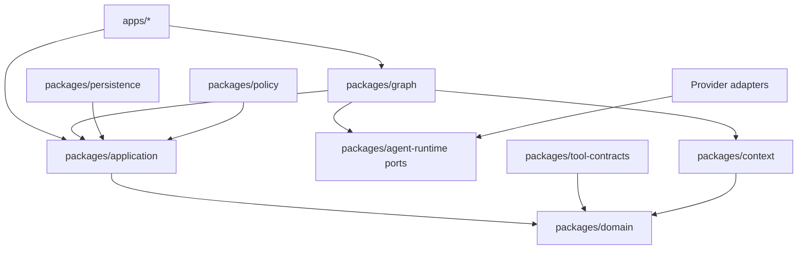

# FlowPilot 仓库结构规范

## 1. 结构决策

FlowPilot 首个企业级核心版采用 **Monorepo + 模块化单体 + 少量独立进程**：

- 模块化单体降低个人项目的部署和事务复杂度。
- API、Task Worker、MCP Gateway 以独立进程运行，分别隔离同步入口、长任务执行和高风险工具。
- 领域逻辑放入可测试的 Python 包，不能反向依赖 FastAPI、LangGraph、Provider SDK 或数据库实现。
- MCP Server、领域包、评测集和基础设施配置作为一级目录，避免埋在 `backend/app` 的技术分层中。
- 达到独立扩缩容、独立故障域或独立合规边界后，才允许把模块拆成微服务。

## 2. 目标目录

```text
flowpilot/
├── README.md
├── STRUCTURE.md
├── AGENTS.md                         # 实现阶段的仓库协作与验证约定
├── WORKFLOW.md                       # 七会话任务控制面、调度与恢复协议
├── Makefile                          # 稳定开发命令入口
├── pyproject.toml                    # Python workspace、工具和公共约束
├── uv.lock                           # 锁定 Python 依赖
├── langgraph.json                    # Studio/本地 Agent Server 的稳定图入口（WP-012）
│
├── apps/                             # 可部署进程，仅负责装配
│   ├── api/                          # FastAPI：认证、命令接收、查询、SSE
│   │   ├── src/flowpilot_api/
│   │   └── tests/
│   ├── worker/                       # LangGraph 执行器、恢复扫描和 Outbox 投递
│   │   ├── src/flowpilot_worker/
│   │   └── tests/
│   └── mcp-gateway/                  # MCP 客户端/服务端桥接与策略执行点
│       ├── src/flowpilot_mcp_gateway/
│       └── tests/
│
├── packages/                         # 可复用的内部包
│   ├── domain/                       # 纯领域模型、状态机不变量、领域事件
│   ├── application/                  # 用例、端口、事务编排
│   ├── graph/                        # LangGraph 图、节点、路由、Checkpoint 映射
│   ├── agent-runtime/                # AgentRuntimePort 与 Provider 适配器
│   ├── model-gateway/                # ModelGatewayPort、LiteLLM 适配和预算
│   ├── tool-contracts/               # ToolRequest/Result、动作摘要和错误分类
│   ├── policy/                       # 策略输入、obligation 和 PDP 适配
│   ├── retrieval/                    # 摄取、混合检索、Rerank、引用
│   ├── context/                      # 分层上下文、摘要、裁剪、Handoff 过滤
│   ├── persistence/                  # PostgreSQL、RLS、Repository、Outbox
│   ├── security/                     # SecurityContext、DLP、注入与附件安全
│   ├── observability/                # OTel、结构化日志、审计事件
│   └── evaluation/                   # 数据集、Runner、规则和 Judge
│
├── domain-packs/                     # 领域配置与领域测试
│   └── it-service/
│       ├── manifest.yaml
│       ├── intents.yaml
│       ├── required-fields.yaml
│       ├── risk-rules.yaml
│       ├── prompts/
│       ├── knowledge/
│       └── evals/
│
├── mcp-servers/                      # 模拟或自建上游工具
│   ├── knowledge/
│   ├── ticket/
│   ├── asset/
│   └── notification/
│
├── contracts/                        # 跨进程、跨语言的版本化契约
│   ├── contract-set.v1.json          # 稳定 content_digest、Review Attestation 与冻结包络
│   ├── conformance/                   # Schema/语义/Audit 链/清单/哈希门禁
│   ├── registries/                    # Evaluation、Dataset、Fixture 候选清单
│   ├── openapi/
│   ├── asyncapi/
│   ├── events/
│   ├── mcp/
│   └── jsonschema/
│
├── web/                              # Next.js 员工台、审批台、治理台
│   ├── app/
│   ├── components/
│   ├── lib/
│   └── tests/
│
├── tests/                            # 跨模块测试
│   ├── runtime/                      # S2：图、Runtime、Context、Worker 恢复
│   │   ├── unit/
│   │   ├── contract/
│   │   ├── integration/
│   │   ├── e2e/
│   │   └── recovery/
│   ├── platform/                     # S3：Gateway、工具、策略、安全
│   │   ├── contract/
│   │   ├── integration/
│   │   ├── security/
│   │   └── recovery/
│   ├── core/                         # S5：Domain、Application、API
│   │   ├── unit/
│   │   ├── contract/
│   │   ├── integration/
│   │   └── application/
│   ├── data/                         # S6：Persistence、RLS、Migration、恢复
│   │   ├── unit/
│   │   ├── integration/
│   │   ├── security/
│   │   ├── e2e/
│   │   └── recovery/
│   ├── experience/                   # S4：Web、组件、可访问性
│   ├── integration/                  # S7：跨分支组合、依赖闭包与证据复现
│   └── acceptance/                   # S4：跨组件 E2E、评测与证据
│       ├── e2e/
│       ├── evaluation/
│       ├── observability/
│       ├── security/
│       └── chaos/
│
├── evals/
│   ├── datasets/
│   │   ├── functional/               # 目标：固定 120 条
│   │   ├── safety-fault/             # 目标：固定 36 条
│   │   └── routing-lora/             # 可选：800 条，需数据卡
│   ├── rubrics/
│   ├── baselines/
│   ├── runners/
│   └── reports/                      # 生成文件，不手工篡改
│
├── infra/
│   ├── compose/
│   ├── postgres/
│   ├── redis/
│   ├── keycloak/
│   ├── opa/
│   ├── otel/
│   ├── grafana/
│   ├── minio/
│   └── audit/
│
├── migrations/                       # 数据库迁移和 RLS 策略
├── scripts/                          # 可复现的开发、种子、验收与 S7 集成复现脚本
├── artifacts/                        # 本地验收证据，默认不提交敏感内容
│   ├── acceptance/
│   └── integration/                  # S7 组合验证生成物，默认不提交
└── docs/
    ├── architecture/                  # 总体、Context、Runtime Port 与 Studio 非黑箱设计
    ├── acceptance/                    # 定义、机器 Traceability 与人类视图
    ├── decisions/
    ├── roadmap/                       # 实施路线、项目交接总览与加速交付计划
    ├── review/
    ├── team/                          # Codex 会话角色、执行契约、工作包、RFC 与交接
    │   ├── session-contracts/
    │   └── work-packages/
    ├── security/
    ├── operations/
    └── reference/
```

当前阶段不会创建大量空目录。实现某一垂直切片时，必须同时创建该切片的代码、契约、测试和文档，避免出现只有目录没有所有权的“架构占位”。

## 3. 部署单元

| 部署单元 | 入口 | 可访问 | 禁止访问 |
|---|---|---|---|
| `api` | HTTP/SSE | OIDC、任务 Repository、Queue Port | Provider 密钥、上游 MCP、业务写工具 |
| `worker` | 队列/恢复扫描 | LangGraph、Checkpoint、Agent/Model Port、MCP Gateway | 直接业务数据库和企业工具 |
| `mcp-gateway` | MCP/内部 HTTP | PDP、Vault、上游 MCP、执行账本、审计 | 修改业务图状态、代替审批人 |
| `web` | 浏览器 | API | 数据库、Provider、MCP |
| `mcp-servers/*` | MCP | 各自模拟业务存储 | 平台 Checkpoint、其他租户 |

PostgreSQL 可以是同一集群，但必须使用不同数据库角色和 Schema 权限。MCP Gateway 不得更新 LangGraph Checkpoint；Worker 不得持有上游工具的长期凭据。

## 4. Python 包依赖方向



强制规则：

1. `domain` 不依赖 FastAPI、LangGraph、SQLAlchemy、Redis、MCP 或模型 SDK。
2. `application` 只依赖领域对象和抽象端口。
3. `graph` 可以依赖 LangGraph，但节点通过端口调用模型、工具、策略和存储。
4. Provider SDK 只能出现在 `agent-runtime` 的适配器目录。
5. LiteLLM 只能出现在 `model-gateway` 的适配器目录。
6. 上游 MCP 客户端只能出现在 `apps/mcp-gateway`。
7. `domain-packs` 通过版本化 Manifest 注册，不允许运行任意 Python 初始化代码。
8. `web` 只消费 OpenAPI/AsyncAPI 生成的客户端，不复制后端枚举。
9. 跨部署单元对象必须来自 `contracts`，不得导入对方内部 Python 类。

这些规则必须由静态导入测试或架构测试执行，不能只写在文档里。

## 5. 关键目录职责

### `packages/domain`

保存稳定业务概念：`Task`、`PlannedAction`、`Approval`、`ToolExecution`、`Evidence`、`SecurityContextRef`、状态转换与不变量。不保存 Prompt、SDK Session 对象或 ORM 模型。

### `packages/graph`

保存 LangGraph State、Reducer、节点和路由。节点必须小而可重放；外部副作用只能通过应用端口发起。图状态不得直接保存二进制附件、完整检索文档、长期凭据或 Provider 私有对象。

### `packages/context`

根据 Agent 职责构建 `ContextEnvelope`，包含来源、信任等级、数据等级、Token 预算和裁剪记录。任何 Handoff 都必须走此包的过滤策略。

### `packages/tool-contracts`

定义工具输入、输出、稳定错误码、`action_digest` 和 `idempotency_key`。工具契约改变必须产生版本差异；不兼容变更要求新版本和重新审批。

### `apps/mcp-gateway`

同时承担 MCP Server 注册/发现、Schema 固定、信任分级、PDP/PEP、短期凭据交换、出站控制、DLP、执行账本和审计。它是安全执行边界，不是业务编排器。

### `evals`

数据集与业务代码分离。每个数据集必须有 `dataset-card.yaml`，记录来源、许可、脱敏、标签说明、切分方法和哈希。报告包含输入数据哈希、代码提交、模型、Prompt、策略和随机种子。

## 6. 命名规范

- Python 包：`snake_case`，发布包前缀使用 `flowpilot_`。
- 目录：`kebab-case`；Python 源码目录除外。
- 功能 ID：`FP-<DOMAIN>-NNN`，例如 `FP-FLOW-004`。
- 事件：过去时态，如 `approval.requested.v1`、`tool.execution_succeeded.v1`。
- 工具：`<domain>.<resource>.<verb>.v<major>`，例如 `itsm.ticket.create.v1`。
- 策略：`<domain>/<resource>/<action>`，例如 `it/ticket/create`。
- 数据库表：复数 `snake_case`，所有租户业务表含 `tenant_id`。
- Trace 属性：使用 OpenTelemetry 语义约定；FlowPilot 自定义项以 `flowpilot.` 开头。

## 7. 目录级验收

实现代码进入主分支前，结构必须满足：

- 每个 `apps/*` 有独立入口、健康检查、配置模型和最小权限说明。
- 每个 `packages/*` 有公开 API 与禁止依赖说明。
- 每个外部接口有版本化契约和契约测试。
- 每个数据库变更有迁移、回滚说明和租户隔离测试。
- 每个领域包有 Manifest、字段/风险规则、Prompt、工具白名单和评测集。
- 每个功能 ID 在追踪矩阵中至少对应一个自动化测试。
- 不提交密钥、未脱敏生产样本、原始附件或含个人信息的 Trace。
- 生成型报告带哈希和命令，不将手工编辑的结果当成验收证据。

## 8. 从当前仓库迁移

当前仓库已有架构文档和 M0 候选公共契约，但尚无功能实现。迁移顺序如下：

1. 由 S2、S3、S4、S5、S6 针对 `flowpilot-m0-contracts-v1-rc2` 的精确摘要重新审查；五个实现角色全部 `ACCEPT` 后，S1 激活实现基线。发布级冻结仍需候选质量资产完成。
2. 用户保留主仓作为 S1 集成目录，并为五个实现角色建立独立 Worktree。
3. 第一波先启动 S5/WP-011 建立 Python Workspace 与 Application/Repository Port；S4/WP-030 可并行建设不依赖运行代码的离线质量骨架。
4. S1 接受 `WP-011-H1` Workspace/Port 交接后，并行启动 S2/WP-010 与 S6/WP-021；连同仍在运行的 S4，写会话不超过三个。
5. S6 交付执行账本 Port、S5 Workspace 可用后启动 S3/WP-020；S4 在前置切片可运行后接入跨组件黑盒验收。
6. 按 WP-011 → WP-010 → WP-021 → WP-020 → WP-030 的依赖顺序集成；依赖交付使用版本化 Port、契约和交接证据，不共享可写目录。
7. 完成 VPN 垂直切片后再创建通用检索、控制台和第二 Provider。
8. 完成审批恢复闭环后再引入新员工复合请求。
9. 核心闭环通过后再创建 `multimodal` 和 `routing-lora` 目录。

禁止一次性生成整棵空目录树并将其视为“企业级改造完成”。
