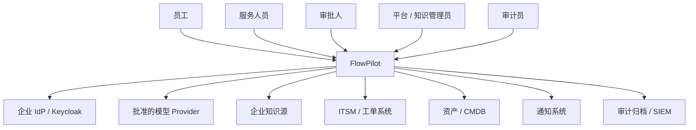
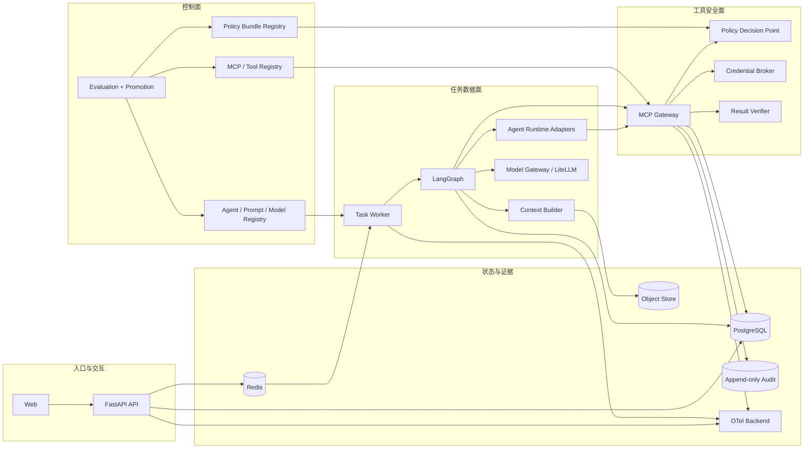
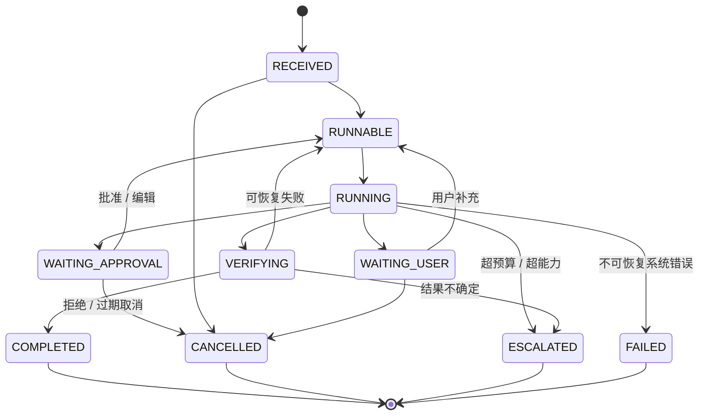
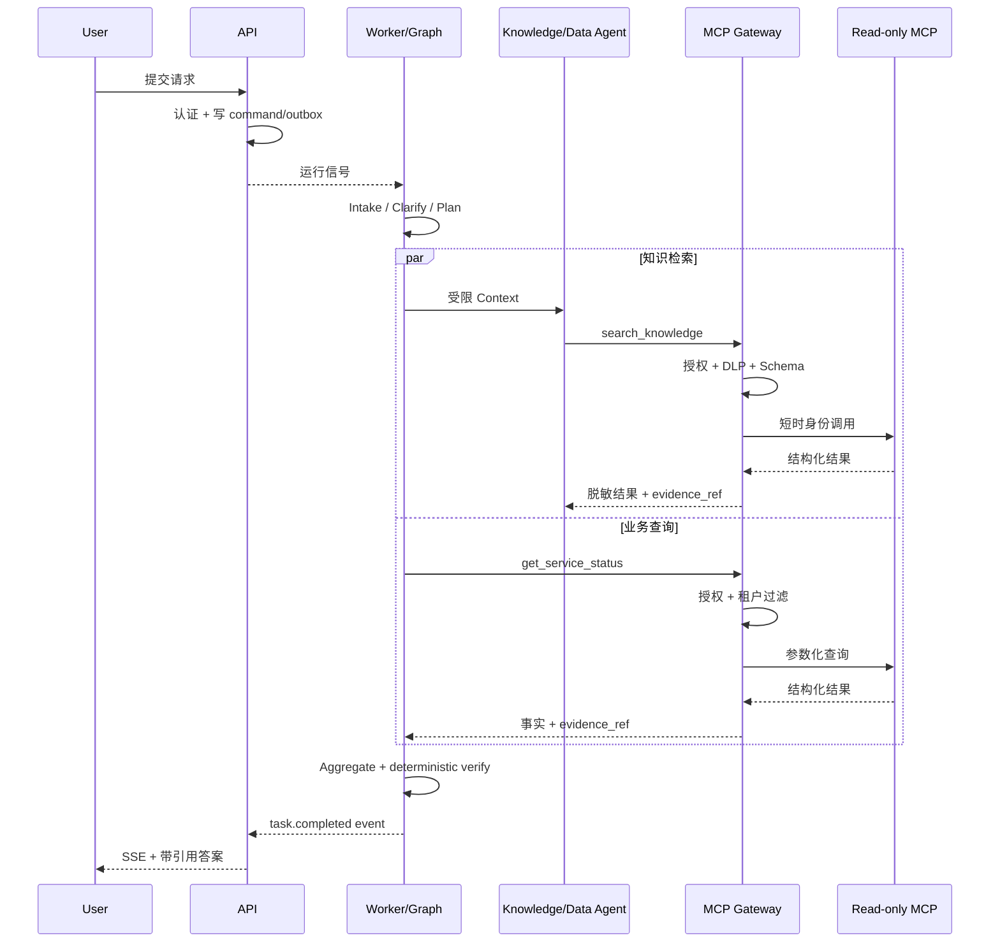
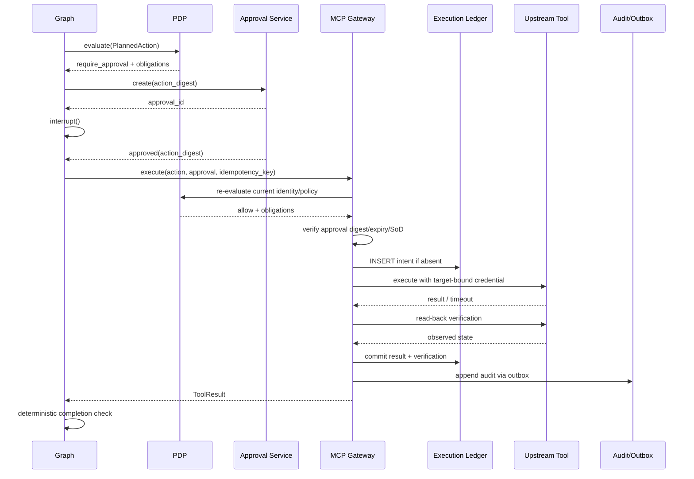

# FlowPilot 企业级目标架构

## 1. 文档定位

本文是 FlowPilot 的实施级架构基线，定义组件边界、状态所有权、关键事务、安全执行协议、恢复语义和可观测证据。产品范围、目录规范和验收标准分别见：

- [README](../../README.md)
- [仓库结构](../../STRUCTURE.md)
- [Context Engineering](./CONTEXT_ENGINEERING.md)
- [功能验收标准](../acceptance/ACCEPTANCE.md)

## 2. 架构驱动因素

按优先级排序：

1. **安全正确性**：跨租户、越权写入、审批绕过和凭据泄漏必须确定性阻断。
2. **可恢复性**：任务可在等待用户、等待审批、进程重启和瞬时故障后继续。
3. **副作用唯一性**：超时、重放和恢复不能重复创建工单或发送通知。
4. **可审计性**：谁、以什么身份、基于哪版策略、对什么资源做了什么必须可追踪。
5. **证据正确性**：知识答案、业务数据和工具结果都保留来源。
6. **可评测性**：同一任务可在固定配置下回放，对比单 Agent、多 Agent 和上下文策略。
7. **可扩展性**：新增领域包或 Provider 不改变核心状态与安全不变量。
8. **个人项目可完成性**：不以微服务数量和生产组件堆叠代替核心闭环。

发生冲突时，上述顺序也是取舍顺序。成本优化不能绕过审批，Provider 降级不能突破数据驻留，自动恢复不能制造重复副作用。

## 3. 系统上下文



FlowPilot 信任用户身份提供方签发的身份声明，但仍对每个请求执行租户、用途和资源级授权。知识、用户输入、附件、模型输出、工具定义和工具输出均不是可信指令。

## 4. 容器与部署边界



### 4.1 API

负责：

- OIDC 登录和访问令牌校验。
- 创建不可由模型修改的 `SecurityContextRef`。
- 接收用户消息、确认、审批和取消命令。
- 查询任务投影、证据、审批和审计摘要。
- 通过 SSE 返回版本化任务事件。
- 将运行意图写入数据库并发出队列信号。

不负责：

- 在 HTTP 请求生命周期内运行完整 LangGraph。
- 直接调用模型、上游 MCP 或业务写工具。
- 持有上游系统长期凭据。

### 4.2 Task Worker

负责：

- 获取带租约的可运行任务。
- 恢复/调用 LangGraph。
- 执行路由、并行只读分支、Interrupt 和补偿。
- 构建最小上下文并调用 Agent/Model 端口。
- 将状态变化写入 Checkpoint、任务投影和 Outbox。
- 扫描超时租约、等待超时和未决补偿。

同一 `task_id` 同时只能有一个有效运行租约。乐观版本 `run_generation` 防止旧 Worker 覆盖新状态。

### 4.3 MCP Gateway

负责：

- 发现并固定上游 MCP Server 和 Tool Schema。
- 根据用户、Agent、用途、数据等级、资源与环境执行 PDP/PEP。
- 对工具输入、输出和 URL 执行 DLP、Schema 与内容安全校验。
- 将审批绑定到不可变动作摘要。
- 获取面向目标资源、短时、最小 Scope 的凭据。
- 维护工具执行账本、幂等、超时、不确定结果和回读验证。
- 产生不可采样的工具、安全和授权审计事件。

MCP Gateway 不修改 LangGraph 状态，也不能自行批准动作。

### 4.4 控制面

核心版可先用 Git 版本文件和受控发布命令实现，不要求首版提供完整 UI。控制面管理：

- Agent/Prompt/模型路由版本。
- 工具 Schema、信任等级和允许列表。
- 策略 Bundle 与回滚。
- 评测数据、报告和版本晋级。

运行时只能读取已发布的不可变版本；Agent 无权修改控制面。

## 5. 状态所有权

“单一状态机”不等于所有数据放进一个对象。不同数据类别具有不同权威源：

| 数据 | 权威源 | 写入者 | 说明 |
|---|---|---|---|
| 业务流程转换 | LangGraph 定义 | Worker | 唯一决定下一业务节点 |
| 图运行快照 | PostgreSQL Checkpointer | LangGraph | 线程级恢复状态 |
| 任务对外状态 | `tasks` 投影表 | Worker | 只能由图状态事件更新 |
| 用户命令 | `task_commands` | API | 追加写；Worker 消费 |
| 审批记录 | `approvals` | API/审批服务 | 决策绑定动作摘要 |
| 工具执行账本 | `tool_executions` | MCP Gateway | 处理幂等与不确定结果 |
| 事务事件 | `outbox_events` | 各业务事务 | 与业务写同事务提交 |
| 对话原文 | 加密消息表/对象存储 | API | 与图状态分离，有保留期 |
| 对话摘要 | 版本化 Summary Store | Context 服务 | 可重建，不覆盖原文 |
| 长期用户偏好 | 明确授权的 Memory Store | 应用服务 | 默认关闭，跨线程且可删除 |
| 知识文档 | 知识源 + 索引 | 摄取服务 | 索引不是原文事实源 |
| Agent SDK Session | Provider/SDK + 引用 | Runtime Adapter | 不是业务状态源 |
| Trace | 可观测后端 | 各组件 | 可采样、可设保留期 |
| Audit Log | 追加写审计存储 | Gateway/审批/API | 不可采样、不可修改 |
| Redis 缓存/信号 | Redis | API/Worker | 可丢失、可重建、非事实源 |

如果任务投影与 Checkpoint 不一致，运行控制以最新合法 Checkpoint 和图版本为准，对外投影通过恢复任务重建。任何人工修复都产生管理命令和审计记录，禁止直接改 Checkpoint JSON。

## 6. 领域状态机



状态约束：

- `WAITING_APPROVAL` 必须引用一个仍有效的 `approval_id` 和 `action_digest`。
- `VERIFYING` 必须引用至少一个工具执行记录。
- `COMPLETED` 的完成条件由意图对应的 `completion_criteria` 决定。
- `FAILED` 表示技术上不可恢复；业务无法自动完成应使用 `ESCALATED`。
- 终态不能由模型直接输出，只能由确定性路由函数产生。
- 每次状态转换都包含 `expected_version`，拒绝丢失更新。

## 7. Graph State 最小模型

Graph State 只保存流程恢复所需数据：

```text
FlowPilotState
├── identity
│   ├── task_id / thread_id / tenant_id
│   ├── security_context_ref / security_context_hash
│   └── run_generation
├── release
│   ├── graph_version / domain_pack_version
│   ├── agent_version / prompt_version
│   ├── policy_version / tool_schema_set
│   └── provider / model
├── intent
│   ├── domain / intent / confidence
│   ├── fields / missing_fields
│   └── risk / data_classification / purpose
├── execution
│   ├── plan / current_step / completion_criteria
│   ├── branch_refs / evidence_refs / observation_refs
│   ├── planned_action_ref / approval_ref
│   └── tool_execution_refs
├── budgets
│   ├── graph_steps / retries
│   ├── input_tokens / output_tokens / cost
│   └── elapsed_ms
└── outcome
    ├── task_status / error_code
    ├── escalation_reason
    └── final_answer_ref
```

以下内容禁止进入 State：

- OAuth Access Token、API Key、Cookie、私钥。
- 原始附件或完整二进制。
- 未裁剪的全部知识文档和全部工具响应。
- 隐藏思维链。
- Provider SDK 的不可序列化运行对象。
- 可通过引用回取的高敏感用户资料。

## 8. Agent 与路由

| Agent | 输入 | 输出 | 工具 |
|---|---|---|---|
| Intake | 当前请求、摘要、字段规则 | 意图、字段、缺失项、置信度 | 无写工具 |
| Knowledge | 查询、授权过滤器、知识元数据 | 答案证据、冲突、知识缺口 | 只读知识 |
| Data | 参数化查询条件、安全上下文 | 结构化业务事实、来源 | 只读业务 |
| Action Planner | 已验证事实、完成条件、允许动作 | `PlannedAction` | 不直接执行 |
| Policy/Verifier | 动作、证据、规则输出 | 语义风险或忠实度建议 | 无写工具 |
| Response | 已验证结论、证据 | 用户可见答案 | 无业务工具 |

执行写工具不是自由 Agent 循环中的任意一步，而是确定性 `ExecuteAction` 图节点调用 MCP Gateway。

路由顺序：

1. 代码规则处理终态、审批状态、重试和预算。
2. 结构化模型处理语义意图与字段。
3. 领域包规则校验模型输出。
4. 独立只读任务使用 LangGraph 并行分发。
5. 汇总节点按 `branch_id` 去重，验证必要分支齐全。

ReAct 只允许在一个专业节点的局部预算内使用；Reflection 最多执行一次，并且只能修正语义输出，不能改变授权结果或扩大工具集。

## 9. Agent Runtime 与模型网关

### 9.1 Agent Runtime Port

```python
class AgentRuntimePort(Protocol):
    async def run(self, request: AgentRunRequest) -> AgentRunResult: ...
```

实现：

- `OpenAIAgentsRuntimeAdapter`
- `ClaudeAgentRuntimeAdapter`
- `FakeAgentRuntimeAdapter`（测试）

端口的完整字段、稳定错误码和 Conformance 规则见 `docs/architecture/AGENT_RUNTIME.md` 与 `AgentRunRequest/AgentRunResult v1` Schema。统一输出只包含结构化业务结果、公开推理摘要、用量、工具提案、Session 引用和 Trace 关联。Provider 原生 Session/Run State 不进入领域层。

工具提案不是权威 `PlannedAction`。Application 层必须使用受信 Task、安全上下文、Agent/Tool Registry 和策略版本重新构造动作；模型给出的租户、主体、Agent、策略、审批或终态字段全部忽略。

一个图节点一次只能选择一个 Runtime。Provider 切换发生在节点边界，必须重新构建 Context、重新计算模型数据策略并记录原因。

### 9.2 Model Gateway Port

用于不需要完整 Agent loop 的窄任务：

- 意图分类。
- 字段抽取。
- 对话摘要。
- Rerank。
- LLM-as-Judge。
- 本地 LoRA 路由模型。

LiteLLM 实现此端口的 Provider 路由、限额、计量和故障策略。它不决定业务路由、审批或工具权限。

### 9.3 Handoff

OpenAI Agents SDK 中：

- Manager 仍拥有会话时，优先使用 agent-as-tool。
- 只有专业域内部真正需要所有权转移时使用 Handoff。

任何 Handoff：

1. 创建新的 `ContextEnvelope`。
2. 仅传递目标 Agent 所需字段和证据引用。
3. 丢弃上游隐藏工作内容和无关消息。
4. 重新计算 `allowed_tools`。
5. 重新执行数据等级与 Provider 策略。
6. 记录 `handoff.from`、`handoff.to`、过滤策略版本和字段清单。

## 10. 只读闭环



只读不等于无风险。每次读取仍执行租户、字段和目的限制，并写授权审计；高敏感批量读取可触发审批或转人工。

## 11. 有副作用动作协议

### 11.1 PlannedAction

```json
{
  "action_id": "act_...",
  "tenant_id": "tenant-a",
  "task_id": "task_...",
  "requester_id": "user-123",
  "agent": {
    "id": "action-planner",
    "version": "1.0.0"
  },
  "tool": {
    "name": "itsm.ticket.create.v1",
    "schema_hash": "sha256:0123456789abcdef0123456789abcdef0123456789abcdef0123456789abcdef",
    "operation": "write"
  },
  "arguments": {
    "category": "network",
    "summary": "VPN 691",
    "description_ref": "obj_..."
  },
  "resource": {
    "type": "ticket",
    "owner_id": "user-123"
  },
  "purpose": "resolve_vpn_incident",
  "data_classification": "internal",
  "policy_version": "policy-...",
  "expires_at": "2026-07-28T12:00:00Z"
}
```

对规范化 JSON 计算：

```text
action_digest = SHA-256(canonical_json(PlannedAction_without_display_fields))
```

所有影响语义、权限或影响范围的字段都必须进入摘要。仅 UI 展示文本可排除。

### 11.2 审批绑定

审批记录至少绑定：

- `tenant_id`
- `task_id`
- `requester_id`
- `action_id`
- `action_digest`
- `tool_schema_hash`
- `policy_decision_id`
- `policy_version`
- `approver_id`
- `decision`
- `decided_at`
- `expires_at`
- `separation_of_duties_result`

审批人编辑参数时，系统创建新 `PlannedAction` 和新摘要，并重新运行策略。旧审批不得迁移到新动作。

M0 只支持一个审批人，`minimum_approvers` 固定为 1。已批准记录必须具有非空审批人、决策时间和为真的职责分离结果；会签、或签和法定人数审批必须使用后续显式契约版本。

Gateway 不把“这些对象同时出现”视为已经绑定。执行前必须确定性比较 SecurityContext↔PlannedAction 的租户/主体、SecurityContext 的 `context_ref/context_hash`↔PolicyDecision 的 `subject_ref/subject_context_hash`、AgentPrincipal↔PlannedAction/PolicyDecision 的 ID/版本/工作负载引用，并重新计算 `action_digest` 对账 PolicyDecision、Approval 和 ToolRequest；审批还必须确定性满足 `approver_id != requester_id`。任何不一致都在调用上游前 fail-closed。ToolResult 的请求、策略和操作类型必须回绑原 ToolRequest；写入成功只有在非空业务结果、证据引用、观察引用和权威回读全部存在时才能标记为 `verified`。

### 11.3 执行顺序



## 12. 幂等、超时与不确定结果

### 12.1 幂等键

```text
idempotency_key =
  SHA-256(tenant_id + task_id + action_id + action_digest)
```

- 相同语义动作的重试必须复用同一键。
- 语义变化必须创建新 `action_id` 和新键。
- Gateway 对 `(tenant_id, tool, idempotency_key)` 建唯一约束。
- 上游支持幂等键时必须继续传递；不支持时使用业务唯一标记与回读对账。

### 12.2 执行账本状态

```text
PREPARED -> RUNNING -> SUCCEEDED -> VERIFIED
                    \-> FAILED_RETRYABLE
                    \-> FAILED_FINAL
                    \-> UNKNOWN
```

`UNKNOWN` 表示请求可能已到达上游，但调用方未收到确定结果。此时禁止盲目重试：

1. 使用上游幂等查询或业务唯一标记回读。
2. 找到结果则转 `SUCCEEDED/VERIFIED`。
3. 确认未执行才允许复用原幂等键重试。
4. 无法确认则转人工对账。

### 12.3 补偿

补偿不是数据库回滚。每个可补偿工具显式定义：

- `compensation_tool`
- `compensation_preconditions`
- `compensation_requires_approval`
- `irreversible_after`

工单创建通常可以通过关闭/取消补偿；已经发送的外部通知不可撤销，只能追加更正。不可逆动作在审批卡中明确提示。

## 13. 事务与消息可靠性

### 13.1 API 命令事务

在一个 PostgreSQL 事务中：

1. 验证任务版本和用户权限。
2. 追加 `task_commands`。
3. 追加 `outbox_events`。
4. 提交。

Outbox Publisher 将事件写入 Redis Stream/队列。Redis 丢失时，未投递 Outbox 会重新发布，因此 Redis 不是事实源。

### 13.2 Worker 状态事务

节点完成后：

1. LangGraph Checkpointer 持久化节点结果。
2. 同一数据库事务或可验证的原子适配层更新任务投影和 Outbox。
3. 如果所用 Checkpointer 无法加入同一事务，增加 `checkpoint_id` 对账记录，并由 Reconciler 修复投影。

不得假设“调用两个 Repository 后都成功”就是原子性。

### 13.3 工具事务

远程业务动作无法与平台数据库形成分布式 ACID。使用：

- 写前执行账本。
- 上游幂等键。
- 明确超时分类。
- 回读验证。
- Transactional Outbox。
- `UNKNOWN` 对账。

这构成可审计的 Saga，而不是伪装成分布式事务。

## 14. Interrupt 与恢复

LangGraph 的动态 Interrupt 在恢复时会从包含 `interrupt()` 的节点开头重新执行。架构要求：

- `PrepareApproval`：纯计算，生成动作摘要。
- `PersistApproval`：幂等创建审批记录。
- `WaitApproval`：调用 `interrupt()`；在其之前不执行外部动作。
- `ValidateResume`：验证命令、审批、当前身份、摘要、策略和过期时间。
- `ExecuteAction`：独立副作用节点，依赖幂等账本。

恢复流程：

1. API 追加批准/用户补充命令。
2. Worker 用同一 `thread_id` 加载 Checkpoint。
3. 校验 `run_generation` 和图版本兼容性。
4. 重新解析当前 `SecurityContextRef`。
5. 重新执行 PDP；权限撤销优先于旧审批。
6. 验证命令未被消费，随后恢复图。
7. 写动作使用原 `idempotency_key`。

升级后的图若不能读取旧状态，必须提供状态迁移函数或将任务转人工，不允许静默用新字段默认值继续高风险动作。

## 15. 多租户与数据

### 15.1 数据库

- 所有租户业务表包含不可空 `tenant_id`。
- API 和 Worker 在每个事务设置受控租户上下文。
- PostgreSQL RLS 作为应用过滤之外的兜底。
- 平台管理员不能默认绕过 RLS；Break-glass 使用独立角色、短时授权和完整审计。
- 唯一约束通常包含 `tenant_id`。
- 跨租户分析使用脱敏聚合管道，不在在线 Agent 查询中完成。

### 15.2 检索

授权过滤发生在召回前：

```text
tenant_id
AND acl_subjects intersects caller_subjects
AND data_classification <= permitted_level
AND effective_at <= now
AND (expires_at IS NULL OR expires_at > now)
```

Rerank 和生成阶段不能重新引入过滤前候选。引用包含文档、版本、章节、Chunk、有效期和访问决策 ID。

### 15.3 对象存储

- 上传先进入隔离 Bucket。
- 扫描通过后生成规范化 Observation。
- Agent 默认只拿 Observation 与短时读取引用。
- 原文件、派生文本和缩略图分别设置权限与保留期。
- 租户密钥、对象路径和预签名 URL 不进入模型上下文。

## 16. 安全模型

### 16.1 身份

- 用户：OIDC Authorization Code + PKCE。
- 服务：Workload Identity 或 mTLS。
- MCP 上游：目标资源绑定的 Token Exchange，不透传用户原 Token。
- 审批链接：一次性 nonce、短期有效、绑定审批人和任务。

### 16.2 授权输入

PDP 输入至少包括：

- Subject：租户、用户、角色、部门、组、认证强度。
- Agent：ID、版本、运行时、允许能力。
- Action：工具、版本、读写分类、参数摘要。
- Resource：租户、所有者、数据等级、业务状态。
- Environment：用途、风险、网络、设备、时间、审批状态。

输出为 `allow`、`deny` 或 `require_approval`，附带强类型、可执行 obligations。未知、重复、畸形、冲突或执行点不支持的 obligation 一律 fail-closed。用户主体与 Agent 主体分别授权，任一明确拒绝采用 deny-overrides。

安全输入必须来自认证服务和已发布 Registry，并校验租户、用途、有效期、版本与哈希。Schema 合法只证明结构，不证明来源可信。

### 16.3 Prompt Injection

防御是纵深控制：

1. 输入、检索、附件和工具输出标记来源/信任等级。
2. 系统策略与不可信数据分区。
3. MCP 工具列表固定、描述审核、Schema 哈希。
4. Agent 工具白名单与参数 Schema。
5. 确定性授权、审批和出站控制。
6. 输出 DLP、URL 白名单和引用验证。
7. 安全事件与红队回归。

注入检测器是风险信号，不是授权器。即使检测漏报，工具层仍应阻止越权动作。

## 17. 可观测性与审计

### 17.1 关联键

所有组件传播：

- `trace_id`
- `task_id`
- `thread_id`
- `tenant_id`（日志中可用不可逆别名）
- `run_id`
- `graph_node`
- `agent_id` / `agent_version`
- `model` / `prompt_version`
- `policy_decision_id`
- `tool_execution_id`

### 17.2 三类记录

| 类型 | 目的 | 采样 | 敏感内容 |
|---|---|---|---|
| Trace | 调试、延迟、调用路径 | 允许 | 默认仅摘要、哈希和引用 |
| Audit Log | 合规与责任 | 禁止 | 脱敏参数、身份、决策、结果 |
| Security Event | 检测与响应 | 禁止 | 规则命中、影响与处置 |

三类记录使用一致的 `trace_id/thread_id/task_id/run_id/correlation_id/causation_id` 语义，但进入不同存储。Trace 被采样不影响 AuditEvent 与 SecurityEvent 持久化；阻断审计必须关联独立安全事件。

TaskEvent、AuditEvent 和 SecurityEvent 都携带认证工作负载的 `producer_principal_ref`，枚举值不能代替生产者身份。AuditEvent 按受信 Tenant/Stream 注册表建立哈希链，并在流内使用严格递增 `sequence`：首事件 `previous_hash=null`，后续事件必须引用前一条已重算事件哈希。哈希前像固定为 `{"profile":"flowpilot.audit-chain.v1","event":<仅删除 integrity.event_hash 的完整事件>}` 的 RFC 8785 规范字节；正文篡改、重复/缺口、跨流前序引用和错误 Tenant 都 fail-closed。SecurityEvent 保存稳定规则、原因码、严重度、影响、处置和脱敏证据引用，不承载原始 Prompt、工具输出或密钥。

### 17.3 必须可证明的 Trace

- 知识与数据分支实际并行。
- Interrupt 前后使用同一任务和不同 Run。
- 恢复时重新授权。
- Handoff 过滤前后只记录字段名、分类和 Token 数，不记录被丢弃的敏感值。
- 写动作从计划、审批、执行到账本/回读完整关联。

### 17.4 审计降级

对写操作采用 fail-closed：

- 审计 Outbox 无法在本地事务中持久化时，不执行写工具。
- 审计下游暂不可用但 Outbox 已持久化时，可执行并持续重投。
- Outbox 超过告警阈值后停止新的高风险动作，保留只读和人工恢复能力。

## 18. 可靠性与预算

默认预算由配置提供并写入每次 Run：

- 图最大步骤。
- 单节点重试次数。
- 总恢复次数。
- 每 Agent 输入/输出 Token。
- 单任务成本。
- 工具超时。
- 总挂钟时间。

重试矩阵：

| 错误 | 自动重试 | 处理 |
|---|---:|---|
| 429/503/网络未发送 | 是 | 指数退避 + jitter |
| 参数 Schema 错误 | 最多一次模型修正 | 再失败转人工 |
| 业务拒绝 | 否 | 返回明确原因 |
| 权限拒绝 | 否 | 终止动作并审计 |
| 上游结果不确定 | 否 | 回读/对账 |
| Prompt Injection 高风险 | 否 | 阻断并产生安全事件 |
| 预算耗尽 | 否 | 输出进度并转人工 |

连续两次没有有效状态变化、或相同 `(agent, tool, args_hash)` 重复出现时结束自动循环。

## 19. 本地部署拓扑

核心版 Docker Compose：

```text
web
api
worker
mcp-gateway
mcp-knowledge
mcp-ticket
mcp-asset
mcp-notification
postgres
redis
keycloak
opa
minio
otel-collector
prometheus
grafana
```

可选 Profile：

- `provider-openai`
- `provider-claude`
- `multimodal`
- `lora`
- `audit-worm-simulator`

默认 Profile 必须可使用 Fake Runtime 和模拟 MCP 完成测试，CI 不依赖真实 Provider 账户。

## 20. 明确不采用

- 不将每个 Agent 部署为微服务。
- 不让 Supervisor 直接持有所有工具。
- 不让模型生成任意 SQL 或 Shell 后直接执行。
- 不用 Redis 保存唯一任务状态。
- 不把 Provider Session 当作业务 Checkpoint。
- 不让审批只绑定自然语言摘要。
- 不对 `UNKNOWN` 结果盲目重试。
- 不用 LLM-as-Judge 判定是否越权或工具是否真的成功。
- 不在线自动修改 Prompt、策略或模型权重。
- 不在实现前把目标数字写成实际成果。

## 21. 技术依据

- [OpenAI Agents SDK](https://developers.openai.com/api/docs/guides/agents)
- [OpenAI MCP and Connectors](https://developers.openai.com/api/docs/guides/tools-connectors-mcp)
- [LangGraph Persistence](https://docs.langchain.com/oss/python/langgraph/persistence)
- [LangGraph Interrupts](https://docs.langchain.com/oss/python/langgraph/interrupts)
- [LangGraph Subgraphs](https://docs.langchain.com/oss/python/langgraph/use-subgraphs)
- [MCP Authorization 2025-11-25](https://modelcontextprotocol.io/specification/2025-11-25/basic/authorization)
- [MCP Security Best Practices](https://modelcontextprotocol.io/docs/tutorials/security/security_best_practices)
