# FlowPilot Context Engineering 与分层记忆

## 1. 目标

FlowPilot 的 Context Engineering 不追求“把更多历史塞给模型”，而是为每个 Agent 构造最小、可追踪、权限正确的输入。验收关注：

- 上下文是否只包含当前步骤所需数据。
- 数据是否带来源、信任等级和分类。
- Handoff 是否消除不必要信息和权限继承。
- 长对话是否在预算内稳定运行。
- 裁剪前后 Token、质量和安全是否可复现比较。

“平均输入 Token 降低 24%”只能是评测结果，不能预先写成架构事实。

## 2. ContextEnvelope

所有模型和 Agent 调用必须使用统一信封：

```json
{
  "context_id": "ctx_...",
  "task_id": "task_...",
  "tenant_id": "tenant-a",
  "agent_id": "knowledge-agent",
  "purpose": "resolve_vpn_incident",
  "policy": {
    "context_policy_version": "ctx-policy-1",
    "data_classification_ceiling": "internal",
    "provider_allowlist": ["provider-a"],
    "token_budget": 6000
  },
  "layers": [],
  "manifest": {
    "included_refs": [],
    "excluded_fields": [],
    "redactions": [],
    "input_tokens_estimated": 0,
    "input_tokens_actual": null,
    "truncation_reason": null
  }
}
```

`ContextEnvelope` 是模型输入的唯一入口。Runtime Adapter 不允许绕过它自行拼接完整历史。

## 3. 上下文层级

| 层 | 内容 | 信任等级 | 默认优先级 | 可裁剪 |
|---|---|---|---:|---|
| L0 | 平台安全指令、Agent 职责、结构化输出契约 | 受控配置 | 0 | 否 |
| L1 | 最小安全视图：主体别名、租户、用途、允许能力 | 已认证引用的派生视图 | 1 | 否 |
| L2 | 当前任务状态、完成条件、当前步骤、预算 | 业务状态 | 2 | 否 |
| L3 | 版本化对话摘要、未决问题、用户确认 | 派生数据 | 3 | 部分 |
| L4 | 最近且相关的对话消息 | 用户/外部输入 | 5 | 是 |
| L5 | 权限过滤后的检索证据 | 不可信数据 | 4 | 是 |
| L6 | 脱敏后的工具 Observation | 不可信数据 | 3 | 是 |
| L7 | 领域示例或少样本示例 | 受控配置 | 6 | 是 |

优先级数值越小越重要。裁剪时不能删除 L0/L1/L2，也不能通过删除来源元数据来保留更多正文。

Schema 信任值固定映射为：L0/L7=`controlled_instruction`、L1=`authenticated_derived`、L2=`business_state`、L3=`derived_data`、L4/L5/L6=`untrusted_data`。任何层都必须具有非空内容和至少一个 `source_ref`；L0/L1/L2 的内容必须是非空结构化对象。检索结果、用户消息或工具 Observation 即使通过 Schema 或由可信服务转发，也不能升级成指令。

## 4. 指令与数据分区

呈现给模型的逻辑结构固定为：

```text
[SYSTEM_POLICY]
  平台不可变安全规则
[AGENT_CONTRACT]
  当前 Agent 责任、禁止事项、输出 Schema
[SECURITY_VIEW]
  经签名引用派生的最小权限信息
[TASK_STATE]
  目标、当前步骤、完成条件、预算
[CONVERSATION_SUMMARY]
  已确认事实、未决问题、用户偏好
[UNTRUSTED_EVIDENCE]
  文档、工具结果、附件 Observation
[RECENT_MESSAGES]
  必要的最近对话
```

`UNTRUSTED_EVIDENCE` 中的“忽略系统规则”“调用某工具”等内容均作为数据，不具有指令优先级。任何工具调用仍由 Schema、允许列表和 PDP 强制约束。

## 5. 分层记忆

| 记忆类型 | 范围 | 存储 | 内容 | 写入条件 |
|---|---|---|---|---|
| Graph State | 单任务/线程 | PostgreSQL Checkpointer | 当前流程与引用 | 每个安全节点边界 |
| Conversation Messages | 单线程 | 加密消息表/对象存储 | 用户与系统可见消息 | 每次交互 |
| Conversation Summary | 单线程 | Summary Store | 已确认事实、未决问题、决定 | 阈值触发或阶段结束 |
| Task Facts | 单任务 | 业务表 | 结构化字段、完成条件 | 验证后 |
| Retrieval Evidence | 单次/可缓存 | 检索索引 + 引用 | 文档片段与元数据 | 每次检索 |
| Tool Observation | 单动作 | 工具账本/对象存储 | 脱敏结果、回读证据 | 工具完成后 |
| User Preference | 跨线程 | Opt-in Memory Store | 语言、通知偏好等 | 用户明确授权 |
| Knowledge | 跨用户 | 企业知识源 | SOP、FAQ、制度 | 管理员发布 |

安全上下文、角色和 Scope 不属于长期记忆。每次恢复和工具调用都从身份/策略服务重新求值。

## 6. 对话摘要契约

摘要必须结构化：

```json
{
  "summary_version": 4,
  "covered_message_ids": ["msg_1", "msg_2"],
  "confirmed_facts": {
    "operating_system": "Windows 11",
    "vpn_error_code": "691"
  },
  "user_reported_actions": [
    "已重新输入账号密码"
  ],
  "system_verified_facts": [],
  "pending_questions": [
    "当前使用公司网络还是家庭网络"
  ],
  "decisions": [],
  "citations": [],
  "sensitive_refs": [],
  "generated_by": {
    "model": "...",
    "prompt_version": "...",
    "source_hash": "..."
  }
}
```

规则：

- 区分用户声称、系统验证和模型推断。
- 摘要不能把推断升级为事实。
- 新摘要只能覆盖明确列出的消息范围。
- 重要审批、用户确认和工具结果使用结构化记录，不只依赖摘要。
- 摘要生成失败时保留旧版本并回退到相关消息窗口。
- 可通过原始消息重建摘要，摘要不是审计源。

## 7. Context 构建流水线

```mermaid
flowchart LR
    P["Purpose + Agent Profile"] --> AUTH["Resolve Security View"]
    AUTH --> STATE["Select Task State"]
    STATE --> SUM["Load / Refresh Summary"]
    SUM --> RET["Retrieve with ACL"]
    RET --> OBS["Load Tool Observations"]
    OBS --> SAN["Sanitize + Source Labels"]
    SAN --> SCORE["Relevance / Recency / Necessity"]
    SCORE --> BUDGET["Allocate Token Budget"]
    BUDGET --> PACK["Build ContextEnvelope"]
    PACK --> LOG["Write Manifest + Hash"]
```



流水线是确定性的应用代码。模型可以参与摘要、Query 改写和相关性评分，但不能改变数据分类上限或绕过授权过滤。

## 8. Token 预算

预算由 Agent Profile 和任务阶段共同决定：

```text
total_input_budget
  = reserved_system
  + reserved_output_schema
  + task_state_budget
  + evidence_budget
  + conversation_budget
  + examples_budget
```

分配原则：

1. 先预留 L0/L1/L2 和输出空间。
2. 保留当前动作直接相关的工具 Observation。
3. 证据按权限、有效期、相关性、去重后选择。
4. 对话优先保留未决问题和最近确认。
5. 少样本示例最后加入。
6. 超限时记录删除对象的引用、原因和 Token，不记录被删除的敏感正文。

模型窗口大小不是默认使用目标。每个 Agent Profile 有独立软/硬预算；超过硬预算直接失败或转摘要，不能静默截断系统策略或输出 Schema。

## 9. Agent 输入过滤

| 目标 Agent | 必须包含 | 默认排除 |
|---|---|---|
| Intake | 当前用户消息、任务摘要、字段规则 | 检索全文、工具凭据、其他领域历史 |
| Knowledge | 查询、已确认字段、ACL 过滤器、引用格式 | 用户角色明细、写工具、全部对话 |
| Data | 参数化查询意图、资源范围、安全上下文引用 | 检索文档、写动作计划、无关消息 |
| Action Planner | 已验证事实、完成条件、允许工具 Schema | 原始敏感字段、未经验证的模型猜测 |
| Policy/Verifier | 动作摘要、证据引用、规则结果 | 凭据、无关历史、隐藏推理 |
| Response | 已验证结论、引用、用户可见状态 | 内部策略细节、工具密钥、完整 Trace |
| Judge | 脱敏样本、Rubric、参考答案 | 生产身份、模型隐藏推理、未经授权附件 |

## 10. Handoff 输入过滤

Handoff 不是传递完整 Transcript。过程：

1. 目标 Agent 声明 `required_context_fields`。
2. Context Builder 从结构化 State 和引用中选择字段。
3. 应用数据分类和用途限制。
4. 对文档/工具结果做不可信来源标记。
5. 丢弃调用方的工具结果原文，只保留必要 Observation。
6. 生成 `handoff_manifest`。
7. 目标 Agent 工具集合根据其身份和当前动作重新计算。

`handoff_manifest` 示例：

```json
{
  "from": "orchestrator",
  "to": "knowledge-agent",
  "policy_version": "handoff-2",
  "included_fields": [
    "task.intent",
    "task.confirmed_fields.operating_system",
    "task.confirmed_fields.vpn_error_code"
  ],
  "included_refs": ["summary:v4"],
  "excluded_categories": [
    "approval",
    "tool_credentials",
    "unrelated_messages"
  ],
  "input_tokens": 812
}
```

## 11. 检索上下文

每个证据片段包含：

- `document_id`
- `document_version`
- `chunk_id`
- `title`
- `section`
- `tenant_id`
- `acl_decision_id`
- `data_classification`
- `effective_at`
- `expires_at`
- `retrieval_score`
- `rerank_score`
- `content_hash`

引用正确性由确定性代码验证：

- 引用是否来自本次允许候选。
- 文档是否仍有效。
- 输出声明能否定位到具体 Chunk。
- 不允许模型创建不存在的文档 ID。

## 12. 工具 Observation

Agent 不直接接收任意上游响应。Gateway 将结果规范化为：

```json
{
  "observation_id": "obs_...",
  "tool_execution_id": "tex_...",
  "tool": "itsm.ticket.get.v1",
  "status": "success",
  "facts": {},
  "display_summary": "...",
  "evidence_ref": "evidence_...",
  "source_trust": "t0_internal",
  "data_classification": "internal",
  "redactions": [],
  "injection_signals": [],
  "content_hash": "..."
}
```

大响应正文进入对象存储，Context 只取允许字段和引用。包含 URL、Markdown、HTML、日志或自由文本的字段再次进行注入和出站检查。

## 13. 评测设计

### 13.1 对照组

- **Baseline**：相同任务、模型、Prompt 目标和工具，使用完整对话窗口与固定 Top-K 证据。
- **Optimized**：使用分层摘要、相关消息窗口、权限过滤、证据去重和 Handoff Profile。

不能用更强模型或更大预算作为 Optimized 的隐藏变量。

### 13.2 记录

每个 Case 记录：

- Baseline/Optimized 的实际输入与输出 Token。
- 上下文层级 Token 分布。
- 被裁剪对象数量与原因。
- 任务成功、字段正确、工具参数、引用正确。
- 安全违规和敏感数据泄漏。
- 延迟与成本。
- 模型、Runtime、Prompt、Context Policy 和数据集版本。

### 13.3 发布判断

Context 策略通过功能验收需满足：

- 每次模型调用都有可查询 Manifest。
- 超预算时按确定性顺序裁剪或失败。
- Handoff 禁止字段为零泄漏。
- 长对话 Case 全部保持在硬预算内。
- 任务质量与安全没有超过团队设定的回归容忍度。
- 报告给出真实 Token 变化分布，而非只给一个平均数。

24% 不是固定门槛。如果实测为 11%，报告 11%；如果 Token 降低但任务成功率明显下降，该策略不能晋级。

## 14. 隐私与保留

- 原始消息、摘要、Context Manifest、Trace 和评测样本采用不同保留策略。
- Manifest 记录引用、分类、哈希和 Token，默认不复制完整 Prompt。
- 用户删除请求应删除可删除的对话与长期记忆，并保留最小合规审计。
- 生产失败样本进入评测前必须去标识化、人工复核并重新授权用途。
- 跨租户样本不能混入同一 Prompt；跨租户统计只能使用脱敏聚合。

## 15. 失败与降级

| 故障 | 降级 |
|---|---|
| Summary 模型失败 | 使用上一个有效摘要 + 最近消息 |
| Token 估算失败 | 使用保守字符预算，禁止超硬限制 |
| Retrieval 不可用 | 明确知识不可用，转工单或人工 |
| Context 发现 Restricted 数据且 Provider 不允许 | 改用批准的本地模型或转人工 |
| Handoff 过滤器失败 | Fail closed，不执行 Handoff |
| Manifest 写入失败 | 不发起模型调用 |
| 证据过期/冲突 | 标记冲突，不生成确定性结论 |

## 16. 反模式

- 把全部对话摘要成一段不可追踪自由文本。
- 在摘要里保存明文密钥或完整身份证件。
- 为节省 Token 删除引用和数据分类。
- Handoff 复制所有消息和所有工具。
- 把向量相似度当作授权。
- 用模型自行决定哪些租户数据可见。
- 只测平均 Token，不测 P95、成功率和安全回归。
- 根据生产反馈自动修改 Prompt 或 Context Policy。
