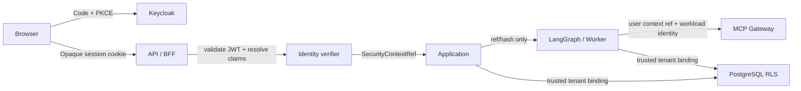

# M8 本地身份与租户架构

## 1. 信任链

Keycloak 只负责认证与会话生命周期；FlowPilot 负责把允许 Claim 映射为受信上下文，
并在 API、Worker、Gateway 和数据库边界重新验证。模型不参与这条信任链。

## 2. 本地身份配置

| 主体 | Flow | audience | 用途 |
|---|---|---|---|
| Web 用户 | Authorization Code + PKCE | FlowPilot API | 登录、查询、命令、审批 |
| Worker | Client Credentials | Worker/MCP service audience | 拉取任务、恢复图、提出工具调用 |
| MCP Gateway | Client Credentials 或本地 mTLS 等价入口 | Gateway/upstream audience | 验证 Agent 并调用受控工具 |

Realm 至少包含两个租户。租户 Claim 使用固定名称与枚举映射；客户端不能通过 Query、
Header、正文或 Graph State 覆盖。角色只做认证属性输入，最终授权仍由后续策略执行点决定。

## 3. API/BFF 会话

- 浏览器只获得 `HttpOnly`、`SameSite` 的不透明会话 Cookie；生产模式要求 `Secure`。
- state、nonce 与 PKCE verifier 为一次性材料，回调成功或失败后立即失效。
- Access/Refresh Token 只在服务端会话边界使用；Refresh 失败、登出或 Keycloak 撤销后，
  本地会话和关联 SecurityContext 同时失效。
- API 将认证结果映射为 `TrustedRequestIdentity` 和服务端上下文记录。请求正文携带的
  `SecurityContextRef` 只能与受信记录完全相等，不能创建或修改身份。

## 4. SecurityContext 生命周期

服务端记录至少保存 ref/hash、tenant、subject、角色/组、scope、认证方法与强度、用途、
数据分级上限、issued/expires、session hash 和 active 状态。跨进程对象仍只携带现有
`SecurityContextRef v1`。

以下边界必须重新解析，而不是相信上一步传入的 Mapping：

1. API Command Intake 与任务读取。
2. Worker 获取租约并恢复 Graph。
3. Handoff 后重新构建 Context 与工具集合。
4. MCP Gateway 在策略、账本占位和上游调用之前。
5. PostgreSQL 事务建立 tenant binding 之前。

## 5. 数据库绑定

RLS 的 tenant 值不能直接来自外部字符串。生产组合先验证 SecurityContext，再创建当前
事务可消费的 tenant binding；Persistence 在事务开始时设置 tenant/context/subject，
在提交、回滚和连接归还前清理。数据库角色必须显式拒绝 `SUPERUSER` 与 `BYPASSRLS`，
启动时发现不安全的既存角色应失败，而不是沿用。

## 6. 禁止传播的数据

Bearer Token、Refresh Token、Authorization Code、Cookie、Client Secret、原始 Claim、
PKCE verifier 和 nonce 不得进入 Task、Command、Graph State、Checkpoint、Context、
Prompt、Trace、Audit、事件、错误或 Evidence。需要关联时只保存不可逆 Hash 或不透明引用。

## 7. M8 边界

M8 完成身份认证、租户绑定和恢复重验。Rego 策略、DLP、Secret Provider 和可查询追加式
审计属于 M9；企业 IdP、生产 HA、TLS 终止与真实企业 Connector 不在当前本地演示范围。
