# FlowPilot M11 短期记忆架构

## 1. 定位

短期记忆服务于一个 `tenant_id + task_id + thread_id` 内的连续对话。它保存最近轮次、
已确认事实、待补字段、未决问题、引用和任务内决定，使 Worker 重启或用户暂离后仍能在
硬 Token 预算内恢复。

短期记忆不是新的业务状态机，也不是长期用户画像：

- LangGraph 仍是跨节点流程状态机，PostgreSQL Task/Checkpoint 仍是业务恢复事实。
- 结构化 Task Facts、审批、策略和工具账本仍由各自权威对象决定。
- SecurityContext、角色、Scope、Capability、凭据和 Provider Session 不得写入记忆。
- M12 长期记忆和 M13 用户画像不能提前混入本阶段。

公共 `ContextEnvelope v1` 已包含 L3/L4、Manifest 和 Token 预算，本阶段不修改
ContractSet。M11 在内部 Python Port、数据库表和产品投影上实现该契约。

## 2. 状态所有权

| 对象 | 权威性 | 持久化 | 用途 |
|---|---|---|---|
| Task/Graph State | 业务事实 | PostgreSQL Checkpoint/Task | 流程、状态、恢复位置 |
| Conversation Turn | 用户可见交互记录 | PostgreSQL 追加记录 | 重建摘要和最近消息 |
| Working Memory Snapshot | 可重建派生状态 | PostgreSQL 版本记录 | L3 摘要、未决问题、消息高水位 |
| Context Manifest | 调用证据 | PostgreSQL 追加记录 | 层级引用、预算、裁剪、Hash、实际用量 |
| Token Budget Ledger | Checkpoint 绑定计数 | Graph Checkpoint + Manifest | 跨轮硬预算与恢复 |
| Redis | 非权威协调 | 可清空 | 缓存、唤醒、清理调度 |

Checkpoint 只保存 `memory_snapshot_ref/version/hash`、消息高水位、预算计数和必要恢复
字段，不保存完整 Transcript、Prompt、凭据或隐藏思维链。Snapshot 丢失时可以从仍在保留期
内的可见消息和 Task Facts 重建；重建失败时不得伪造摘要。

## 3. 内部模型

`ConversationTurn` 至少绑定：

- tenant、task、thread、command/message ID 和单调序号；
- actor 类型、可见文本或安全对象引用、分类、来源与创建时间；
- 内容 Hash、幂等键、保留期限和删除状态；
- 不包含 Token、Cookie、Provider Session、隐藏推理或原始附件。

`WorkingMemorySnapshot` 至少包含：

- snapshot version、covered-through sequence、source hash 和 policy version；
- `claimed`、`verified`、`inferred` 三个互斥区；
- pending fields/questions、decisions、citations、recent-message refs；
- classification ceiling、created/expires time、生成器与校验器版本；
- Token 估算和可解释裁剪结果。

事实升级只能由确定性规则完成：用户输入进入 `claimed`；可信工具、业务事实或用户明确
确认可以进入 `verified`；模型候选只能进入 `inferred`，不能自行升级。相同来源范围的摘要
使用 CAS 和内容 Hash 幂等；同版本不同内容必须冲突。

## 4. 写入与调用顺序

```mermaid
flowchart LR
    IN["已认证用户输入"] --> TURN["追加 Conversation Turn"]
    TURN --> FACT["读取权威 Task Facts"]
    FACT --> COMPACT["确定性合并 / 可选摘要候选"]
    COMPACT --> CAS["CAS Working Memory Snapshot"]
    CAS --> BUILD["构建 L0-L6 ContextEnvelope"]
    BUILD --> MANIFEST["持久化 Context Manifest"]
    MANIFEST --> MODEL["调用 Provider"]
    MODEL --> USAGE["回填实际 Token 用量"]
    USAGE --> CHECKPOINT["提交安全 Graph Checkpoint"]
```

约束：

1. 用户输入先持久化，再允许调用模型；重复 Command 不得形成重复逻辑 Turn。
2. Summary Candidate Port 可以调用模型，但输出先经过 Schema、来源、分类、DLP 和事实升级
   校验；失败时保留上一有效 Snapshot 加最近消息。
3. Context Manifest 写入失败时不调用模型；实际 Token 回填失败记录可恢复欠账，不篡改业务
   终态。
4. Summary、Turn 与 Manifest 不与外部工具副作用组成同一事务；工具事实仍由账本和回读决定。
5. Redis 清空、Worker 重启和重复恢复不得改变 Snapshot Hash 或重复计入 Token。

## 5. Token 预算与裁剪

复用现有 `ContextEnvelope`、`ContextBudgetLedger` 和 L0～L7 优先级。M11 增加任务内策略：

- L0/L1/L2 永不裁剪；先预留输出和当前动作所需 Observation。
- L3 保留未决问题、已验证事实和仍有效引用；L4 只保留预算内最近相关消息。
- 裁剪记录对象引用、层级、原因、估算 Token 和策略版本，不记录被删除正文。
- Provider 返回实际用量后按 request/context ID 去重回填。
- 超过硬预算时触发摘要或明确失败，不能静默丢弃安全策略、输出 Schema 或必要事实。

“降低 24%”不是退出条件。固定 Baseline/Optimized 使用相同模型、任务、Prompt 目标和工具，
报告 P50/P95 Token、成功率、引用、安全、延迟与成本；结果是多少就记录多少。

## 6. Handoff 与恢复

- Handoff 从 Task Facts、当前 Snapshot 和授权引用重新构建 Context，不复制完整 Transcript。
- 接收 Agent 只得到它声明的字段、允许工具和独立 Manifest。
- 恢复时精确绑定最新 Checkpoint、Snapshot version/hash、消息高水位和 `run_generation`。
- 历史 Snapshot、历史 Checkpoint 或旧 Worker 不得覆盖新版本。
- Snapshot 与 Checkpoint 不一致时失败关闭并进入可观察对账，不由模型选择哪份为真。
- 终态任务停止继续累积短期记忆；保留期到达后按租户策略清理可删除内容和派生索引。

## 7. 隐私与安全

- M11 使用集中 `WORKING_MEMORY` 内容安全表面；构造、写入、重放、Context 输出、SSE、
  Web 和错误路径采用同一凭据/DLP family registry。
- 未知字段、敏感字段名、高置信凭据值、隐藏推理标记和超分类内容一律失败关闭。
- Context/Web 默认只展示安全投影：层级、引用、分类、Token、裁剪原因、版本和时间，不展示
  原始 Prompt、完整消息或被裁剪正文。
- tenant/task/thread 必须同时匹配受信 Context；跨租户成功读取、写入、清理和重建均为 0。
- 用户清除任务记忆时删除可删除 Turn/Snapshot/Manifest 内容；最小合规审计仅保留安全引用、
  时间、主体和删除结果，不复制被删除内容。

## 8. 产品入口

M11 Web 增加任务内“上下文与短期记忆”面板：

- 当前 Snapshot 版本、覆盖轮次、待办、来源类型和过期时间；
- 本次调用 L0～L7 是否使用、逐层 Token、裁剪原因和引用；
- 重启恢复、摘要回退、预算拒绝和 Handoff 结果；
- 清除本任务短期记忆并显示可验证结果。

该页面是诊断和用户可控入口，不允许修改 verified facts、角色、审批或策略。

## 9. 验收

M11 至少验证：

- 50 轮连续对话处于硬预算内，未决问题、关键事实和引用不丢失；
- claimed/verified/inferred 不发生越级，矛盾事实可解释；
- 重复消息、乱序消息、并发压缩和相同来源重放保持幂等；
- Worker 重启、Redis 清空、Snapshot/Checkpoint 对账和旧 Worker fencing；
- Handoff 禁止字段、凭据、跨租户、恶意摘要候选和删除后残留为 0；
- Baseline/Optimized 报告真实 Token 分布，不以目标数字替代测量；
- 固定 156 Case 不缩减，只有精确接通的 long-context Case 才注册执行器。

## 10. 非目标

- 跨任务长期记忆、用户偏好和画像；
- 自动从模型推断永久事实；
- 生产级对象存储、归档、法务保留和跨地域灾备；
- 用向量检索决定授权，或用记忆替代身份、策略、审批和业务事实。
