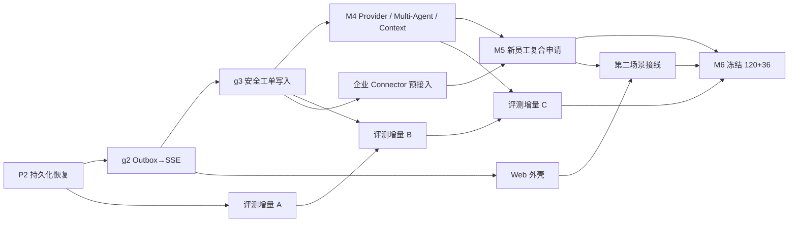

# FlowPilot 加速交付规划：M3～M6 并行轨道

## 1. 状态与目标

```text
STATUS=PLANNED_PAUSED_AWAITING_NEXT_GOAL_APPROVAL
CURRENT_ACTIVE_CHAIN=none
TARGET_WINDOW=15-25 effective working days
SCOPE=M3-M6 core + Web shell + AC-E2E-002 + 120/36 evaluation
EXCLUDES=production enterprise rollout,multimodal,LoRA
```

本规划不改变正在执行的 P2 链，也不自动批准 Flow Lite `g2` 或 `g3`。P2 通过
S7/S1/用户门禁后，后续工作从单一串行路线改为四条受控轨道：核心业务、评测
数据、产品 Web、企业 Connector 预接入。每条轨道使用独立 Worktree、互斥路径和
确定性汇合门禁。

## 2. 并行拓扑



关键路径仍是 `P2 → g2 → g3 → M4 → M5 → M6`。评测、Web 和 Connector 只在
前置契约稳定后并行，不能为了赶时间复制领域状态、安全判断或数据库事实。

## 3. 轨道 A：核心业务链

### A1：完成 P2

- S2 接入 PostgreSQL Checkpoint、Lease/Fencing 与 Redis 信号重建。
- S7 验证重启、旧 Worker、Checkpoint CAS、RLS 和 completed branch 不重跑。
- P2 final 前不启动后续写链。

### A2：g2 Outbox→SSE

- 前置：P2 合并，Task/Event 查询契约稳定。
- 目标：Task 时间线、断线续传、事件去重、租户隔离和慢消费者处理。
- 非目标：Web 页面和工单写动作。
- 状态：待单独用户批准，不能从本规划自动激活。

### A3：g3 安全工单写入

- 前置：g2 合并，ToolRequest/Approval/Ledger 契约无歧义。
- 目标：VPN 升级工单、审批/确认、幂等、`UNKNOWN` 对账、回读和审计闭环。
- 必须保持 MCP Gateway 唯一工具入口，写动作重放十次只产生一个资源。
- 状态：待单独用户批准，不能从本规划自动激活。

### A4：M4 与 M5

- M4 接入第一个真实 Provider Adapter、Context 预算、受限 Handoff 和多 Agent
  对比；确定性验收不依赖 Provider 在线。
- M5 实现 `AC-E2E-002` 新员工设备与权限复合申请、部分失败和多动作汇总。

## 4. 轨道 B：评测数据提前建设

注册临时 Agent `evaluation-curator`，映射 `S4-QUALITY` 风险档案：

```text
WRITE_SCOPE=packages/evaluation/**,evals/**,tests/acceptance/evaluation/**
EXCLUDES=web/**,product implementation,contracts/**,Makefile
REVIEWER=S1-ARCH
```

数据集在 M3～M5 期间以 `candidate` 增量建设，到 M6 才冻结。每个 Case 必须先
绑定 Feature、Fixture、规则断言、数据来源和安全分类；不能用模型生成数量代替
人工校验。

### 增量 A：P1/P2 与 M3 同期

功能候选 48 条：

- 知识问答与引用：24。
- 信息补全与多轮澄清：16。
- 工单写入与结果验证：8。

安全/故障候选 21 条：

- 跨租户隔离：6。
- RBAC/ABAC 与职责分离：6。
- Prompt Injection / 恶意 MCP：6。
- 审批重放、参数篡改、重复写：3。

### 增量 B：M4 同期

新增功能候选 40 条，累计 88：

- 业务只读查询：16。
- 工单写入与结果验证：剩余 8。
- 审批与恢复：8。
- 长上下文与 Handoff：8。

新增安全/故障候选 12 条，累计 33：

- 审批重放、参数篡改、重复写：剩余 3。
- Provider/MCP/进程故障与 `UNKNOWN`：6。
- 密钥、DLP、审计完整性：3。

### 增量 C：M5 同期

新增功能候选 32 条，累计 120：

- 审批与恢复：剩余 8。
- 并行/复合任务：16。
- 长上下文与 Handoff：剩余 8。

新增安全/故障候选 3 条，累计 36：

- 密钥、DLP、审计完整性：剩余 3。

M6 只做 Hash 冻结、Judge 人工校准、公平对比、失败保留和证据包，不再临时
补产品功能来迎合数据集。

## 5. 轨道 C：Web 外壳提前并行

API 的 Task/Command/Event、稳定错误和 SSE 契约完成后，注册临时 Agent
`experience-builder`，映射 `S4-QUALITY` 路径档案：

```text
WRITE_SCOPE=web/**,tests/experience/**
INPUT=versioned OpenAPI + SSE event contract + synthetic fixtures
EXCLUDES=domain decisions,database access,MCP access,authorization decisions
REVIEWER=S5-CORE
```

第一阶段只建立可替换外壳：

- Task 列表与详情。
- 时间线、运行/等待/失败状态。
- 信息补全表单与恢复入口。
- 审批卡的参数、影响、依据、摘要和过期时间展示。
- 引用、结果引用、重试与错误面板。
- 本地合成 Fixture 和 API/SSE 适配边界。

Web 不保存业务事实，不推断审批成功，不直接访问 PostgreSQL/MCP。M5 再把
新员工复合申请、多子动作和部分失败汇总接入同一外壳。

正式激活 Web 工作包前，S1 需要分配 UI Feature ID；本规划不会在 P2 活跃期间
修改 ContractSet/Traceability 摘要。

## 6. 轨道 D：企业系统预接入

注册临时 Agent `connector-preview`，映射 `S3-PLATFORM` 路径档案，复用
FP-MCP-001～006 与 FP-OPS-003：

```text
WRITE_SCOPE=mcp-servers/**,packages/tool-contracts/**,tests/platform/**
MODE=sandbox-only,disabled-by-default
REVIEWER=S4-QUALITY + S1-ARCH for security-sensitive paths
```

允许提前完成：

- Vendor-neutral Knowledge/Ticket/Identity Connector Port。
- Schema Pin、Capability、超时/限流、稳定错误和回读接口。
- OAuth2/Token Exchange 的抽象与本地短时凭据 Fake。
- 本地 HTTP Sandbox 或录制后脱敏 Fixture 的契约测试。
- 环境门禁的可选 Sandbox Smoke；没有凭据时明确 `NOT_RUN`。

明确不做：

- 生产租户、生产凭据或真实员工/工单数据。
- 完整厂商字段映射、批量同步、Webhook、附件和账号自动开通。
- 绕过 MCP Gateway 的直连适配器。
- 把 Sandbox 成功宣称为真实企业系统已接入。

## 7. 注册与并发规则

| 轨道 | 注册 Agent | 路径 | 启动条件 |
|---|---|---|---|
| 核心 | 按工作包选择 S2/S3/S5/S6 | 产品路径 | 上一核心 Gate 完成 |
| 评测 | `evaluation-curator` | Evaluation/Evals | P2 合并，Case 所需行为已存在 |
| Web | `experience-builder` | Web/Experience tests | API + SSE 契约稳定 |
| Connector | `connector-preview` | MCP Server/Tool tests | M3 Tool Schema 稳定 |
| 汇合 | `integration-verifier` | Integration | 一个垂直候选达到汇合点 |

- 最多三个并行写 Agent，且必须是互斥路径。
- S7 不参与每个小提交，只在垂直候选汇合时执行 STANDARD/RELEASE。
- 跨会话默认 `DELTA` Context；没有状态变化不发送消息。
- 临时 Agent 完成交付后退出注册，不升级成新的永久 S 编号。

## 8. 建议日程

| 有效工作日 | 核心轨道 | 并行轨道 |
|---:|---|---|
| 1～2 | 完成 P2 | 准备但不冻结评测 Case 模板 |
| 3～5 | g2 SSE | 评测增量 A 开始 |
| 6～10 | g3 安全写入 | 评测 A；Web 外壳；Connector 预接入 |
| 11～15 | M4 Provider/Multi-Agent | 评测 B；Web 接线 |
| 16～21 | M5 第二场景 | 评测 C；Web 第二场景；Connector Sandbox |
| 22～25 | M6 final | 120+36 冻结、Judge 校准、三次复现、最终返修 |

这是在无 Contract Major 重写、无生产企业网络阻塞、每天持续开发且用户门禁
及时完成的目标窗口。真实企业上线、多模态和 LoRA 不计入。

## 9. 汇合与完成定义

1. 核心产品行为先通过确定性测试，评测不能用 Judge 覆盖失败。
2. Web 只消费稳定 API/SSE，不复制领域或授权规则。
3. Connector Sandbox 仍经过 Gateway/Policy/Approval/Ledger，旁路数为 0。
4. 120+36 分母固定，无未说明跳过；所有 Case 绑定版本和 Hash。
5. `AC-E2E-001` 与 `AC-E2E-002` 在空卷 Compose 中可复现。
6. 最终 S7/S1 Gate 通过前，不宣称发布级 `VERIFIED/RELEASED`。
