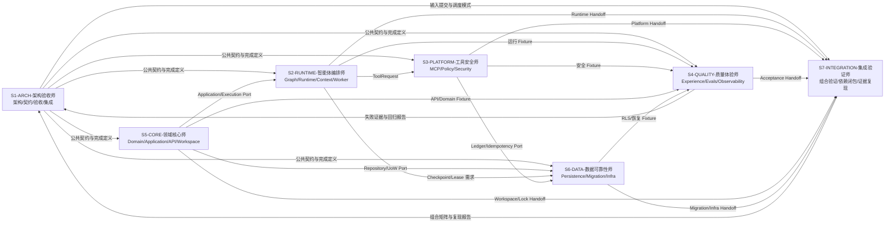

# FlowPilot 七 Codex 会话协作设计

## 1. 设计目标

FlowPilot 使用七个长期存在、用户可分别继续对话的顶层 Codex 会话。角色负责稳定的能力和路径，实际执行围绕 Work Package、Git Worktree、分支和证据包组织。

这与 OpenAI Symphony 的核心思路一致：从“管理聊天会话”转向“管理待完成工作”。FlowPilot 当前先采用人工控制面，后续可把 GitHub Issues/Projects 接成任务控制面。



当前会话是 `S1-ARCH`。所有会话必须先声明 `SESSION_ROLE`，再读取自己的 Session Contract 和 Work Package。

## 2. 七个角色

`SESSION_ROLE` 是机器身份，不能因显示名变化而修改分支、证据或契约字段。中文名用于用户识别、任务标题和日常沟通。

| 会话 | 中文显示名 | 定位 | 独占产物 | 当前工作包 |
|---|---|---|---|---|
| S1-ARCH | 架构验收师 | 架构、契约、验收与集成 | README、Structure、Schema、ADR、追踪、工作包、发布裁决 | WP-000 |
| S2-RUNTIME | 智能体编排师 | Agent 流程与运行时 | Worker、LangGraph、Agent Runtime、Model Gateway、Context | WP-010 / WP-012 |
| S3-PLATFORM | 工具安全师 | MCP、安全与策略执行 | MCP Gateway、Tool Contracts、Policy、Security、MCP Servers | WP-020 |
| S4-QUALITY | 质量体验师 | 产品体验与质量证明 | Web、Retrieval、Observability、Evaluation、Evals、Acceptance | WP-030 |
| S5-CORE | 领域核心师 | 领域、应用与 API 核心 | API、Domain、Application、Domain Pack、Python Workspace | WP-011 |
| S6-DATA | 数据可靠性师 | 数据可靠性与基础设施 | Persistence、Migration、RLS、Inbox/Outbox、Infra | WP-021 |
| S7-INTEGRATION | 集成验证师 | 独立集成验证 | 组合矩阵、依赖闭包、证据复算、集成复现工具 | WP-040 |

路径所有权以根目录 `AGENTS.md` 为唯一总规则；Session Contract 和 Work Package 只能进一步收紧。

## 3. 会话与工作的分离

七个会话是能力所有者，不是任务状态机。任务状态属于 Work Package 或 Issue：

```text
BACKLOG
  → READY
  → IN_PROGRESS
  → REVIEW
  → HANDOFF
  → ACCEPTED
  → MERGED
```

异常状态：

```text
BLOCKED  外部依赖或需要新授权
FAILED   自动门禁失败，允许同一工作包修复后重试
CANCELLED 由用户或 S1 明确终止
```

规则：

1. 一个 Work Package 只绑定一个责任会话、一个分支和一个 Worktree。
2. 一个会话同一时间只允许一个写工作包处于 `IN_PROGRESS`。
3. 会话发现范围外问题时提交 RFC/后续 Issue，不顺手扩大当前工作包。
4. `HANDOFF` 不等于完成；只有责任会话自测、跨角色复核和 S1 集成后才可 `ACCEPTED`。
5. 聊天窗口关闭不改变工作状态；状态由仓库工作包、Git 和证据决定。

## 4. 当前激活门禁

仓库已经初始化 Git 并绑定远端。摘要 `sha256:0a82e7f58c4223362721c95a50e9a820d714e550e72eebc7a90ab01e283100fc` 已取得五角色 `ACCEPT`，Review Evidence、Attestation 和完整门禁均已完成；包含本状态的提交即为 Git 激活提交。

激活进度：

1. `[DONE]` S2、S3、S4、S5、S6 对同一 RC2 `content_digest` 全部返回 `ACCEPT`。
2. `[DONE]` 保存五份 Review Evidence。
3. `[DONE]` 写入 ContractSet Review Attestation。
4. `[DONE]` 运行完整 Contract Conformance Gate。
5. `[DONE]` 创建并推送实现基线激活提交 `b5caaf2448c2860cfa67d8c5a39b9cda62eca809`。
6. `[DONE]` 从激活提交建立 S2～S6 独立 Worktree。
7. `[DONE]` S5 `WP-011-a1` H1 修复复审通过，合并提交 `5959820d9740f162fc3fdb0e74372bb6d0cbcc7a`。
8. `[DONE]` S4 `WP-030-a1` 离线骨架修复复审通过，合并提交 `5cfa78b7e8d9cc1393dac4ae515ac6a9340fdf5f`。
9. `[READY]` S2/WP-010 与 S6/WP-021 在同步最新主分支后进入实施；S5 继续 WP-011 后续范围。
10. `[DEPENDENCY_WAIT]` S3/WP-020 等待 S6 执行账本 Port；S4 跨组件范围等待可运行切片。

发布级 `frozen` 仍等待 Registry、Dataset、Fixture 和 Traceability 完成，不前置阻塞实现。

## 5. Worktree 与分支

建议目录和分支：

| 会话 | Worktree | 分支 |
|---|---|---|
| S2 | `E:\workspace\Multi-agent-s2` | `codex/s2/wp-010-runtime-bootstrap` |
| S3 | `E:\workspace\Multi-agent-s3` | `codex/s3/wp-020-platform-bootstrap` |
| S4 | `E:\workspace\Multi-agent-s4` | `codex/s4/wp-030-quality-bootstrap` |
| S5 | `E:\workspace\Multi-agent-s5` | `codex/s5/wp-011-core-bootstrap` |
| S6 | `E:\workspace\Multi-agent-s6` | `codex/s6/wp-021-data-bootstrap` |
| S7 | `E:\workspace\Multi-agent-s7` | `codex/s7/wp-040-integration-verification` |

S1 留在主 Worktree。禁止两个会话使用同一 Worktree，禁止同一分支同时签出到多个 Worktree。

## 6. 并发容量

七个会话不等于七个会话必须同时写代码。S2～S6 是产品实现角色，S7 默认只读验证；人工协调阶段同时写入上限仍为 3。当前 M0 容量复核如下：

| 会话 | 当前负载 | 判断 | 达到什么条件时拆分 |
|---|---|---|---|
| S1 | 中 | 可控；只做控制面、契约与最终裁决 | 连续两个迭代都需要 S1 直接修产品代码时，先收紧职责而不是扩容 |
| S2 | 中高 | M0 可控；Graph、Runtime、Context 已形成强耦合切片 | Provider 适配、Context 优化与 Graph/Worker/Studio 同时进入实施时，拆出 LLM Runtime |
| S3 | 中 | 当前尚未过载 | 真实企业 MCP 接入与身份、策略、凭据治理并行时，拆出独立 Security 角色 |
| S4 | 高 | 七会话中最接近拆分阈值 | Web/Retrieval 与 Evaluation/Observability 同时进入写阶段时，优先拆出 Experience |
| S5 | 中高 | M0 可控；Workspace 单写者会制造短时峰值 | API/Domain Pack 与 Build/依赖治理连续相互阻塞时，拆出 DevEx/Build |
| S6 | 中高 | M0 可控；迁移、RLS、恢复门禁成本高 | 多数据库适配、生产运维和业务 Persistence 同时推进时，拆出 DBRE/Infra |
| S7 | 中 | 职责边界合理；耗时主要来自发布门禁，不是代码范围 | 先按 FAST/STANDARD/RELEASE 分级；只有组合矩阵长期超过 5 个并发候选才拆出 Release Engineering |

未来新增会话的推荐顺序是：`S8-EXPERIENCE` 从 S4 接管 Web/Retrieval；`S9-LLM-RUNTIME` 从 S2 接管 Agent Runtime/Model Gateway/Context/Provider；`S10-SECURITY` 从 S3 接管身份、策略和凭据治理。未达到触发条件时，不为“看起来对称”提前扩容。

当前并行规则：

1. 相互独立的产品切片最多三个 `PARALLEL` 写会话。
2. `ORDERED` 链由生产者直接交给消费者，正常路径不逐步返回 S1。
3. S7 的候选静态检查可 `READ_ONLY_PARALLEL`；完整发布门禁只在候选身份发生变化时运行。
4. S1 和 S7 都不得成为每个小步骤的同步确认点。

每次多会话派发必须声明调度模式：

- `PARALLEL`：可同时写入互斥路径，派发中写明汇合门禁。
- `READ_ONLY_PARALLEL`：只读并行，不修改文件或 Git。
- `ORDERED`：按显式顺序执行，前一项达到解锁条件后才能启动下一项。

会话编号、消息到达顺序和用户粘贴顺序不自动构成执行顺序。

对依赖稳定的 `ORDERED` 链，S1 可以按
[`CHAIN_EXECUTION_PROTOCOL.md`](./CHAIN_EXECUTION_PROTOCOL.md)
一次性预授权。生产者直接交给下一消费者；消费者核验精确 Head、摘要、
范围和证据后即可继续。正常链路只在 S7 最终组合门禁返回 S1。

预授权不适用于 R3。契约变化、越权路径、风险升级、门禁失败或重复返修
会暂停链路并上报 S1。

若某会话等待依赖，它可以只读审查、补测试设计或准备 RFC，不能绕过依赖私自修改共享文件。

### 信息预算

七个会话统一使用 `OUTCOME_FIRST`：

1. 内部充分推理，对外只保留结论、证据、风险和下一动作。
2. 能在角色范围内确定解决的问题直接处理；不为低风险细节要求用户逐项确认。
3. `P0/P1` 立即发送给 S1 和实际 Owner；`P2/P3` 合并进入 Handoff 或后续工作包。
4. 没有状态变化的等待消息不重复发送。
5. S1 选择性通知实际执行者和必要 Reviewer，不默认广播七个会话。
6. 原始隐藏思考过程不得写入仓库、Trace、Audit、Security Event 或验收证据。

## 7. RACI

| 事项 | S1 | S2 | S3 | S4 | S5 | S6 | S7 |
|---|---|---|---|---|---|---|---|
| 公共 Schema/ADR | A/R | C | C | C | C | C | C |
| Domain/Application/API | A | C | C | C | R | C | C |
| LangGraph/Runtime/Context | A | R | C | C | C | C | C |
| MCP Gateway/Policy/Security | A | C | R | C | C | C | C |
| Persistence/RLS/Migration/Infra | A | C | C | C | C | R | C |
| Evaluation/Judge/Observability/Web | A | C | C | R | C | C | C |
| Python Workspace/公共依赖 | A | C | C | C | R | C | C |
| Compose/环境变量/部署依赖 | A | C | C | C | C | R | C |
| 跨分支组合与证据复现 | A | C | C | C | C | C | R |
| 功能状态与发布裁决 | A/R | C | C | C | C | C | C |

`A` 为最终负责，`R` 为实施负责，`C` 为必须咨询。

## 8. 共享文件单写者

| 文件 | 默认写入者 |
|---|---|
| `pyproject.toml`、`uv.lock`、`Makefile` | S5-CORE / WP-011 |
| `.env.example`、根级 Compose/Docker/部署配置 | S6-DATA / WP-021 |
| `scripts/acceptance/**` | S4-QUALITY / WP-030 |
| `contracts/**`、架构/验收/团队文档 | S1-ARCH |

共享文件需要其他角色修改时，先由当前单写者合并或建立独立共享文件工作包。

## 9. 交接与证据

每个 Work Package 的交接必须使用 `docs/team/HANDOFF_TEMPLATE.md`，至少包含：

- Work Package、Feature ID、分支、基线提交与 ContractSet 摘要。
- 完成/未完成内容和修改路径。
- 实际运行命令、退出码及失败项。
- 正常、边界、失败、安全、恢复测试。
- Schema、数据库、依赖和环境变化。
- Evidence 路径与 SHA-256。
- 下一接收会话及其明确动作。
- Chain/Step/Attempt、交接策略和是否需要 S1。

预授权链中，`CONSUMER_ACCEPTED` 只表示消费者可以继续，不代表工作包
已经正式接受或可以合并。

建议 Proof of Work 包含 CI、跨角色 Review、复杂度变化和 UI/多模态功能的可复现演示。

## 10. 审查矩阵

- S2 Graph/State：S1 或 S4 复核；与领域 Port 的绑定由 S5 复核。
- S3 授权/审批/凭据/工具写路径：S1 复核，S4 增加黑盒负向测试，S6 复核账本 Port。
- S4 Judge/指标/报告：S1 复核。
- S5 Domain/Command/API：S1 或 S2 复核，S4 验证外部行为。
- S6 RLS/事务/Inbox/Outbox/Migration：S1 复核，S3 验证安全语义，S4 增加故障测试。
- S7 组合矩阵/依赖闭包/证据复算：S1 复核；涉及产品体验由 S4 复核，涉及安全或数据分别咨询 S3/S6。
- S1 Schema/ADR：对应实现会话至少一名验证可实现性。

## 11. Symphony 式后续演进

当前先人工执行七会话协议。完成 M0 后可增加 GitHub Issues/Projects 控制面：

1. Issue 字段映射 Work Package、Feature ID、Owner Role、依赖、优先级和状态。
2. 只有 `READY` 且依赖完成的 Issue 才创建隔离 Worktree。
3. Agent 失败或停滞时从 Git/Issue/Evidence 恢复，不依赖聊天上下文。
4. Agent 可以提出后续 Issue，但不能自行扩大当前 Scope 或自动批准安全变更。
5. 自动合并只对低风险、全门禁通过的路径开放；契约、安全、迁移和发布仍需人工批准。

参考：

- [OpenAI：An open-source spec for Codex orchestration: Symphony](https://openai.com/index/open-source-codex-orchestration-symphony/)
- [openai/symphony SPEC](https://github.com/openai/symphony/blob/main/SPEC.md)

## 12. 整体完成定义

- 五个实现会话只在自己的 Worktree、分支和路径内写入。
- S7 只在自己的集成 Worktree 中组合和复现，不修改输入分支；S1 保留最终合并与发布裁决。
- 公共契约、依赖、共享配置和数据库变更具有单一权威。
- 正常、边界、失败、安全和恢复证据可由其他会话复现。
- 跨租户成功读写、重复逻辑写入和 Secret 泄漏均为 0。
- S1 根据证据而不是聊天声明更新 `DESIGNED/IMPLEMENTED/VERIFIED/RELEASED`。
