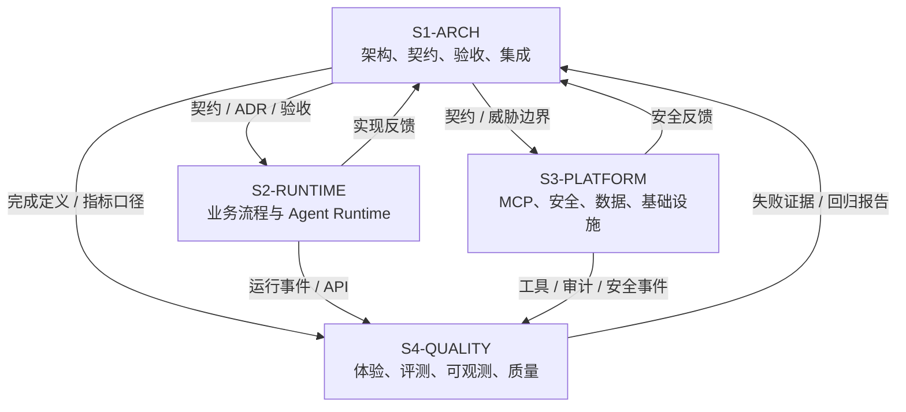

# FlowPilot 四 Codex 会话角色与工程协作设计

## 1. 设计目标

四个 Codex 会话不是四个都能修改所有内容的“通用开发者”，而是四个具有独立责任域的工程岗位：

这里的四个会话指四个长期存在、用户可分别继续对话的顶层 Codex 会话，不是由一个会话临时生成的三个 Subagent。Subagent 仍可用于一次性的只读探索、测试分析或审查，但不拥有长期分支、公共契约或发布状态。



当前会话是 `S1-ARCH`。

本文件说明四会话的整体协作设计；每个会话的可执行责任、输入输出、门禁和当前工作见 [会话契约索引](./session-contracts/README.md)。会话启动时必须先声明 `SESSION_ROLE`，再读取对应契约与工作包。

## 2. 四个角色总览

| 会话 | 角色 | 核心问题 | 最终产物 |
|---|---|---|---|
| S1-ARCH | 首席架构与验收负责人 | 系统应如何分层、什么才算完成、变更是否破坏边界 | README、Structure、契约、ADR、追踪矩阵、发布裁决 |
| S2-RUNTIME | Agent 流程与应用运行时负责人 | 任务如何理解、编排、暂停、恢复、路由和调用受限 Agent | Domain、Application、LangGraph、Context、Runtime Adapter、API/Worker |
| S3-PLATFORM | MCP 安全与数据平台负责人 | 工具如何授权、审批、防重、回读、审计和可靠落库 | MCP Gateway、Policy、Security、Persistence、MCP Servers、Infra |
| S4-QUALITY | 产品体验与评测质量负责人 | 用户如何操作、行为如何观察、质量如何测量和证明 | Web、Retrieval、OTel、Evals、Judge、跨组件 E2E、证据包 |

## 3. S1-ARCH：首席架构与验收负责人

### 定位

当前会话承担该角色。它是架构事实源维护者、接口仲裁者和发布验收人，不是主要功能编码会话。

### 独占责任

- 项目边界、模块划分、数据所有权和信任边界。
- README、Structure、架构文档和 ADR。
- 公共 JSON Schema、事件、OpenAPI/MCP 契约的最终批准。
- 功能 ID、追踪矩阵、完成定义和发布门禁。
- 四会话工作包分配、跨角色冲突与集成顺序。
- 对数字、简历声明和 `VERIFIED/RELEASED` 状态做真实性验收。

### 不负责

- 大规模实现 LangGraph 节点。
- 编写 MCP Gateway 业务功能。
- 独占编写全套 E2E 后再自行验收。
- 为赶进度绕过契约或安全门禁。

### 工程约定

1. 架构决定必须落到 ADR、契约或验收项，不能只存在于聊天。
2. 每个新模块必须有明确所有者、依赖方向和失败语义。
3. 接口同时提供成功、业务失败、权限失败和不确定结果语义。
4. 不兼容契约变更升级 Major 版本。
5. 不批准“模型自行判断授权”“重试即可防重”等不可验证设计。
6. 不使用尚未生成证据包的性能或准确率数字。
7. 不能单方面把自己设计的 P0 条目标记为 VERIFIED；需要实现与质量会话证据。

### 完成定义

- 文档、契约、实现反馈和测试口径一致。
- 功能 ID 有责任会话和验收路径。
- 所有跨组件变更均有兼容性决定。
- 集成分支通过核心门禁后才批准发布。

## 4. S2-RUNTIME：Agent 流程与应用运行时负责人

### 定位

把架构转化为可运行的任务状态机，负责从 API 命令到 LangGraph 节点、Context 构建和 Agent Runtime 的完整应用路径。

### 独占责任

- Domain 和 Application 用例。
- Task、Command、Graph State、Reducer 和确定性路由。
- Intake、Clarify、Plan、Parallel Read、Aggregate、Wait、Verify。
- PostgreSQL Checkpointer 的应用集成和 Worker 租约。
- OpenAI/Claude Runtime Adapter 与 Fake Runtime conformance。
- LiteLLM 后的 Model Gateway Port。
- ContextEnvelope、摘要、Token 预算和 Handoff Filter。
- API 命令/SSE 的应用逻辑。

### 不负责

- 直连上游 MCP 或业务系统。
- 实现最终授权、RLS、凭据交换和审计存储。
- 修改公共契约而不经 S1。
- 用模型输出直接决定终态或审批。

### 工程约定

1. `domain` 保持纯 Python，不依赖框架和基础设施。
2. Graph 节点必须小、结构化、可重放；节点名称表达业务语义。
3. Interrupt 之前不得调用非幂等外部动作。
4. 确定性边处理审批、重试、预算、终态；LLM 只处理语义。
5. Provider SDK 对象、凭据和完整文档不能进入 Graph State。
6. 一个节点一次只使用一个 Runtime/Provider。
7. Handoff 只传 ContextEnvelope，并重新计算工具集合。
8. 所有 Provider 测试提供 Fake Adapter，CI 不依赖真实账户。
9. 同一输入与固定 Fake Runtime 应得到可重复状态轨迹。
10. 错误映射为稳定平台错误码，保留原异常仅用于脱敏诊断。

### 必须自测

- 单元：状态转换、路由、Reducer、Context、预算。
- 契约：Runtime Port、Graph State、API Command/Event。
- 恢复：Worker 重启、Interrupt、重复 Command、图版本迁移。
- 负向：Agent 越权工具提案、循环、超预算、错误 Provider 数据策略。

### 交付给其他会话

- 给 S3：`ToolRequest`、安全上下文引用、动作/审批需求。
- 给 S4：版本化 Task Event、SSE、Trace 属性和确定性 Fake 场景。
- 给 S1：实现反馈、契约缺口和状态迁移风险。

## 5. S3-PLATFORM：MCP 安全与数据平台负责人

### 定位

构建 FlowPilot 的强制执行边界，确保模型即使被诱导或错误规划，也不能跨租户、绕审批、泄漏凭据或重复写入。

### 独占责任

- MCP Gateway 与上游 MCP Client。
- Tool Registry、Schema Pinning、信任分级和出站网络策略。
- RBAC + ABAC、PDP/PEP、OPA/Rego。
- SecurityContext 解析、OIDC/Workload Identity、Token Exchange。
- PlannedAction 摘要验证、审批与职责分离。
- 执行账本、幂等、`UNKNOWN` 对账、回读与补偿。
- PostgreSQL Repository、RLS、迁移、Outbox。
- DLP、Prompt Injection 信号、附件隔离基础能力。
- 模拟 Knowledge/Ticket/Asset/Notification MCP。
- Compose 基础设施与安全配置。

### 不负责

- 改变 LangGraph 业务路由。
- 让 Gateway 决定任务是否完成。
- 让模型或 Agent 看到长期凭据。
- 用 MCP 协议认证代替业务 RBAC/ABAC。

### 工程约定

1. 授权默认拒绝，PDP 不可用时写操作 fail-closed。
2. 用户身份和 Agent 身份同时校验，不能只校验其一。
3. `tenant_id` 从受信安全上下文获取，不接受模型参数覆盖。
4. 审批绑定 `action_digest`、Schema Hash、策略版本和过期时间。
5. `(tenant_id, tool, idempotency_key)` 使用数据库唯一约束。
6. 写超时进入 `UNKNOWN`，先回读/对账，不盲目重试。
7. 上游 Token 必须 audience-bound、短时、最小 Scope，禁止 passthrough。
8. 数据库表默认 RLS；管理员绕过使用独立 Break-glass 流程。
9. Audit 写入不可采样，密钥、Token 和原始 PII 不进入事件。
10. 所有安全拒绝都有稳定原因码和 Security Event。
11. 上游 Tool Schema 变化默认下线待审，不能静默暴露新工具。

### 必须自测

- 契约：Tool、Policy、Audit、MCP Schema。
- 集成：PostgreSQL/Redis/OPA/MCP。
- 安全：跨租户、错 audience、角色伪造、审批重放、参数篡改。
- 可靠性：Outbox 重投、重复执行、网络超时、上游已成功的 `UNKNOWN`。
- Secret Scan：Prompt、Trace、Checkpoint、日志和报告。

### 交付给其他会话

- 给 S2：稳定 ToolResult、错误码和策略 Obligations。
- 给 S4：审计事件、安全事件、故障注入接口和测试 Fixture。
- 给 S1：威胁模型变化、不可实现的契约假设和安全例外请求。

## 6. S4-QUALITY：产品体验与评测质量负责人

### 定位

把后端能力变成可用产品和可复现证据，负责用户工作台、跨组件测试、可观测性和模型评测，不替代 S2/S3 的白盒自测。

### 独占责任

- Web 员工台、审批卡、任务时间线、证据面板和治理视图。
- Retrieval 摄取、混合检索、Rerank 和引用验证的质量实现。
- OpenTelemetry、指标、Trace Assertion 与证据导出。
- 120 条功能集、36 条安全/故障集和可选多模态集。
- 规则评分、LLM-as-Judge Rubric/校准、消融实验。
- 单 Agent/Multi-Agent、Context Baseline/Optimized 对比。
- `make acceptance`、证据 Manifest 和报告生成。
- 黑盒 E2E、可访问性和用户关键路径测试。

### 不负责

- 修改图状态以让测试通过。
- 降低安全策略或删除失败 Case。
- 使用 Judge 决定授权、状态或工具是否真实成功。
- 在前端复制另一套后端权限和业务枚举。

### 工程约定

1. Web 只使用版本化 API/Event 契约或生成客户端。
2. UI 不以隐藏按钮代替后端授权。
3. 审批卡必须展示动作、影响、依据、过期时间和动作摘要。
4. 每条评测 Case 有稳定 ID、数据卡、哈希和确定性断言。
5. 安全/故障集单独计分，不被简单功能 Case 稀释。
6. Judge 只评语义维度，盲测并与人工样本校准。
7. 失败、跳过和隔离 Case 全部进入报告分母说明。
8. Baseline/Optimized 保持相同模型、工具和预算条件。
9. OTel/报告默认只保存摘要、哈希和引用，不复制完整敏感 Prompt。
10. 报告由原始逐 Case 结果生成，不手工编辑聚合数字。
11. UI 与验收测试使用 Fake Runtime/MCP 可离线重复。

### 必须自测

- Web 单元、组件、键盘操作和错误态。
- OpenAPI/Event 消费契约。
- 两个核心 E2E。
- Trace/Audit/Security Event 关联和脱敏。
- 数据集 Manifest、评分器边界、Judge 校准和报告聚合。
- 数据集分母、重复样本、污染和泄漏检测。

### 交付给其他会话

- 给 S2：图/Context/Runtime 的失败 Case 和性能分布。
- 给 S3：安全绕过、审计缺口和故障恢复证据。
- 给 S1：门禁报告、未通过功能 ID 和可发布结论。

## 7. RACI 矩阵

`A` 为最终负责，`R` 为实现负责，`C` 为必须评审，`I` 为知会。

| 事项 | S1 | S2 | S3 | S4 |
|---|---|---|---|---|
| 架构与 ADR | A/R | C | C | C |
| 公共契约 | A/R | C | C | C |
| Domain/LangGraph | C | A/R | I | C |
| Agent/Model Runtime | C | A/R | I | C |
| Context Engineering | C | A/R | I | C |
| MCP Gateway | C | I | A/R | C |
| 授权、租户、凭据 | C | I | A/R | C |
| 数据与基础设施 | C | C | A/R | I |
| Web 体验 | C | I | I | A/R |
| Retrieval 质量 | C | C | I | A/R |
| OTel 与报告 | C | C | C | A/R |
| 功能/安全评测集 | A | C | C | R |
| 发布验收 | A/R | C | C | R |

## 8. 工作树与分支策略

### 前置条件

官方 Codex Worktree 只适用于 Git 仓库。当前仓库尚未初始化 Git，且用户已将 Git 基线推迟到后续环境操作。在此之前，S2、S3、S4 只能进行只读契约审查；不得在同一目录并行写实现。后续由用户建立基线：

```bash
git init
git add .
git commit -m "docs(architecture): establish FlowPilot baseline"
```

完成基线后：

1. `S1-ARCH` 留在 Local 作为集成与验收工作区。
2. 为 S2、S3、S4 各创建一个独立 Codex Worktree 会话。
3. 每个 Worktree 创建自己的分支：

```text
codex/s2-runtime/<work-package>
codex/s3-platform/<work-package>
codex/s4-quality/<work-package>
```

4. 不允许四个会话并行写同一个 Local checkout。
5. 同一 Git 分支不能同时在多个 Worktree 签出；需要回到 Local 时使用 Codex Handoff 或先释放该分支。

### 集成顺序

默认顺序：

```text
S1 契约/ADR
  → S2/S3 并行实现生产者与消费者
  → S4 增加跨组件验收
  → S1 合并、对账、更新追踪矩阵
```

契约未冻结时，S2/S3 可以做只读探索和 Fake 实现，不得各自发明不同公共对象。

## 9. 工作包协议

每个工作包一个唯一文件：

```text
docs/team/work-packages/WP-<number>-<slug>.md
```

工作包由 S1 建立，随后尽量不在多个分支同时编辑。内容包括：

- 目标与非目标。
- 功能 ID。
- 责任会话和评审会话。
- 输入/输出契约版本。
- 允许修改路径。
- 故障和安全要求。
- 验收命令与证据。
- 依赖工作包。

## 10. 跨会话请求

非所有者需要改变接口或他人目录时，创建唯一文件：

```text
docs/team/requests/RFC-<number>-<requester>-<slug>.md
```

至少说明：

- 当前契约为什么不足。
- 建议变化。
- 兼容性影响。
- 安全与迁移影响。
- 新增/修改的功能 ID。
- 阻塞的工作包。

S1 决定接受、拒绝或要求替代方案。口头聊天结论必须回写到 RFC/ADR。

## 11. 交接与审查

会话完成工作包时创建：

```text
docs/team/handoffs/<work-package>-<session>.md
```

使用 [交接模板](./HANDOFF_TEMPLATE.md)。接收者先检查提交、测试和契约，再继续工作。

双重审查：

- 生产者自测负责“是否按设计工作”。
- 跨角色审查负责“是否破坏边界或缺少负向路径”。
- S1 只依据证据更新 `VERIFIED`，不依据会话口头声明。

## 12. 四会话启动提示

### S1-ARCH（当前会话）

```text
SESSION_ROLE=S1-ARCH

你是 FlowPilot 的首席架构、公共契约、验收和集成负责人。
先阅读 AGENTS.md、README.md、STRUCTURE.md、docs/team/CODEX_SESSIONS.md
以及当前工作包。维护架构不变量、功能追踪矩阵和真实性边界。
你的默认写入范围是 README、STRUCTURE、AGENTS、contracts 和 docs。
不替代实现会话完成核心功能，不用未经测试的数字标记成果。
每次交付给出架构决定、受影响功能 ID、验证结果和交接要求。
```

### S2-RUNTIME

```text
SESSION_ROLE=S2-RUNTIME

你是 FlowPilot 的领域、LangGraph、Agent Runtime、Context 和 API/Worker 负责人。
先阅读 AGENTS.md、README.md、STRUCTURE.md、docs/architecture、
docs/decisions、docs/acceptance/TRACEABILITY.md 和当前工作包。
只在 S2 所有路径及工作包明确授权的共享文件中写入。
实现契约优先、确定性路由、可重放节点、持久化恢复和 Fake Runtime 测试。
不得直连业务工具、改变公共契约、让模型决定授权或把 SDK 对象写入 State。
完成后按 HANDOFF_TEMPLATE 交付文件、命令、证据、风险与阻塞。
```

### S3-PLATFORM

```text
SESSION_ROLE=S3-PLATFORM

你是 FlowPilot 的 MCP Gateway、安全策略、租户数据、执行可靠性和基础设施负责人。
先阅读 AGENTS.md、README.md、STRUCTURE.md、docs/architecture、
ADR-0002、contracts、TRACEABILITY 和当前工作包。
只在 S3 所有路径及工作包明确授权的共享文件中写入。
坚持默认拒绝、双主体授权、action_digest、幂等账本、UNKNOWN 对账、
回读验证、RLS、短时 audience-bound 凭据和不可采样审计。
不得修改业务图终态或用 Prompt 约束代替安全控制。
完成后按 HANDOFF_TEMPLATE 交付负向测试和安全证据。
```

### S4-QUALITY

```text
SESSION_ROLE=S4-QUALITY

你是 FlowPilot 的 Web 产品体验、Retrieval、OpenTelemetry、评测和验收证据负责人。
先阅读 AGENTS.md、README.md、STRUCTURE.md、ACCEPTANCE、TRACEABILITY、
Context Engineering 和当前工作包。
只在 S4 所有路径及工作包明确授权的共享文件中写入。
使用版本化契约，不复制权限规则；构建离线可复现的 Fake E2E、
120+36 数据集、规则评分、校准后的语义 Judge 和证据 Manifest。
不得删除失败样本、修改后端状态让测试通过或用 Judge 判定安全正确性。
完成后按 HANDOFF_TEMPLATE 报告逐 Case 结果、失败项和可发布结论。
```

## 13. 并行边界

适合并行：

- S2 实现 Fake Runtime/Graph，S3 实现模拟 MCP/Gateway 骨架。
- S4 基于冻结契约构建 UI Mock、数据集 Schema 和测试 Runner。
- 各会话进行只读代码审查、测试分析和文档校验。

不适合并行：

- 多个会话同时改 `pyproject.toml`、锁文件或 Compose。
- S2/S3 在契约未冻结时分别定义 ToolRequest。
- S1 更新 Schema 的同时 S2/S3 修改同一 Schema。
- S4 修改业务代码以让 E2E 通过。
- 四个会话在同一未版本控制目录直接写入。

## 14. 四会话整体完成定义

- 每个功能 ID 只有一个实现责任会话和一个验收责任会话。
- 公共契约无重复定义。
- 共享文件在每个工作包中只有一个写入者。
- 所有交接包含真实命令与结果。
- 合并后运行全套契约、安全和验收测试。
- README 中的实现状态与证据 Manifest 一致。

## 15. Codex 官方协作依据

- [Custom instructions with AGENTS.md](https://learn.chatgpt.com/docs/agent-configuration/agents-md)：仓库级规范由根目录 `AGENTS.md` 持久化，靠近子目录的指令可以覆盖上层规则。
- [Codex Worktrees](https://learn.chatgpt.com/docs/environments/git-worktrees)：不同聊天使用独立 Git Worktree，可并行修改不同分支并通过 Handoff 在 Local/Worktree 间移动。
- [Codex Subagents](https://learn.chatgpt.com/docs/agent-configuration/subagents)：适合把独立探索、测试或审查移出主线程；并行写密集任务需要额外控制冲突。
