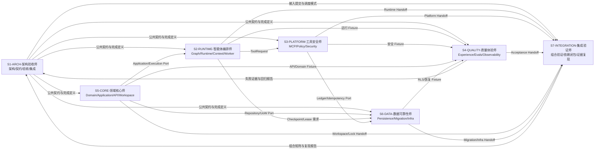

# FlowPilot 七 Codex 会话协作设计

## 1. 设计目标

FlowPilot 保留七个稳定的责任档案，用来界定能力、风险和路径所有权；实际开发
不要求七个长期会话常驻。每条链从 Agent Registry 选择最少执行者，围绕
Work Package、Git Worktree、分支和证据包组织。

这与 OpenAI Symphony 的核心思路一致：从“管理聊天会话”转向“管理待完成工作”。FlowPilot 当前先采用人工控制面，后续可把 GitHub Issues/Projects 接成任务控制面。



当前会话是 `S1-ARCH`。所有会话必须先声明 `SESSION_ROLE`，再读取自己的 Session Contract 和 Work Package。

## 2. 七个角色

`SESSION_ROLE` 是机器身份，不能因显示名变化而修改分支、证据或契约字段。中文名用于用户识别、任务标题和日常沟通。

| 会话 | 中文显示名 | 定位 | 独占产物 | 当前状态 |
|---|---|---|---|---|
| S1-ARCH | 架构验收师 | 架构、契约、验收与集成 | README、Structure、Schema、ADR、追踪、工作包、发布裁决 | M9T ACTIVE / CHAIN OWNER |
| S2-RUNTIME | 智能体编排师 | Agent 流程与运行时 | Worker、LangGraph、Agent Runtime、Model Gateway、Context | UNSELECTED / M9T |
| S3-PLATFORM | 工具安全师 | MCP、安全与策略执行 | MCP Gateway、Tool Contracts、Policy、Security、MCP Servers | UNSELECTED / M9T |
| S4-QUALITY | 质量体验师 | 产品体验与质量证明 | Web、Retrieval、Observability、Evaluation、Evals、Acceptance | DEPENDENCY_WAIT / WP-093 |
| S5-CORE | 领域核心师 | 领域、应用与 API 核心 | API、Domain、Application、Domain Pack、Python Workspace | ACTIVE / WP-091 |
| S6-DATA | 数据可靠性师 | 数据可靠性与基础设施 | Persistence、Migration、RLS、Inbox/Outbox、Infra | UNSELECTED / M9T |
| S7-INTEGRATION | 集成验证师 | 独立集成验证 | 组合矩阵、依赖闭包、证据复算、集成复现工具 | DEPENDENCY_WAIT / WP-094 |

路径所有权以根目录 `AGENTS.md` 为唯一总规则；Session Contract 和 Work Package 只能进一步收紧。

## 3. 会话与工作的分离

七个会话是能力所有者，不是任务状态机。任务状态属于 Work Package 或 Issue：

```text
BACKLOG
  → READY
  → IN_PROGRESS
  → REVIEW
  → HANDOFF
  → ACCEPTED
  → MERGED
```

异常状态：

```text
BLOCKED  外部依赖或需要新授权
FAILED   自动门禁失败，允许同一工作包修复后重试
CANCELLED 由用户或 S1 明确终止
```

规则：

1. 一个 Work Package 只绑定一个责任会话、一个分支和一个 Worktree。
2. 一个会话同一时间只允许一个写工作包处于 `IN_PROGRESS`。
3. 会话发现范围外问题时提交 RFC/后续 Issue，不顺手扩大当前工作包。
4. `HANDOFF` 不等于完成；只有责任会话自测、跨角色复核和 S1 集成后才可 `ACCEPTED`。
5. 聊天窗口关闭不改变工作状态；状态由仓库工作包、Git 和证据决定。

## 4. 当前激活门禁

ContractSet 摘要
`sha256:1cad07bdc78c9cd0dfd8591c03fdb29c5e3039c15f88f7b624211abf2b5b42a2`
仍是当前实现基线。M0～M8 工程候选与 P2 持久化恢复已完成；M9T 工程控制面已激活，
原 M9～M20 尚未激活。发布级 `frozen` 仍等待其余产品执行器、Evidence、
Judge 校准和 Traceability 提升。

当前状态只在 [`PROJECT_HANDOFF.md`](../roadmap/PROJECT_HANDOFF.md) 和
[`work-packages/README.md`](./work-packages/README.md) 维护。历史提交、顺序和
证据留在 `chain-authorizations/**`、`tests/**/evidence/**` 与 `docs/review/**`，
不再复制进本强制角色文档。

## 5. Worktree 与分支

建议目录和分支：

| 会话 | Worktree | 分支 |
|---|---|---|
| S2 | `E:\workspace\Multi-agent-s2` | `codex/s2/wp-010-runtime-bootstrap` |
| S3 | `E:\workspace\Multi-agent-s3` | `codex/s3/wp-020-platform-bootstrap` |
| S4 | `E:\workspace\Multi-agent-s4` | `codex/s4/wp-030-quality-bootstrap` |
| S5 | `E:\workspace\Multi-agent-s5` | `codex/s5/wp-011-core-bootstrap` |
| S6 | `E:\workspace\Multi-agent-s6` | `codex/s6/wp-021-data-bootstrap` |
| S7 | `E:\workspace\Multi-agent-s7` | `codex/s7/wp-040-integration-verification` |

S1 留在主 Worktree。禁止两个会话使用同一 Worktree，禁止同一分支同时签出到多个 Worktree。

## 6. 并发容量

固定 S1～S7 只表示路径 Owner 和风险档案。实际工作使用 Agent 注册制选择最小
集合，最多三个互斥路径写 Agent；依赖链必须 `ORDERED`，独立审查可
`READ_ONLY_PARALLEL`。R3、契约、安全、破坏性迁移和发布仍逐次人工批准。

后续 M8～M20 按里程碑注册临时 Agent，不新增永久 S 编号。具体依赖、并行路径
和拆包规则见 [`IMPLEMENTATION_PLAN.md`](../roadmap/IMPLEMENTATION_PLAN.md)。

每个 S 会话都是领域主 Agent，可以在有效工作包内自主调用临时子 Agent。多个只读
子 Agent可并行，同一 Worktree 仍只有一个写入者；子 Agent没有 Git、跨会话唤醒或
裁决权。完整规则见
[`PRINCIPAL_SUBAGENT_PROTOCOL.md`](./PRINCIPAL_SUBAGENT_PROTOCOL.md)。

链执行、唤醒、增量上下文和门禁细节分别由
[`CHAIN_EXECUTION_PROTOCOL.md`](./CHAIN_EXECUTION_PROTOCOL.md)、
[`THREAD_WAKE_PROTOCOL.md`](./THREAD_WAKE_PROTOCOL.md)、
[`CONTEXT_BOOTSTRAP_PROTOCOL.md`](./CONTEXT_BOOTSTRAP_PROTOCOL.md) 与
[`PRINCIPAL_SUBAGENT_PROTOCOL.md`](./PRINCIPAL_SUBAGENT_PROTOCOL.md)、
[`INTEGRATION_GATES.md`](./INTEGRATION_GATES.md) 维护，本文件不再重复。

### 信息预算

七个会话统一使用 `OUTCOME_FIRST`：

1. 内部充分推理，对外只保留结论、证据、风险和下一动作。
2. 能在角色范围内确定解决的问题直接处理；不为低风险细节要求用户逐项确认。
3. `P0/P1` 立即发送给 S1 和实际 Owner；`P2/P3` 合并进入 Handoff 或后续工作包。
4. 没有状态变化的等待消息不重复发送。
5. S1 选择性通知实际执行者和必要 Reviewer，不默认广播七个会话。
6. 原始隐藏思考过程不得写入仓库、Trace、Audit、Security Event 或验收证据。
7. S1 到达用户门禁时只报告“本轮完成 / 本轮问题 / 需要重大决策 / 下一步”；机器证据按需展开。
8. 相关 Blob、契约和证据未变化时复用已有判断；强制独立审查更换观察边界。
9. 同类错误第二次出现时修共享机理，第三次等价绕过停止局部补丁并升级处理。

## 7. RACI

| 事项 | S1 | S2 | S3 | S4 | S5 | S6 | S7 |
|---|---|---|---|---|---|---|---|
| 公共 Schema/ADR | A/R | C | C | C | C | C | C |
| Domain/Application/API | A | C | C | C | R | C | C |
| LangGraph/Runtime/Context | A | R | C | C | C | C | C |
| MCP Gateway/Policy/Security | A | C | R | C | C | C | C |
| Persistence/RLS/Migration/Infra | A | C | C | C | C | R | C |
| Evaluation/Judge/Observability/Web | A | C | C | R | C | C | C |
| Python Workspace/公共依赖 | A | C | C | C | R | C | C |
| Compose/环境变量/部署依赖 | A | C | C | C | C | R | C |
| 跨分支组合与证据复现 | A | C | C | C | C | C | R |
| 功能状态与发布裁决 | A/R | C | C | C | C | C | C |

`A` 为最终负责，`R` 为实施负责，`C` 为必须咨询。

## 8. 共享文件单写者

| 文件 | 默认写入者 |
|---|---|
| `pyproject.toml`、`uv.lock`、`Makefile` | S5-CORE / WP-011 |
| `.env.example`、根级 Compose/Docker/部署配置 | S6-DATA / WP-021 |
| `scripts/acceptance/**` | S4-QUALITY / WP-030 |
| `contracts/**`、架构/验收/团队文档 | S1-ARCH |

共享文件需要其他角色修改时，先由当前单写者合并或建立独立共享文件工作包。

## 9. 交接与证据

每个 Work Package 的交接必须使用 `docs/team/HANDOFF_TEMPLATE.md`，至少包含：

- Work Package、Feature ID、分支、基线提交与 ContractSet 摘要。
- 完成/未完成内容和修改路径。
- 实际运行命令、退出码及失败项。
- 正常、边界、失败、安全、恢复测试。
- Schema、数据库、依赖和环境变化。
- Evidence 路径与 SHA-256。
- 下一接收会话及其明确动作。
- Chain/Step/Attempt、交接策略和是否需要 S1。

预授权链中，`CONSUMER_ACCEPTED` 只表示消费者可以继续，不代表工作包
已经正式接受或可以合并。

建议 Proof of Work 包含 CI、跨角色 Review、复杂度变化和 UI/多模态功能的可复现演示。

## 10. 审查矩阵

- S2 Graph/State：S1 或 S4 复核；与领域 Port 的绑定由 S5 复核。
- S3 授权/审批/凭据/工具写路径：S1 复核，S4 增加黑盒负向测试，S6 复核账本 Port。
- S4 Judge/指标/报告：S1 复核。
- S5 Domain/Command/API：S1 或 S2 复核，S4 验证外部行为。
- S6 RLS/事务/Inbox/Outbox/Migration：S1 复核，S3 验证安全语义，S4 增加故障测试。
- S7 组合矩阵/依赖闭包/证据复算：S1 复核；涉及产品体验由 S4 复核，涉及安全或数据分别咨询 S3/S6。
- S1 Schema/ADR：对应实现会话至少一名验证可实现性。

## 11. Symphony 式后续演进

当前已经采用 Agent Registry、Work Package、Git Head、Evidence 与事件驱动唤醒，
不再把七个聊天窗口当作工作状态。后续可把同一字段映射到 GitHub Issues/Projects
或独立编排控制面，但不能改变仓库内权限、风险和用户门禁。

参考：

- [OpenAI：An open-source spec for Codex orchestration: Symphony](https://openai.com/index/open-source-codex-orchestration-symphony/)
- [openai/symphony SPEC](https://github.com/openai/symphony/blob/main/SPEC.md)

## 12. 整体完成定义

- 五个实现会话只在自己的 Worktree、分支和路径内写入。
- S7 只在自己的集成 Worktree 中组合和复现，不修改输入分支；S1 保留最终合并与发布裁决。
- 公共契约、依赖、共享配置和数据库变更具有单一权威。
- 正常、边界、失败、安全和恢复证据可由其他会话复现。
- 跨租户成功读写、重复逻辑写入和 Secret 泄漏均为 0。
- S1 根据证据而不是聊天声明更新 `DESIGNED/IMPLEMENTED/VERIFIED/RELEASED`。
