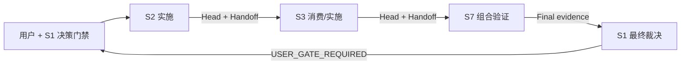

# FlowPilot Codex 会话自动唤醒协议

## 1. 目标

Codex 客户端允许一个既有任务向另一个既有任务发送后续指令并唤醒空闲任务。FlowPilot 用它减少人工复制交接，但不把聊天消息变成工作状态或授权事实。

推荐循环：



到达最后一个 S1 后必须等待用户共同决策。用户明确批准下一轮后，S1 才能唤醒新的首个责任会话。

## 2. 两个平面

| 平面 | 内容 | 是否权威 |
|---|---|---|
| 工作状态 | Work Package、Git Head、Contract Digest、Handoff Hash、Evidence、门禁结果 | 是 |
| 唤醒通知 | Codex task ID、消息、到达状态、对话摘要 | 否 |

任务未收到消息不改变 Git 状态；消息重复到达也不能重复执行同一 Attempt。聊天关闭、摘要压缩或客户端重启后，消费者必须从工作状态恢复。

## 3. 链授权

S1 在启动前写入或明确声明：

```text
CHAIN_ID=<stable-id>
GOAL=<可验收目标>
AUTHORITY=S1-ARCH
EXECUTION_MODE=ORDERED
AUTO_WAKE=enabled
RISK_CLASS=<R0|R1|R2>
MAX_HOPS=<positive-int>
USER_GATE=FINAL_S1
ORDER=S2-RUNTIME->S3-PLATFORM->S7-INTEGRATION->S1-ARCH
STOP_CONDITIONS=P0/P1,contract_change,path_violation,gate_failure,risk_upgrade
```

R3、破坏性数据操作、生产凭据、外部发布和公共契约不兼容变化不能预授权自动唤醒链。

## 4. 唤醒信封

生产者只向下一个消费者发送一条结构化消息：

```text
WAKE_PROTOCOL=flowpilot.thread-wake.v1
CHAIN_ID=<id>
STEP_ID=<id>
ATTEMPT_ID=<id>
DEDUP_KEY=<chain/step/attempt/input-head>
PRODUCER_ROLE=<role>
CONSUMER_ROLE=<role>
EXECUTION_MODE=ORDERED
RISK_CLASS=<class>
BASE_COMMIT=<sha>
INPUT_HEAD=<sha>
CONTRACT_CONTENT_DIGEST=sha256:<64hex>
HANDOFF=<repo-relative-path>
HANDOFF_SHA256=sha256:<64hex>
UNLOCK_CONDITION=<deterministic-condition>
MODE=<REVIEW_ONLY|IMPLEMENTATION|FINAL_GATE>
USER_GATE_REQUIRED=<yes|no>
```

自由文本只能补充目标和已知风险，不能放宽信封中的范围、风险和停止条件。

## 5. 消费者算法

消费者被唤醒后依次执行：

1. 核对自身 `SESSION_ROLE`、Worktree、分支和允许路径。
2. 检查 `DEDUP_KEY`；已经消费过的消息只返回原结果，不重复写入。
3. 验证 Base/Input Head、Contract Digest、Handoff Hash、工作树洁净度和解锁条件。
4. 门禁不满足时停止，不唤醒下一会话；一次性批量报告阻断。
5. 门禁满足时执行授权 Attempt，生成新的 Head、Handoff 和证据。
6. 只有 `CONSUMER_ACCEPTED` 且不命中停止条件，才向链中的下一个角色发送唤醒信封。
7. 最后一个生产者唤醒 S1；S1 运行 final gate 后输出 `USER_GATE_REQUIRED=yes` 并停止。

唤醒发送成功只表示消息已投递，不表示消费者已经接受或完成。

## 6. 循环保护

- `MAX_HOPS` 防止 S1→S2→S3→S7→S1 之外的意外回环。
- 同一 `CHAIN_ID/STEP_ID/ATTEMPT_ID/INPUT_HEAD` 只消费一次。
- 返修增加 Attempt，不覆盖旧 Head 和旧证据。
- 每个 Step 只有一个合法下一角色；不能由模型临时选择新的会话。
- P0/P1、契约变化、路径越权、风险升级、门禁失败和脏工作树立即断链。
- 没有新增事实的等待状态不触发消息。
- S1 final 与用户门禁之间禁止自动超时批准。

## 7. Task 映射

Codex task ID 和 Host ID 属于本地客户端运行状态，不提交 Git，也不写进可移植契约。S1 派发前通过客户端核对：

- 任务标题与 `SESSION_ROLE` 一致。
- 工作目录/Worktree 与角色一致。
- 目标任务不是另一个项目的同名会话。
- 目标任务没有正在执行冲突 Work Package。

找不到唯一目标时停止并请用户指定；不能只按模糊标题发送。

## 8. 用户需要提供什么

已有七个会话和 Worktree 时，用户通常只需提供：

1. 本轮业务/工程目标和可验收结果。
2. 希望的角色顺序；也可以让 S1 根据依赖提出顺序。
3. 允许的最高风险和外部副作用范围；默认不允许生产或外部写操作。
4. 最终必须由用户决定的事项。

S1 负责补齐 Chain/Step/Attempt、精确 Heads、路径、测试、停止条件和任务映射。推荐启动语句：

```text
启动自动唤醒链：目标=<目标>；
建议顺序=S2->S3->S7->S1；
最高风险=R2；
最终在 S1 等我确认，不执行生产/外部写入。
```

## 9. 失败恢复

- 发送失败：生产者保留 Handoff，不改变 Step 状态；S1 或用户可按同一 `DEDUP_KEY` 重发。
- 消费者环境不可用：状态为 `ENV_BLOCKED`，不跳过该消费者。
- 客户端重启：S1 从仓库 Chain 记录和最新 Head 恢复，不依赖对话记忆。
- 用户拒绝 final：S1 创建新 Attempt 或终止 Chain，不修改已经完成的历史证据。
